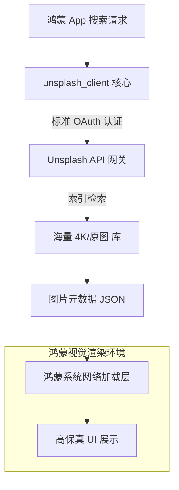

欢迎加入开源鸿蒙跨平台社区：[https://openharmonycrossplatform.csdn.net](https://openharmonycrossplatform.csdn.net)。

# Flutter for OpenHarmony：unsplash_client — 全球视觉素材引擎（高颜设计底座）

## 前言

在华为鸿蒙（OpenHarmony）应用的高品质设计中，图片素材的质感往往直接决定了产品的格调。无论是作为壁纸类 App 的内容源、社交应用的动态配图，还是作为电商平台的占位图填充。

`unsplash_client` 是一款精心封装的 Unsplash API 官方 SDK 适配库。它让你能够以极其简单的方式接入 Unsplash 这一全球最受欢迎的高品质版权免费图片平台。在构建鸿蒙平台的个性化桌面、专业摄影应用或极简生活类 App 时，它能通过流畅的 API 接口，瞬间让你的应用拥有“电影级”的视觉纵深感。

## 一、原理展示 / 概念介绍

### 1.1 基础概念

`unsplash_client` 实现了端侧与 Unsplash 云端图库的稳定握手。



### 1.2 核心要点解析

- **多维度检索**：支持按关键词搜索、按主题分类列表（Topics）、以及获取每日精选。
- **丰富的元数据**：除了图片 URL，还提供摄影师信息、拍摄器材（EXIF）以及点赞/统计数据。
- **自动链接归因**：内置符合 Unsplash 使用规范的追踪逻辑（Download Location），确保开发者行为合规。

## 二、核心 API / 组件详解

### 2.1 依赖引入

在鸿蒙工程的 `pubspec.yaml` 中添加以下依赖：

```yaml
dependencies:
  unsplash_client: ^1.1.0 # 建议参考最新版本
```

### 2.2 客户端初始化

💡 **技巧**：在应用入口初始化全局客户端。

```dart
import 'package:unsplash_client/unsplash_client.dart';

// ✅ 推荐做法：通过 accessKey 进行安全初始化
final client = UnsplashClient(
  settings: UnsplashSettings(
    accessKey: 'YOUR_UNSPLASH_ACCESS_KEY',
  ),
);
```

### 2.3 快速获取精选图片

```dart
Future<void> fetchSpotlight() async {
  // 💡 技巧：获取特定尺寸的高清图
  final photos = await client.photos.list(page: 1, perPage: 10);
  for (var photo in photos) {
    print('摄影师: ${photo.user.name}, 图片流: ${photo.urls.regular}');
  }
}
```

## 三、场景示例

### 3.1 场景一：鸿蒙端“每日一图”壁纸设置

利用 `client.photos.random()` 接口，在鸿蒙每次锁屏或启动时动态更新一张震撼人心的自然景观。

### 3.2 场景二：智能笔记应用的自动配图

根据笔记标题的关键词（如“咖啡”、“旅行”），利用搜索接口自动匹配氛围感背景。

## 四、OpenHarmony 平台适配挑战

### 4.1 高清图加载对内存的压力

Unsplash 的图片通常分辨率极高，在低内存规格的鸿蒙设备上直接加载原图会导致内存溢出（OOM）。

✅ **适配策略建议**：
1. **优先使用 Regular 档位**：`photo.urls.regular` 通常具有 1080p 分辨率，在手机/平板显示上足够清晰且内存占用合理。对于略缩图，请务必使用 `small` 档位。
2. **预加载与缓存优化**：结合 `cached_network_image` 插件，在鸿蒙端实现二级文件缓存，避免重复下载不仅节省用户流量，还能显著提升鸿蒙设备的流畅度。

## 五、综合实战示例代码

以下是一个演示如何在鸿蒙应用中展示 Unsplash 摄影画廊的实战组件：

```dart
import 'package:flutter/material.dart';
import 'package:unsplash_client/unsplash_client.dart';

class UnsplashLabPage extends StatefulWidget {
  const UnsplashLabPage({super.key});

  @override
  State<UnsplashLabPage> createState() => _UnsplashLabPageState();
}

class _UnsplashLabPageState extends State<UnsplashLabPage> {
  final _client = UnsplashClient(settings: UnsplashSettings(accessKey: 'PASTE_KEY_HERE'));
  List<Photo> _photos = [];

  void _loadPhotos() async {
    try {
      final res = await _client.photos.list(perPage: 6);
      setState(() => _photos = res);
    } catch (e) {
      debugPrint("API 调用建议检查网络或 Key 有效性: $e");
    }
  }

  @override
  Widget build(BuildContext context) {
    return Scaffold(
      appBar: AppBar(title: const Text('Unsplash 视觉预览实验室')),
      body: GridView.builder(
        padding: const EdgeInsets.all(10),
        gridDelegate: const SliverGridDelegateWithFixedCrossAxisCount(
          crossAxisCount: 2, crossAxisSpacing: 10, mainAxisSpacing: 10,
        ),
        itemCount: _photos.length,
        itemBuilder: (context, index) {
          final p = _photos[index];
          // 💡 实战技巧：展示摄影师信息块
          return ClipRRect(
            borderRadius: BorderRadius.circular(15),
            child: Stack(
              fit: StackFit.expand,
              children: [
                Image.network(p.urls.small.toString(), fit: BoxFit.cover),
                Positioned(
                  bottom: 0, left: 0, right: 0,
                  child: Container(
                    color: Colors.black26,
                    padding: const EdgeInsets.all(5),
                    child: Text(p.user.name, style: const TextStyle(color: Colors.white, fontSize: 10)),
                  ),
                )
              ],
            ),
          );
        },
      ),
      floatingActionButton: FloatingActionButton(
        onPressed: _loadPhotos, child: const Icon(Icons.refresh),
      ),
    );
  }
}
```

## 六、总结

`unsplash_client` 为鸿蒙应用打开了一扇通往全球顶级视觉素材的大门。在追求极致审美和技术底下的今天，这种集成高质量现成内容的能力是应用成功的催化剂。

✅ **核心建议**：
1. **严格遵守 API 限频**：Unsplash 免费版 API 限频较低，在鸿蒙端务必做好并发控制，避免用户频繁刷新导致接口被封禁。
2. **图片归因（Attribution）**：不仅是法律要求，更是对摄影师的尊重，请务必在 UI 的显著或详情位置保留摄影师名称。
3. **适配系统深色模式**：在鸿蒙端切换至深色模式后，建议对图片进行 10%~20% 的遮罩遮盖，保持视觉沉浸感。

📦 **完整代码已上传至 AtomGit**：[open-harmony-example/unsplash](https://atomgit.com/dragonbady/open-harmony-example/tree/main/examples/unsplash)

🌐 **欢迎加入开源鸿蒙跨平台社区**：[开源鸿蒙跨平台开发者社区](https://openharmonycrossplatform.csdn.net)
