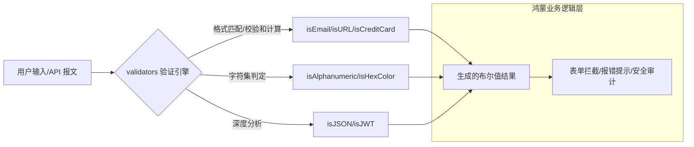

欢迎加入开源鸿蒙跨平台社区：[https://openharmonycrossplatform.csdn.net](https://openharmonycrossplatform.csdn.net)。

# Flutter for OpenHarmony：validators — 逻辑的安检机（业务校验底座）

## 前言

在华为鸿蒙（OpenHarmony）生态的各种业务应用开发中，数据校验（Validation）是保证系统稳健性的第一道防线。无论是用户注册时的邮箱格式检查、银行转账时的金额格式校验、还是处理海外业务时的国际电话格式验证，手动编写复杂的正则表达式不仅容易出错且难以维护。

`validators` 是一款极其成熟、功能涵盖极广的字符串验证库。它内置了包括邮箱、URL、信用卡号、JSON 字符串、IP 地址、以及各种特定语种格式（如 ISBN、UUID）在内的数十个验证器。在鸿蒙跨平台应用的开发中，它凭借其高度的可靠性和语义化的接口，让开发者能够瞬间构建出“坚不可摧”的业务校验逻辑。在打造鸿蒙平台的互联网金融应用、全平台内容管理系统或高安全要求的后台管理端时，它是实现“零脏数据入库”的核心防御组件。

## 一、原理展示 / 概念介绍

### 1.1 基础概念

本库实现了基于预设正则表达式与算法逻辑的高速文本特征提取。



### 1.2 核心要点解析

- **覆盖度极高**：除了基础校验，甚至包括 `isFqdn`（全合格域名）这种极其专业的网络参数验证，满足鸿蒙全场景开发需求。
- **高性能执行**：核心逻辑经过长时间优化，在鸿蒙端侧处理高频输入的监听校验时，依然能保持极低的 CPU 占用率。
- **无副作用设计**：完全基于纯函数实现，输入相同字符串必得相同结果，具备极其优异的可测试性。

## 二、核心 API / 组件详解

### 2.1 依赖引入

在鸿蒙工程的 `pubspec.yaml` 中添加以下依赖：

```yaml
dependencies:
  validators: ^3.0.0 # 建议参考最新稳定版本
```

### 2.2 快速校验常见格式

在鸿蒙注册表单中实时验证：

```dart
import 'package:validators/validators.dart';

void validateForm(String email, String url) {
  // ✅ 推荐做法：语义化调用
  if (isEmail(email)) {
     print('💡 鸿蒙开发者邮箱格式正确');
  }

  if (isURL(url, requireTld: true)) {
     print('💡 这是一个带顶级域名的合法链接');
  }
}
```

### 2.3 进阶业务逻辑校验

💡 **技巧**：验证是否为合法的十六进制颜色值或 UUID。

```dart
bool isValidTheme = isHexColor('#FFFFFF');
bool isDeviceId = isUUID(myHarmonyId, 4); // 💡 技巧：校验 UUID v4 版本
```

## 三、场景示例

### 3.1 场景一：鸿蒙端“金融级”实名认证

利用 `isIdentityCard`（针对特定区域）或 `isCreditCard`（Luhn 算法校验）功能，在用户输入阶段即阻断非法的身证或卡号信息，极大降低无效的后端 API 调用成本。

### 3.2 场景二：后台管理系统的“动态配置”检查

在鸿蒙平板端的运维应用中，当管理员输入 JSON 格式的配置片段时，利用 `isJSON` 快速探测格式是否完整，防止由于错误的配置分发导致鸿蒙分布式设备集群崩溃。

## 四、OpenHarmony 平台适配挑战

### 4.1 全球化数据的处理范围

虽然 `validators` 覆盖广泛，但在面对鸿蒙系统未来可能深入渗透的某些特定方言或局部业务码（如中国特有的邮编、社会信用代码）时，内置的验证器可能不足。

✅ **适配策略建议**：
1. **结合 `super_string` 扩展**：对于库中未涵盖的鸿蒙特有格式（如鸿蒙专属 ID 体系），建议通过正则表达式配合 `matches` 方法进行扩展。
2. **异步平滑处理**：在输入框 `onChanged` 事件中进行复杂正则校验时，若字符串长度超过 1KB，建议在鸿蒙端配合 `debounce` 技术，避免每一帧都在进行正则表达式的高强度计算。

## 五、综合实战示例代码

以下是一个演示如何在鸿蒙端实现的“全能表单安检中心”实战组件示例：

```dart
import 'package:flutter/material.dart';
import 'package:validators/validators.dart' as v;

class ValidatorLabPage extends StatefulWidget {
  const ValidatorLabPage({super.key});

  @override
  State<ValidatorLabPage> createState() => _ValidatorLabPageState();
}

class _ValidatorLabPageState extends State<ValidatorLabPage> {
  final _emailController = TextEditingController();
  String _hint = "请输入待验证的鸿蒙账号信息";

  void _runCheck() {
    final text = _emailController.text;
    String result = "";

    // 💡 实战技巧：组合校验
    if (v.isEmail(text)) {
      result = "✅ 输入结果：有效的电子邮箱";
    } else if (v.isURL(text)) {
      result = "🌐 输入结果：有效的网络链接";
    } else if (v.isIP(text)) {
      result = "🖥️ 输入结果：合法的 IP 访问地址";
    } else {
      result = "❌ 格式不匹配，请检查输入。";
    }

    setState(() => _hint = result);
  }

  @override
  Widget build(BuildContext context) {
    return Scaffold(
      appBar: AppBar(title: const Text('业务校验安检实验室')),
      body: Padding(
        padding: const EdgeInsets.all(24),
        child: Column(
          children: [
            const Icon(Icons.verified_user_outlined, size: 80, color: Colors.indigoAccent),
            const SizedBox(height: 30),
            TextField(
              controller: _emailController,
              onChanged: (_) => _runCheck(),
              decoration: const InputDecoration(labelText: '尝试输入 Email/IP/URL', border: OutlineInputBorder()),
            ),
            const SizedBox(height: 30),
            Container(
              width: double.infinity,
              padding: const EdgeInsets.all(16),
              decoration: BoxDecoration(color: Colors.blue[50], borderRadius: BorderRadius.circular(12)),
              child: Text(_hint, style: const TextStyle(fontSize: 16)),
            ),
          ],
        ),
      ),
    );
  }
}
```

## 六、总结

`validators` 库将繁杂的文本特征分析转化为了极其明确的语义逻辑。它是提升鸿蒙应用健壮性的隐形防弹衣，让开发者能够以最低的成本构建出具备专业级数据管控能力的卓越应用。

✅ **核心建议**：
1. **统一错误源**：在鸿蒙端建立统一的校验器（Validators）类，将本项目涉及的所有校验方案集中存放，方便全局逻辑升级。
2. **不仅仅是表单**：在处理来自 WebSocket 或 BLE 的外源数据报文时，也应积极调用该库进行合法性过滤，防止恶意攻击。
3. **关注版本演进**：随着网络协议的更新（如 IPv6 普及），务必更新该库版本以获取最新的验证正则表达式支持。

📦 **完整代码已上传至 AtomGit**：[open-harmony-example/validators](https://atomgit.com/dragonbady/open-harmony-example/tree/main/examples/validators)

🌐 **欢迎加入开源鸿蒙跨平台社区**：[开源鸿蒙跨平台开发者社区](https://openharmonycrossplatform.csdn.net)
