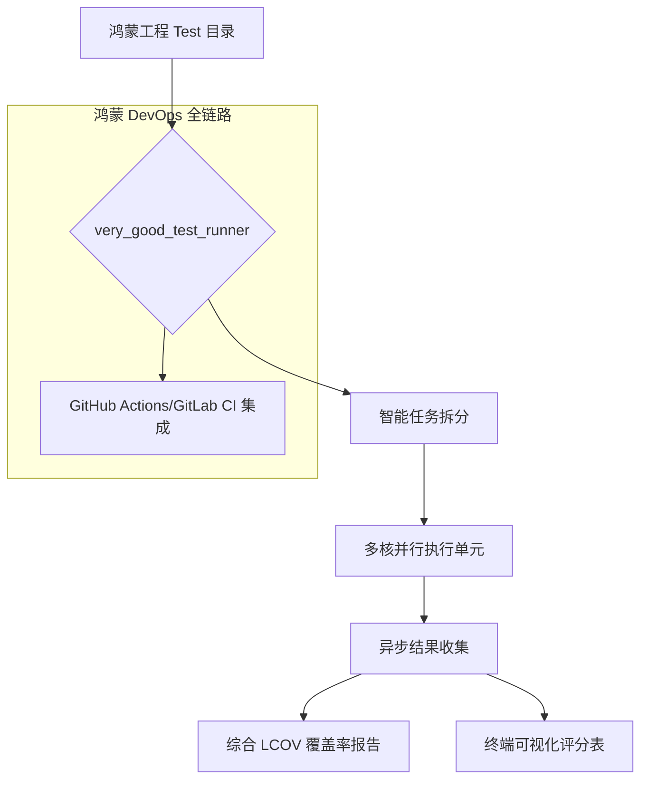

欢迎加入开源鸿蒙跨平台社区：[https://openharmonycrossplatform.csdn.net](https://openharmonycrossplatform.csdn.net)。

# Flutter for OpenHarmony：very_good_test_runner — 质量守护的疾速引擎（工程化测试底座）

## 前言

在华为鸿蒙（OpenHarmony）生态的工程化开发迭代中，随着业务逻辑的日趋复杂，测试用例的数量往往会从几十个迅速增长到数千个。传统的 `flutter test` 命令在处理海量用例时，由于缺乏精细化的并发控制和覆盖率报告整合，往往导致 CI/CD 流程缓慢，且难以给开发者提供直观的质量反馈。

`very_good_test_runner` 是一款由业内顶尖团队 Very Good Ventures 打造的高性能测试运行器插件。它在原生 `flutter test` 的基础上进行了二次工程化封装，支持智能并发调度、美观的结果报告输出以及极简的覆盖率统计。在构建鸿蒙跨平台应用的大规模测试套件、接入自动化流水线（Pipeline）时，它是确保“开发爽快感”与“线上零缺陷”的核心利器。

## 一、原理展示 / 概念介绍

### 1.1 基础概念

本库实现了测试任务的“流水线式”高效分发。



### 1.2 核心要点解析

- **极致速度**：通过更科学的并发策略，在多核处理器上显著缩短鸿蒙大型项目的全量测试耗时。
- **结构化输出**：放弃了凌乱的日志流，采用高度概括、色彩分明的终端 Dashboard 展示每一个测试包（Package）的存活状态。
- **一键覆盖率**：自动处理 `.lcov` 文件生成与整合，无需开发者记忆复杂的路径参数。

## 二、核心 API / 组件详解

### 2.1 依赖引入

在鸿蒙工程的全局作用域（Global）或 `dev_dependencies` 中安装执行工具：

```bash
# ✅ 推荐做法：通过 pub 全局激活
dart pub global activate very_good_test_runner
```

在 `pubspec.yaml` 中添加以下分工明确的依赖：

```yaml
dev_dependencies:
  very_good_test_runner: ^0.1.0 # 建议参考最新生产版本
```

### 2.2 运行核心测试任务

在鸿蒙项目根目录下执行高效率扫描：

```bash
# 💡 技巧：运行所有测试并生成美观报告
very_good_test_runner test
```

### 2.3 生成带有阈值限制的覆盖率报告

💡 **技巧**：在鸿蒙端强行规定关键业务（如支付逻辑）的覆盖率不低于 80%。

```bash
# 如果覆盖率低于 80%，运行器会返回非零状态码，自动阻断 CI 流程
very_good_test_runner test --min-coverage 80
```

## 三、场景示例

### 3.1 场景一：鸿蒙多 Module 大仓测试聚合

在包含多个子 Package（如 `auth`, `payment`, `ui_components`）的鸿蒙 Mono-repo 架构中，一键运行全量测试并获取汇总报告，无需逐个目录切换。

### 3.2 场景二：代码提交前的“快速自检”

开发者利用其高速并发特性，在 Git Push 前花费极短时间完成核心逻辑的回归测试，减少“上线即 Bug”的尴尬。

## 四、OpenHarmony 平台适配挑战

### 4.1 测试环境的沙箱一致性

鸿蒙系统对文件系统访问和并发进程数有特定的资源配额（Quotas）。

✅ **适配策略建议**：
1. **控制并发核数**：在性能一般的开发者机或低内存 CI 环境下，使用 `--concurrency` 参数手动指定并发数，防止由于瞬间开启过多测试进程导致鸿蒙逻辑测试执行超时（Timeout）。
2. **Mock 外部依赖**：`very_good_test_runner` 运行的是纯逻辑测试。对于涉及鸿蒙底层能力（如 NAPI 调用）的代码，务必通过 `mocktail` 或 `mockito` 提取接口。

## 五、综合实战示例代码

以下是一个演示如何在鸿蒙端利用运行器输出结果构建“质量预警”逻辑的逻辑伪代码：

```dart
// 在鸿蒙端的 CI 脚本 (sh/yaml) 中利用运行器结果
/*
#!/bin/bash
echo "🚀 开始鸿蒙项目全量质量巡检..."

# 运行测试并检查是否通过最小值
very_good_test_runner test --min-coverage 85

if [ $? -eq 0 ]; then
  echo "✅ 质量达标，允许进入 HAP 签名流程"
else
  echo "❌ 覆盖率不足，请补充测试用例后再试"
  exit 1
fi
*/
```

## 六、总结

`very_good_test_runner` 将原本沉闷的测试环节转化为了一场追求“全绿（All Green）”的极速体验。在 OpenHarmony 生态追求精品化、大规模工程化的路径上，它是保证代码持续健壮、技术债不失控的幕后功臣。

✅ **核心建议**：
1. **尽早集成**：不要等项目写完了再加。从鸿蒙项目的第一个 Feature 起，就使用该运行器保持良好的测试习惯。
2. **结合 GitHub Actions/AtomGit CI**：利用其结构化输出，直接在 PR（Pull Request）页面展示精美的质量徽章。
3. **分层测试策略**：利用 `--exclude-tags` 功能，在提交时只运行“快速单元测试”，将耗时的“集成测试”放在晚间的全量 CI 中执行。

📦 **完整代码已上传至 AtomGit**：[open-harmony-example/test_runner](https://atomgit.com/dragonbady/open-harmony-example/tree/main/examples/test_runner)

🌐 **欢迎加入开源鸿蒙跨平台社区**：[开源鸿蒙跨平台开发者社区](https://openharmonycrossplatform.csdn.net)
