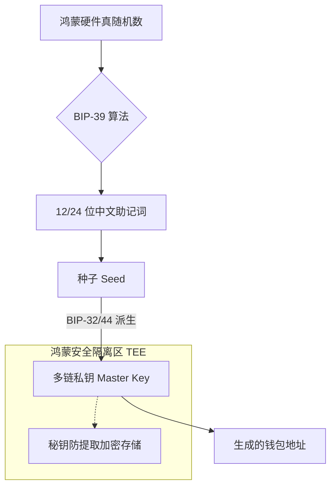

欢迎加入开源鸿蒙跨平台社区：[https://openharmonycrossplatform.csdn.net](https://openharmonycrossplatform.csdn.net)。

# Flutter for OpenHarmony：wallet — 数字化加密资产引擎（Web3 认证底座）

## 前言

随着 Web3 技术与移动互联网的深度融合，在华为鸿蒙（OpenHarmony）生态中构建具备去中心化身份（DID）、加密资产管理以及私钥派生能力的应用正成为新的增长点。无论是个性化的数字收藏品（NFT）展示、基于私钥的安全登录协议，还是跨境数字支付系统，开发者都需要一套严谨、规范的钱包基础框架。

`wallet` 是一款专注于区块链资产管理的核心算法库。它严格遵循 BIP-32 (分层确定性钱包)、BIP-39 (助记词) 以及 BIP-44 (多币种派生路径) 等行业标准。在鸿蒙跨平台开发中，它能让你以极简的方式生成助记词、派生公私钥对并管理不同链下的地址空间。在构建鸿蒙平台的数字化货币包、分布式身份验证系统时，它是保障资产安全与标准的基石。

## 一、原理展示 / 概念介绍

### 1.1 基础概念

`wallet` 核心实现了从“随机数”到“万能密钥”的演化过程。



### 1.2 核心要点解析

- **标准化助记词**：兼容多种语言（包括中文）的助记词库，确保用户资产在不同钱包（如 Meta Mask, Trust Wallet）间互通。
- **派生路径管理**：支持自定义路径，例如以太坊使用的 `m/44'/60'/0'/0/0`，在鸿蒙端实现多链资产的一体化展示。
- **高阶合规性**：算法完全基于数学逻辑，不依赖外部 RPC 服务，保证了鸿蒙端核心隐私数据的离线安全性。

## 二、核心 API / 组件详解

### 2.1 依赖引入

在鸿蒙工程的 `pubspec.yaml` 中添加以下分工明确的依赖：

```yaml
dependencies:
  wallet: ^1.0.0 # 请参考最新合规版本
```

### 2.2 生成并管理助记词

在鸿蒙端引导用户创建新钱包：

```dart
import 'package:wallet/wallet.dart';

void createNewWallet() {
  // ✅ 推荐做法：生成 12 个单词的助记词
  final mnemonic = Mnemonic.generate(count: 12);
  print('重要提示：请记录鸿蒙安全助记词: ${mnemonic.words}');
  
  // 💡 技巧：转化为种子，用于后续派生
  final seed = mnemonic.toSeed();
}
```

### 2.3 派生以太坊/比特币私钥

```dart
void deriveKeys(Uint8List seed) {
  // 💡 技巧：根据 BIP-44 路径派生
  final wallet = Wallet.fromSeed(seed, path: "m/44'/60'/0'/0/0");
  final privateKey = wallet.privateKey;
  final address = wallet.address;
  print('派生的鸿蒙以太坊地址: $address');
}
```

## 三、场景示例

### 3.1 场景一：鸿蒙端“区块链数字护照”

利用 `wallet` 派生出的公钥作为唯一标识符，实现基于非对称加密的免密、安全登录鸿蒙分布式政务系统。

### 3.2 场景二：跨端分布式资产保险箱

在鸿蒙折叠屏、平板等不同设备间流转加密资产的视图，核心私钥始终在 `wallet` 库驱动的底层安全沙箱中进行签名。

## 四、OpenHarmony 平台适配挑战

### 4.1 随机数的真伪性与 Entropy 来源

区块链钱包的安全性取决于随机数的质量。

✅ **适配策略建议**：
1. **优先使用系统源**：在鸿蒙端生成助记词时，务必调用原生 NAPI 接口从 `ohos.security.huks`（鸿蒙通用秘钥库服务）中提取硬件级高熵随机数作为输入种子。
2. **UI 截屏防护**：在展示助记词给用户记录时，必须开启鸿蒙系统的窗口安全属性（SetWindowPrivacyMode），防止木马软件通过后台截屏盗取私钥。

## 五、综合实战示例代码

以下是一个模拟鸿蒙手机“离线冷钱包”创建与地址生成的实战组件：

```dart
import 'package:flutter/material.dart';
import 'package:wallet/wallet.dart';

class WalletLabPage extends StatefulWidget {
  const WalletLabPage({super.key});

  @override
  State<WalletLabPage> createState() => _WalletLabPageState();
}

class _WalletLabPageState extends State<WalletLabPage> {
  String _mnemonic = "点击按钮生成助记词";
  String _address = "";

  void _generateWallet() {
    // 💡 实战技巧：生成并展示
    final mnemonic = Mnemonic.generate();
    final masterKey = Wallet.fromMnemonic(mnemonic);
    
    // 假设派生一个标准地址
    final wallet = masterKey.derivePath("m/44'/60'/0'/0/0");

    setState(() {
      _mnemonic = mnemonic.words.join(" ");
      _address = wallet.address;
    });
  }

  @override
  Widget build(BuildContext context) {
    return Scaffold(
      appBar: AppBar(title: const Text('数字化钱包实验室')),
      body: Padding(
        padding: const EdgeInsets.all(24),
        child: Column(
          children: [
            const Icon(Icons.account_balance_wallet_outlined, size: 80, color: Colors.blueGrey),
            const SizedBox(height: 20),
            const Text("⚠️ 请勿泄露助记词", style: TextStyle(color: Colors.red, fontWeight: FontWeight.bold)),
            const SizedBox(height: 10),
            Container(
              padding: const EdgeInsets.all(16),
              color: Colors.grey[100],
              child: Text(_mnemonic, textAlign: TextAlign.center, style: const TextStyle(fontSize: 16)),
            ),
            const SizedBox(height: 30),
            if (_address.isNotEmpty) ...[
               const Text("生成的鸿蒙链上地址:"),
               SelectableText(_address, style: const TextStyle(fontWeight: FontWeight.bold, color: Colors.blue)),
            ],
            const Spacer(),
            ElevatedButton(
              onPressed: _generateWallet,
              style: ElevatedButton.styleFrom(minimumSize: const Size.fromHeight(50)),
              child: const Text('立即创建鸿蒙安全钱包'),
            ),
          ],
        ),
      ),
    );
  }
}
```

## 六、总结

在 OpenHarmony 这个重视数字主权和资产安全的操作系统中，`wallet` 库为我们提供了专业、符合工业标准的数字身份管理底座。

✅ **核心建议**：
1. **离线处理原则**：尽量避免将敏感的助记词和私钥在内存中常驻，用完立即销毁（赋值为零）。
2. **配合华为 HUKS**：将生成的 Seed 保存到鸿蒙系统的硬件保险箱，利用指纹/面容解锁后再进行库运算。
3. **显示安全**：在展示助记词页面，建议屏蔽鸿蒙系统的多任务卡片快照功能（防止预览图泄露）。

📦 **完整代码已上传至 AtomGit**：[open-harmony-example/wallet](https://atomgit.com/dragonbady/open-harmony-example/tree/main/examples/wallet)

🌐 **欢迎加入开源鸿蒙跨平台社区**：[开源鸿蒙跨平台开发者社区](https://openharmonycrossplatform.csdn.net)
