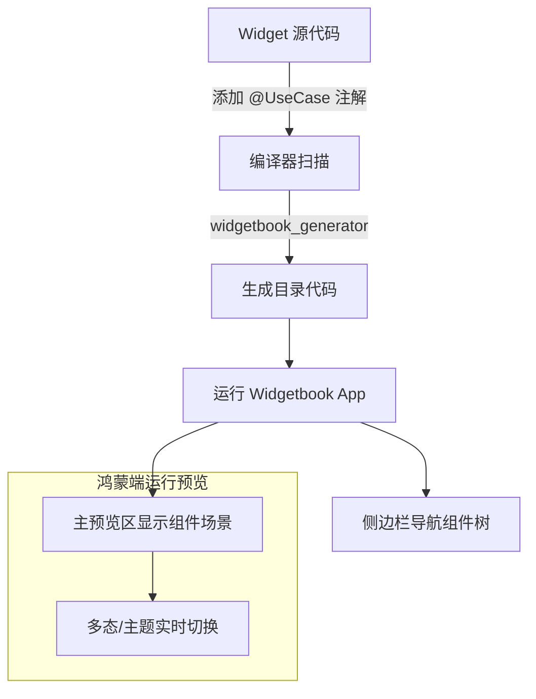

欢迎加入开源鸿蒙跨平台社区：[https://openharmonycrossplatform.csdn.net](https://openharmonycrossplatform.csdn.net)。

# Flutter for OpenHarmony：widgetbook_annotation — 组件化治理底座（UI 提效工具）

## 前言

在华为鸿蒙（OpenHarmony）应用的大规模开发中，随着业务迭代，UI 组件的数量会呈指数级增长。如何让设计师、产品经理以及核心开发者能够在一个统一的界面中直观地预览、测试不同状态下的组件（如折叠屏下的按钮、深色模式下的列表项），是保证 UI 质量的关键。

`widgetbook_annotation` 是 Flutter 生态中极具影响力的 UI 目录管理工具 `Widgetbook` 的注解核心。它允许开发者通过简单的装饰器语法，在业务代码中直接定义组件的“预览点”。结合代码生成技术，它能为鸿蒙应用自动生成一套独立的“组件实验室”页面。在构建鸿蒙平台的标准化组件库时，它是实现“组件驱动开发（Component-Driven Development）”的核心工具。

## 一、原理展示 / 概念介绍

### 1.1 基础概念

本库通过扫描源代码中的特定注解，汇总成组件目录树。



### 1.2 核心要点解析

- **@UseCase**：用于标注组件的一个具体展示场景（如：主按钮-禁用状态）。
- **Knobs（旋钮）**：允许在预览界面动态修改组件属性（如修改文本内容、颜色），实时观察鸿蒙端的视觉反馈。
- **解耦预览**：预览代码与生产代码共生但不干扰，生产打包时注解逻辑自动剥离。

## 二、核心 API / 组件详解

### 2.1 依赖引入

在鸿蒙工程的 `pubspec.yaml` 中添加以下分工明确的依赖：

```yaml
dependencies:
  widgetbook_annotation: ^3.0.0

dev_dependencies:
  widgetbook: ^3.0.0
  widgetbook_generator: ^3.0.0
  build_runner: ^2.4.0
```

### 2.2 定义组件预览点

为鸿蒙风格的自定义卡片添加预览支持：

```dart
import 'package:flutter/material.dart';
import 'package:widgetbook_annotation/widgetbook_annotation.dart' as widgetbook;

// ✅ 推荐做法：使用 @UseCase 标注不同的业务场景
@widgetbook.UseCase(
  name: '基础圆角卡片',
  type: HarmonyCard,
)
Widget buildBasicCard(BuildContext context) {
  return const HarmonyCard(title: '鸿蒙 Lab');
}
```

### 2.3 利用 Knobs 进行动态调试

💡 **技巧**：通过 Knobs 可以在不重新编译的情况下测试组件的边界情况。

```dart
@widgetbook.UseCase(
  name: '动态配置按钮',
  type: HarmonyButton,
)
Widget buildDynamicButton(BuildContext context) {
  return HarmonyButton(
    // 💡 技巧：允许在调试面板实时输入文本
    text: context.knobs.string(label: '按钮文字', initialValue: '立即提交'),
    onPressed: () {},
  );
}
```

## 三、场景示例

### 3.1 场景一：鸿蒙多端适配测试

利用 Widgetbook 提供的设备框架，可以在同一个鸿蒙手机上模拟折叠屏、平板等不同分辨率下的布局效果。

### 3.2 场景二：深色模式/镜像模式对比

在预览区快速切换主题。

## 四、OpenHarmony 平台适配挑战

### 4.1 代码生成与编译环境

由于 `widgetbook_generator` 依赖 `build_runner`，在复杂的鸿蒙工程目录下，由于路径深或文件系统差异，可能会遇到生成冲突。

✅ **适配策略建议**：
1. **清理缓存**：在鸿蒙端重新生成代码前，务必执行 `flutter pub run build_runner clean`。
2. **专注于组件目录**：建议在专门的 `lib/ui_shared/` 等目录下集中定义组件和注解，提高扫描效率。

## 五、综合实战示例代码

这是一个模拟鸿蒙系统“智慧生活”风格组件的实验室化定义：

```dart
import 'package:flutter/material.dart';
import 'package:widgetbook_annotation/widgetbook_annotation.dart' as widgetbook;

// --- 业务组件：鸿蒙开关卡片 ---
class HarmonySwitchCard extends StatelessWidget {
  final String title;
  final bool value;
  final ValueChanged<bool> onChanged;

  const HarmonySwitchCard({
    super.key,
    required this.title,
    required this.value,
    required this.onChanged,
  });

  @override
  Widget build(BuildContext context) {
    return Container(
      padding: const EdgeInsets.all(16),
      decoration: BoxDecoration(
        color: Colors.white,
        borderRadius: BorderRadius.circular(20),
        boxShadow: [BoxShadow(color: Colors.black.withOpacity(0.05), blurRadius: 10)],
      ),
      child: Row(
        mainAxisAlignment: MainAxisAlignment.spaceBetween,
        children: [
          Text(title, style: const TextStyle(fontWeight: FontWeight.bold, fontSize: 18)),
          Switch(value: value, onChanged: onChanged),
        ],
      ),
    );
  }
}

// --- Widgetbook 预览定义 ---
@widgetbook.UseCase(
  name: '智能家居开关场景',
  type: HarmonySwitchCard,
)
Widget homeControlUseCase(BuildContext context) {
  return Center(
    child: HarmonySwitchCard(
      // 💡 实战技巧：将组件属性暴露给 Knobs 旋钮
      title: context.knobs.string(label: '设备名称', initialValue: '客厅吊灯'),
      value: context.knobs.boolean(label: '当前状态', initialValue: true),
      onChanged: (v) {},
    ),
  );
}

// --- 入口 App 示例 (通常在独立目录下) ---
// @widgetbook.App()
// class MyWidgetbook extends StatelessWidget { ... }
```

## 六、总结

`widgetbook_annotation` 通过代码生成的“魔力”，将静态的代码转换为了动态可交互的 UI 文档。在 OpenHarmony 这样重视用户体验设计的平台上，它能极大地缩短 UI 开发与设计的验收链路。

✅ **核心建议**：
1. **原子化拆分**：先为最基础的 Button、Text、Icon 定义注解，再逐步向上构建。
2. **结合 Knobs 做压力测试**：输入超长文本，观察组件在鸿蒙端的溢出处理策略。
3. **独立工程运行**：建议在 `.widgetbook` 文件夹中建立一个独立的子应用，它可以作为鸿蒙工程的“实验室”独立部署。

📦 **完整代码已上传至 AtomGit**：[open-harmony-example/widgetbook](https://atomgit.com/dragonbady/open-harmony-example/tree/main/examples/widgetbook)

🌐 **欢迎加入开源鸿蒙跨平台社区**：[开源鸿蒙跨平台开发者社区](https://openharmonycrossplatform.csdn.net)
