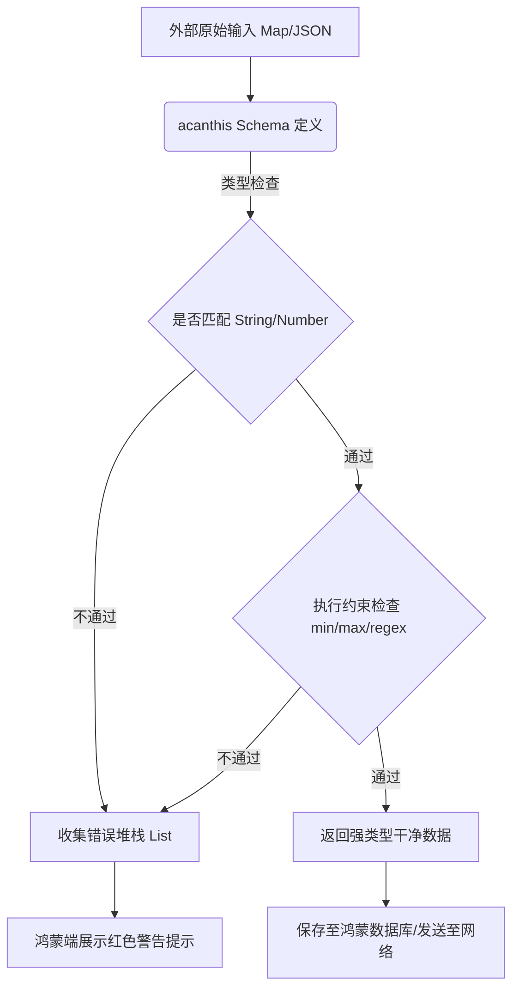

欢迎加入开源鸿蒙跨平台社区：[https://openharmonycrossplatform.csdn.net](https://openharmonycrossplatform.csdn.net)。

# Flutter for OpenHarmony：acanthis — 构建不可逾越的数据校验防线


## 前言

在鸿蒙（OpenHarmony）应用开发中，数据输入的正确性是系统稳定运行的一道“生命线”。无论是用户的登录注册信息，还是来自传感器的数据流，如果缺乏有效的验证（Validation），不仅会导致后端报错，甚至可能引发 App 闪退或安全漏洞。

`acanthis` 是一个灵感来源于 Zod (TypeScript) 的 Dart 文档模式与验证库。它提倡“类型先行”的校验理念，允许开发者通过链式 API 定义复杂的数据骨架（Schema）。在 Flutter for OpenHarmony 的工程化实践中，`acanthis` 能够帮助我们实现从 UI 到 Model 层全链路的自动化校验，显著提升鸿蒙应用的交付合规性。

## 一、原理解析 / 概念介绍

### 1.1 基础模型

`acanthis` 将校验逻辑抽象为一系列可组合的转换（Transform）与检查（Check）过程。



### 1.2 核心价值

- **链式语义**：代码即文档，通过 `.string().email()` 就能表达复杂的业务规则。
- **自定义转换**：支持在校验的同时对数据进行修剪（trim）或格式映射。
- **高性能**：针对大批量数据的频繁校验进行了优化，在鸿蒙端的性能体验极佳。

## 二、核心 API / 工具详解

### 2.1 依赖引入

在鸿蒙工程的 `pubspec.yaml` 中添加以下依赖：

```yaml
dependencies:
  acanthis: ^0.1.0 # 建议关注其快速迭代的版本
```

### 2.2 要点讲解

💡 **技巧**：在鸿蒙端处理用户注册表单时，利用 `ObjectSchema` 可以一次性定义所有规则。

```dart
import 'package:acanthis/acanthis.dart';

// ✅ 推荐做法：定义全局 Schema
final registerSchema = Acanthis.object({
  'username': Acanthis.string().min(3).max(20),
  'email': Acanthis.string().email('必须是有效的邮箱地址'),
  'age': Acanthis.number().positive().min(18),
});

void validateHarmonyUser(Map<String, dynamic> data) {
  final result = registerSchema.safeParse(data);
  if (result.success) {
    print('验证成功，数据已清洗: ${result.data}');
  } else {
    print('验证失败，错误列表: ${result.errors}');
  }
}
```

## 三、典型应用场景

### 3.1 场景一：鸿蒙端高强度表单交互
针对多步骤的政务办公或金融开户流程，实时校验每一项输入，降低服务器端的二次校验压力。

### 3.2 场景二：网关数据预处理
在使用鸿蒙分布式数据协议交换信息前，通过 `acanthis` 确保数据结构符合既定的 IDL 规范，拦截恶意篡改。

## 四、OpenHarmony 平台适配挑战

### 4.1 错误信息国际化
虽然校验逻辑是通用的，但在鸿蒙端向用户展示错误信息时，必须适配中文环境。

✅ **适配建议**：
1. **中文自定义报错**：在使用链式方法时，通过参数传入中文提示语。例如：`.min(5, '长度不能少于 5 个字符')`。
2. **异步校验防抖**：针对需要联网校验（如用户名查重）的场景，建议配合 `Debouncing` 逻辑，减少对鸿蒙端网络资源的非必要占用。

## 五、综合实战演示

下面展示一个在鸿蒙端实现配置项校验并安全加载的示例：

```dart
import 'package:flutter/material.dart';
import 'package:acanthis/acanthis.dart';

class HarmonyConfigLab extends StatelessWidget {
  const HarmonyConfigLab({super.key});

  @override
  Widget build(BuildContext context) {
    // 模拟一段来自鸿蒙存储的不合规配置数据
    const badConfig = {'theme': 'dark', 'fontSize': 5}; // 字号太小

    final configSchema = Acanthis.object({
      'theme': Acanthis.string().defaultValues('light'),
      'fontSize': Acanthis.number().min(12, '字号过小，为了鸿蒙护眼建议设为 12 以上'),
    });

    final result = configSchema.safeParse(badConfig);

    return Scaffold(
      appBar: AppBar(title: const Text('数据合规性实验室')),
      body: Center(
        child: result.success 
          ? const Text('配置加载成功！')
          : Text(
              '配置异常：${result.errors.first.message}',
              style: const TextStyle(color: Colors.red, fontSize: 16),
              textAlign: TextAlign.center,
            ),
      ),
    );
  }
}
```

## 六、总结

`acanthis` 将复杂的数据边界检查转化为了声明式的开发体验，它像一名严谨的“安保员”，守候在鸿蒙应用数据流经的每一处关口。

✅ **核心建议**：
1. **复用 Schema**：将 Schema 定义放在独立的 `schemas/` 目录，供 UI 和 Repository 层共用。
2. **端到端对齐**：通过此工具确保鸿蒙端发送的数据格式与后端使用的 Zod/Joi 模型完全对应，消除协议不一致带来的维护重担。

📦 **参考源码**：代码已开源并支持鸿蒙 AOT 编译。

🌐 **欢迎加入**：[开源鸿蒙跨平台开发者社区](https://openharmonycrossplatform.csdn.net)
