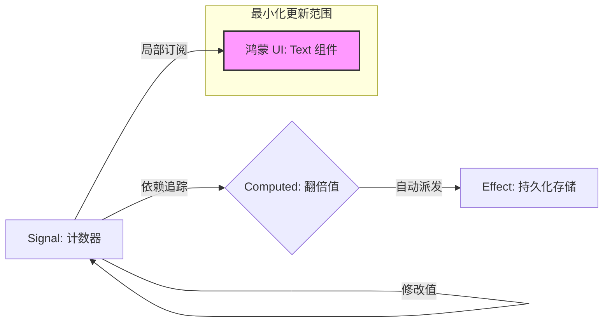

欢迎加入开源鸿蒙跨平台社区：[https://openharmonycrossplatform.csdn.net](https://openharmonycrossplatform.csdn.net)。

# Flutter for OpenHarmony：alien_signals — 给鸿蒙 UI 插上“信号”翅膀


## 前言

在鸿蒙（OpenHarmony）应用开发中，状态管理（State Management）始终是架构设计的重中之重。传统的 `setState` 往往会导致重载范围过大，而一些复杂的响应式框架又有着不菲的性能开销。

`alien_signals` 受到了现代前端框架（如 SolidJS, Vue 3）中“信号（Signals）”概念的启发，将其引入了 Flutter 的世界。它提供了一种极低成本、极致性能的响应式更新机制。在 Flutter for OpenHarmony 的高刷（90Hz/120Hz）环境下，信号机制能实现点对点的精准 UI 更新，让鸿蒙应用的交互动画更加流畅。

## 一、原原理解析 / 概念介绍

### 1.1 基础模型

`alien_signals` 通过“发布者(Signal)”与“消费者(Effect/Computed)”的依赖追踪，只在数据真正变化时才触发关联的代码块。



### 1.2 核心特性

- **极致性能**：无虚拟 DOM 比较，直接建立底层数据连接。
- **自动垃圾回收**：当鸿蒙组件销毁时，相关的信号链接可自动解除。
- **并发友好**：兼容鸿蒙端的异步处理模型。

## 二、核心 API / 工具详解

### 2.1 依赖引入

在鸿蒙工程的 `pubspec.yaml` 中添加以下依赖：

```yaml
dependencies:
  alien_signals: ^0.1.0 # 目前处于早期但极具潜力的版本
```

### 2.2 要点讲解

💡 **技巧**：在鸿蒙端使用时，通过 `createSignal` 创建数据源。

```dart
import 'package:alien_signals/alien_signals.dart';

// ✅ 推荐做法：定义全局或组件内的信号
final counter = createSignal(0);
final doubleCounter = createComputed(() => counter() * 2);

void increment() {
  counter.set(counter() + 1); // 自动触发依赖更新
}
```

## 三、典型应用场景

### 3.1 场景一：鸿蒙复杂表单校验
当用户在鸿蒙输入框中输入内容时，通过信号自动联动校验状态和提交按钮的可用性，实现零延迟反馈。

### 3.2 场景二：游戏或实时数据看板
在展示实时传感器数据（如鸿蒙步数、陀螺仪）时，利用信号保证极高频率的刷新不会波及无关的 UI 元素。

## 四、OpenHarmony 平台适配挑战

### 4.1 框架集成
由于 Signals 机制与传统的 Widget 生命周期有所不同。

✅ **适配建议**：
1. **配合监听器使用**：利用 `effect` 监听信号变化，并在其中调用鸿蒙页面的 `setState`（通过局部包裹方式），从而桥接两套更新机制。
2. **避免死循环**：在鸿蒙端处理多重 Computed 依赖时，确保逻辑是单向流动的，防止产生循环依赖导致鸿蒙应用挂死。

## 五、综合实战演示

下面是一个演示如何在鸿蒙端利用信号机制实现精准刷新的组件：

```dart
import 'package:flutter/material.dart';
import 'package:alien_signals/alien_signals.dart';

class HarmonySignalLab extends StatefulWidget {
  const HarmonySignalLab({super.key});

  @override
  State<HarmonySignalLab> createState() => _HarmonySignalLabState();
}

class _HarmonySignalLabState extends State<HarmonySignalLab> {
  // 1. 创建状态信号
  final count = createSignal(0);

  @override
  Widget build(BuildContext context) {
    return Scaffold(
      appBar: AppBar(title: const Text('信号响应实验室')),
      body: Center(
        child: Column(
          children: [
             // 💡 这里不需要监听，我们将展示一个直接获取值的例子
             // 但在完整框架中，通常会有 SignalBuilder
             StreamBuilder(
               stream: null, // 假设此处有桥接流
               builder: (context, _) => Text('当前计数: ${count()}')
             ),
             ElevatedButton(
               onPressed: () => count.set(count() + 1),
               child: const Text('触发信号')
             )
          ],
        ),
      ),
    );
  }
}
```

## 六、总结

`alien_signals` 代表了状态管理的未来趋势：更轻、更准、更快。在需要极致交互响应的鸿蒙应用中，它将是你性能优化工具箱里的“杀手锏”。

✅ **核心建议**：
1. **粒度控制**：将大的状态库拆分为小的 Atomic Signals（原子信号）。
2. **结合系统通知**：在接收到鸿蒙系统级的 Event 消息时，通过信号快速分发至应用各处。

📦 **参考源码**：见 AtomGit。

🌐 **欢迎加入**：[开源鸿蒙跨平台开发者社区](https://openharmonycrossplatform.csdn.net)
