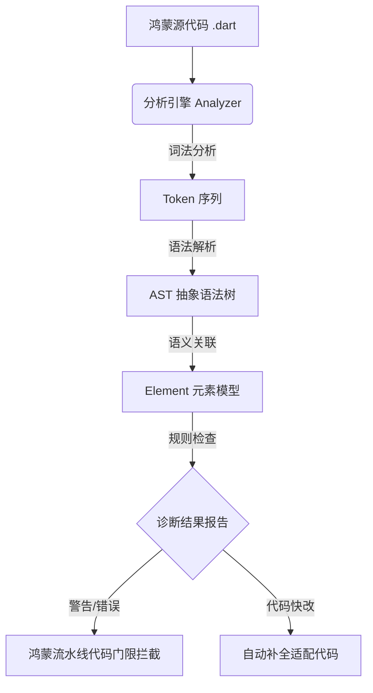

欢迎加入开源鸿蒙跨平台社区：[https://openharmonycrossplatform.csdn.net](https://openharmonycrossplatform.csdn.net)。

# Flutter for OpenHarmony：analyzer — 鸿蒙代码质量的“数字显微镜”


## 前言

在鸿蒙（OpenHarmony）大型项目的持续迭代中，保障数万行代码的质量是极大的挑战。如何在大规模重构前快速定位过时的 API 调用？如何自动检测项目中是否存在未适配鸿蒙特性的代码片段？

`analyzer` 是 Dart 语言生态中最核心的库之一。它集成了词法分析、语法分析和静态分析的全套引擎。通过 `analyzer`，开发者可以深入代码底层，将其转化为抽象语法树（AST），并根据自定义规则进行“自动化诊断”。在 Flutter for OpenHarmony 的企业级治理中，它是构建自定义 Lint 规则、代码自动改写工具（Codemod）及 IDE 插件的基石。

## 一、原理解析 / 概念介绍

### 1.1 基础模型

`analyzer` 库将普通的 `.dart` 文本文件解析为结构化的 AST 树，并附加类型推断等语义信息。



### 1.2 核心价值

- **深度代码洞察**：能够识别类、函数、变量的作用域和调用链。
- **自定义校验规则**：开发者可以编写专属的鸿蒙 Lint 规则（例如：强制所有 `Platform` 判断必须包含鸿蒙检测分枝）。
- **工具链支柱**：`dart fix`、`dart doc` 以及 DevEco 中的代码提示全部依赖此库。

## 二、核心 API / 工具详解

### 2.1 依赖引入

通常作为工具工程或插件开发包引入：

```yaml
dependencies:
  analyzer: ^6.0.0 # 建议根据 Flutter SDK 版本匹配使用
```

### 2.2 要点讲解

💡 **技巧**：在鸿蒙端扫描违规 API 时，通过访问 `AstVisitor` 是最优雅的做法。

```dart
import 'package:analyzer/dart/ast/ast.dart';
import 'package:analyzer/dart/ast/visitor.dart';

// ✅ 推荐做法：继承并重写访问器
class HarmonyForbiddenApiVisitor extends RecursiveAstVisitor<void> {
  @override
  void visitMethodInvocation(MethodInvocation node) {
    if (node.methodName.name == 'iosOnlyFunction') {
       print('⚠️ 警告：检测到苹果私有 API 调用，请适配鸿蒙分枝！位置: ${node.offset}');
    }
    super.visitMethodInvocation(node);
  }
}
```

## 三、典型应用场景

### 3.1 场景一：鸿蒙专项代码合规性扫描
自动化脚本扫描所有 `Network` 相关代码，确保使用了已适配鸿蒙安全协议的封装类。

### 3.2 场景二：自动化代码转换工具
当鸿蒙 Flutter 引擎发生重大升级（Breaking Change）时，利用 `analyzer` 配合 `analyzer_rewriter` 批量自动修改数十个包的 API 调用方式。

## 四、OpenHarmony 平台适配挑战

### 4.1 分析性能与资源占用
解析数千个文件构成的 AST 树会消耗极大的 CPU 和内存。

✅ **适配建议**：
1. **增量分析**：在鸿蒙开发流程中，尽量仅对 Git 增量代码进行 AST 扫描。
2. **多线程并行**：利用 `analyzer` 内部的分析上下文分时分段加载，避免因扫描过重导致开发机崩溃。

## 五、综合实战演示

下面是一个演示如何读取一个鸿蒙源文件并列出其中所有定义的类名的简单脚本：

```dart
import 'package:analyzer/dart/analysis/utilities.dart';
import 'package:analyzer/dart/ast/ast.dart';

void analyzeHarmonySource(String path) {
  final result = parseFile(path: path);
  final CompilationUnit unit = result.unit;

  print('开始分析鸿蒙模块: $path');
  
  for (var declaration in unit.declarations) {
    if (declaration is ClassDeclaration) {
      print('发现定义的类: ${declaration.name.lexeme}');
    }
  }
}

// 模拟运行：
// analyzeHarmonySource('lib/pages/harmony_home.dart');
```

## 六、总结

`analyzer` 让代码变得“透明且可操控”。它不仅是编译器的核心，更是鸿蒙大型项目持续演进的“质量保证官”。

✅ **核心建议**：
1. **结合 Analysis Server**：如果需要实时反馈，应结合 LSP 协议在鸿蒙编辑环境下提供 UI 警告。
2. **版本对齐**：由于 Dart 语法在不断演进，确保你的 `analyzer` 库版本与鸿蒙端使用的 Flutter SDK 版本高度一致。

📦 **参考源码**：代码模板已提交至鸿蒙跨平台社区。

🌐 **欢迎加入**：[开源鸿蒙跨平台开发者社区](https://openharmonycrossplatform.csdn.net)
