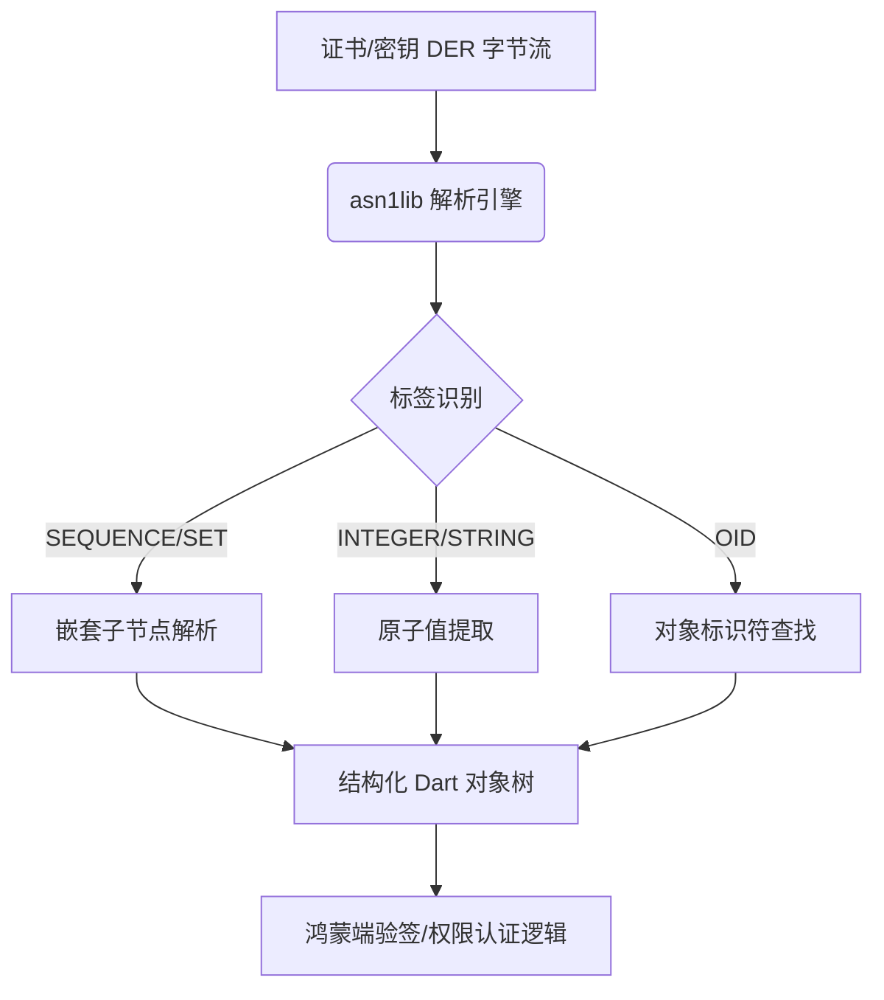

欢迎加入开源鸿蒙跨平台社区：[https://openharmonycrossplatform.csdn.net](https://openharmonycrossplatform.csdn.net)。

# Flutter for OpenHarmony：asn1lib — 深入协议底层安全之翼


## 前言

在鸿蒙（OpenHarmony）生态进军金融、政务和物联网领域时，开发者经常会接触到 SSL/TLS、数字证书（X.509）、以及各种复杂的安全认证协议。这些协议在底层通常使用一种名为 ASN.1（Abstract Syntax Notation One）的标记语言进行描述。

`asn1lib` 是一个专注于 ASN.1 BER/DER 格式编解码的库。在 Flutter for OpenHarmony 的工程化过程中，它是解析数字证书、处理公私钥 DER 编码以及适配特定工业级安全标准的关键基础设施，助力鸿蒙应用构建符合国家安全规范的加密链路。

## 一、原理解析 / 概念介绍

### 1.1 基础模型

ASN.1 将数据结构化为一种嵌套的、打标签的二进制格式，包含类型定义、长度和具体数值。



### 1.2 核心要点

- **全面覆盖标识符**：支持标准的序列（Sequence）、整型、布尔值及多层嵌套结构。
- **高性能编解码**：针对嵌入式和手机端进行了内存优化。
- **鸿蒙适配性**：由于是纯 Dart 逻辑，完美规避了鸿蒙平台对某些二进制交互的沙箱限制，直接在 Dart VM 层级完成协议解析。

## 二、核心 API / 工具详解

### 2.1 依赖引入

在鸿蒙工程的 `pubspec.yaml` 中添加依赖：

```yaml
dependencies:
  asn1lib: ^1.5.0
```

### 2.2 要点讲解

💡 **技巧**：在鸿蒙端处理证书解析时，建议先通过 `ASN1Parser` 获取顶层对象。

```dart
import 'package:asn1lib/asn1lib.dart';
import 'dart:typed_data';

void parseHarmonyCert(Uint8List derBytes) {
  // ✅ 推荐做法：使用解析器
  final parser = ASN1Parser(derBytes);
  final root = parser.nextObject() as ASN1Sequence;

  // 展开后续节点
  for (var element in root.elements) {
    print('找到 ASN1 类型: ${element.tag}');
  }
}
```

## 三、典型应用场景

### 3.1 场景一：鸿蒙电子公文签名解析
在阅读带数字签名的政府电子公文时，利用 `asn1lib` 从文档末尾提取签章信息。

### 3.2 场景二：工业物联网（IIoT）接入
针对一些旧有的、基于 ASN.1 协议标准的鸿蒙传感器网关执行数据透传与鉴权。

## 四、OpenHarmony 平台适配挑战

### 4.1 大数据解析性能
对于极大的证书链或 CRL（证书撤销列表），在鸿蒙初级硬件上可能会出现主线程卡顿。

✅ **适配建议**：
1. **异步计算流**：将 `ASN1Parser` 放入 `compute` 或鸿蒙端的并发任务中，防止大文件的解析阻塞 UI 心跳。
2. **字节流池化**：鸿蒙端建议严格限制 `Uint8List` 的拷贝次数，直接在原始缓冲区内操作，能显著提升协议解析效率。

## 五、综合实战演示

下面是一个解析简单 ASN.1 序列数据的示例：

```dart
import 'package:asn1lib/asn1lib.dart';

void harmonyAsnDemo() {
  // 1. 手动构建一个包含版本号和名字的 ASN1 结构
  final seq = ASN1Sequence();
  seq.add(ASN1Integer(BigInt.from(3))); // 协议版本 V3
  seq.add(ASN1UTF8String('OpenHarmony-Secure-Node'));

  final encoded = seq.encodedBytes;
  print('编码后的二进制: $encoded');

  // 2. 解码操作
  final decodedParser = ASN1Parser(encoded);
  final decodedSeq = decodedParser.nextObject() as ASN1Sequence;
  
  final version = decodedSeq.elements[0] as ASN1Integer;
  final nodeName = decodedSeq.elements[1] as ASN1UTF8String;

  print('解析成功！版本为: ${version.valueAsBigInteger}, 节点名为: ${nodeName.stringValue}');
}
```

## 六、总结

`asn1lib` 是鸿蒙开发者深入底层通信与安全内核的必备阶梯。相比于直接操作 raw bytes，它让协议适配变得更加人性化。

✅ **核心建议**：
1. **严格校验逻辑**：在解析外部输入的 DER 字节流前，先检查数据长度，防止非预期的缓冲区溢出。
2. **文档同步**：建立完善的 ASN.1 OID 映射表，确保在鸿蒙端展现出更有业务意义的字段名称。

📦 **代码参考**：已上传至鸿蒙跨平台社区 AtomGit 仓库。

🌐 **欢迎加入**：[开源鸿蒙跨平台开发者社区](https://openharmonycrossplatform.csdn.net)
