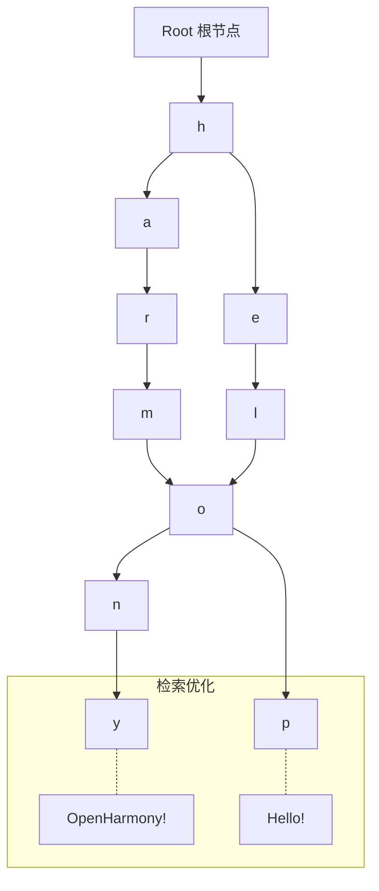

欢迎加入开源鸿蒙跨平台社区：[https://openharmonycrossplatform.csdn.net](https://openharmonycrossplatform.csdn.net)。

# Flutter for OpenHarmony：autotrie — 毫秒级关键词检索利器


## 前言

在鸿蒙（OpenHarmony）应用中，搜索功能是用户交互的最高频入口之一。当用户在搜索框中键入一个字符时，应用需要瞬间从海量的词库（可能是数万条商品名称、城市列表或联系人）中筛选出匹配的前缀，并提供联想建议。

传统的列表遍历在面对大规模数据时会出现明显的卡顿甚至导致鸿蒙 UI 线程掉帧。`autotrie` 采用了一种极其高效的 Trie 树（字典树）数据结构，专为前缀匹配检索而生。在 Flutter for OpenHarmony 的工程化过程中，它能确保搜索建议在大数据量场景下依然保持丝滑般顺畅。

## 一、原理解析 / 概念介绍

### 1.1 基础模型

Trie 树通过将字符串拆分为单个字符并构建层次化路径，实现了时间复杂度仅为 O(k)（k 为关键词长度）的检索效率。



### 1.2 核心特性

- **高效前缀匹配**：无论词库多大，匹配速度只取决于输入的字符长度。
- **自定义权重**：支持为不同关键词设置优先级，让最热门的鸿蒙搜索项排在前面。
- **轻量级实现**：纯 Dart 逻辑，无原生依赖，完美适配鸿蒙各终端。

## 二、核心 API / 工具详解

### 2.1 依赖引入

在鸿蒙工程的 `pubspec.yaml` 中添加以下依赖：

```yaml
dependencies:
  autotrie: ^1.1.0
```

### 2.2 要点讲解

💡 **技巧**：在鸿蒙端初始化时，建议预先加载词库并完成 Trie 树的构建。

```dart
import 'package:autotrie/autotrie.dart';

void initHarmonySearch() {
  // ✅ 推荐做法：创建并填充 Trie 树
  final trie = AutoTrie();
  
  trie.add('鸿蒙系统');
  trie.add('华为手机');
  trie.add('Flutter开发');

  // 执行匹配
  List<String> results = trie.find('鸿蒙');
  print('检索结果: $results'); // ['鸿蒙系统']
}
```

## 三、典型应用场景

### 3.1 场景一：鸿蒙商城搜索联想
支持在用户输入时，动态响应并弹出匹配的商品名或分类。

### 3.2 场景二：代码/文本编辑器补全
针对鸿蒙端的轻量级文档编辑器或代码查看器，提供常用词汇的自动完成功能。

## 四、OpenHarmony 平台适配挑战

### 4.1 初次构建性能
虽然检索极快，但在鸿蒙端一次性将几万条记录插入 Trie 树时，可能会占用一定的 CPU 时间。

✅ **适配建议**：
1. **分段加载**：对于超大静态词库，建议在应用启动后的后台 `Isolate` 中构建 Trie 树，构建完成后再通过消息传递回 UI 线程使用。
2. **序列化缓存**：建议将构建好的 Trie 结构序列化存储在鸿蒙本地偏好设置或数据库中，下次启动时直接恢复，避免重新构建循环。

## 五、综合实战演示

下面是一个模拟鸿蒙手机联系人快速搜索的实战组件：

```dart
import 'package:flutter/material.dart';
import 'package:autotrie/autotrie.dart';

class HarmonySearchLab extends StatefulWidget {
  const HarmonySearchLab({super.key});

  @override
  State<HarmonySearchLab> createState() => _HarmonySearchLabState();
}

class _HarmonySearchLabState extends State<HarmonySearchLab> {
  final AutoTrie _trie = AutoTrie();
  List<String> _suggestions = [];

  @override
  void initState() {
    super.initState();
    // ✅ 预置鸿蒙社区关键词
    for (var item in ['OpenHarmony', 'ArkUI', 'HarmonyOS', 'DevEco']) {
      _trie.add(item);
    }
  }

  void _onInputChanged(String val) {
    setState(() {
      _suggestions = val.isEmpty ? [] : _trie.find(val);
    });
  }

  @override
  Widget build(BuildContext context) {
    return Column(
      children: [
        TextField(onChanged: _onInputChanged, decoration: const InputDecoration(hintText: '搜索鸿蒙关键词...')),
        Expanded(
          child: ListView.builder(
            itemCount: _suggestions.length,
            itemBuilder: (_, i) => ListTile(title: Text(_suggestions[i])),
          ),
        )
      ],
    );
  }
}
```

## 六、总结

`autotrie` 是鸿蒙开发者打磨极致交互体验的必修课建议。它将底层的复杂算法转化为易用的 API，让“即时搜索”不再是负担。

✅ **核心建议**：
1. **区分大小写**：根据业务需求合理设置 `caseSensitive` 参数。
2. **结果限制**：建议在 UI 展示时仅取前 5-10 条结果，防止列表过长影响鸿蒙屏幕布局。

📦 **代码参考**：已上传至 AtomGit。

🌐 **欢迎加入**：[开源鸿蒙跨平台开发者社区](https://openharmonycrossplatform.csdn.net)
