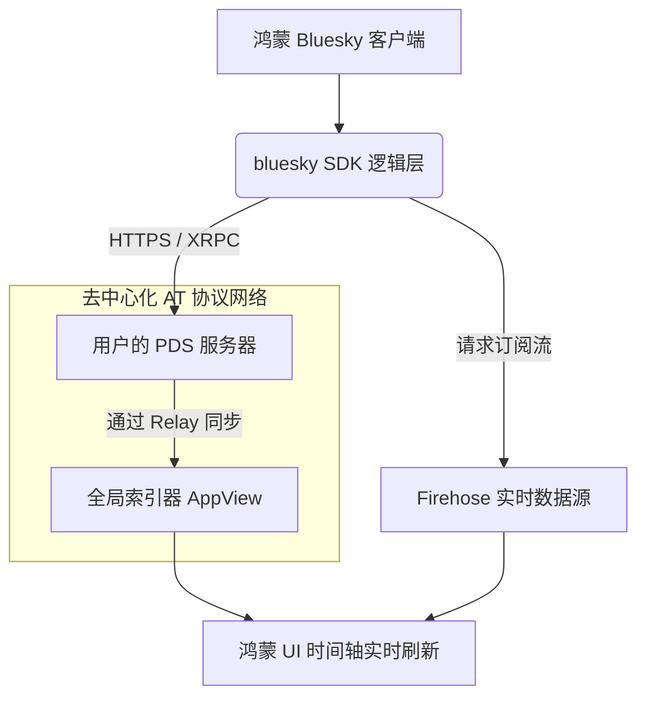

欢迎加入开源鸿蒙跨平台社区：[https://openharmonycrossplatform.csdn.net](https://openharmonycrossplatform.csdn.net)。

# Flutter for OpenHarmony：bluesky — 拥抱去中心化社交时代


## 前言

随着去中心化社交网络（Decentralized Social Networks）的兴起，Bluesky 及其背后的 AT Protocol（Authenticated Transfer Protocol）成为了技术圈关注的焦点。对于鸿蒙（OpenHarmony）开发者而言，将这种新型的社交模式引入鸿蒙生态，不仅能为用户提供更具自主权的社交体验，更是应用国际化和前瞻性布局的重要尝试。

`bluesky` 是一款功能完备的 Dart SDK，它深度封装了 AT Protocol 的核心逻辑，支持账户管理、Timeline 浏览、媒体上传以及复杂的词典（Lexicon）操作。在 Flutter for OpenHarmony 的工程化适配中，`bluesky` 能够帮助我们快速构建支持去中心化特性的鸿蒙社交应用客户端。

## 一、原理解析 / 概念介绍

### 1.1 基础模型

AT Protocol 采用了一种基于 PDS（Personal Data Server）的架构，数据由用户自主掌控并非中心化服务器。



### 1.2 核心特性

- **XRPC 通信封装**：将复杂的 JSON 请求封装为类型安全的 Dart 函数调用。
- **丰富的实体类**：包含帖子、个人资料、记录、通知等全量 Lexicon 的定义。
- **令牌自动刷新**：内置 Session 管理机制，确保持续的登录状态。

## 二、核心 API / 工具详解

### 2.1 依赖引入

在鸿蒙工程的 `pubspec.yaml` 中添加：

```yaml
dependencies:
  bluesky: ^0.1.0 # 建议根据最新版本调整
```

### 2.2 要点讲解

💡 **技巧**：在鸿蒙端初始化时，首要步骤是建立 Session 连接。

```dart
import 'package:bluesky/bluesky.dart' as bsky;

Future<void> connectToBluesky() async {
  // ✅ 推荐做法：通过服务地址和凭证登录
  final bluesky = bsky.Bluesky.fromSession(
    await bsky.createSession(
      service: 'bsky.social',
      identifier: 'harmony.user',
      password: 'mypassword',
    ),
  );

  // 执行发布操作
  final response = await bluesky.feed.post(text: '来自鸿蒙端的第一条去中心化社交消息！');
  print('发布成功，记录 ID: ${response.data.uri}');
}
```

## 三、典型应用场景

### 3.1 场景一：跨平台去中心化微博
构建一款可在鸿蒙手机、平板上流转的去中心化社交客户端，利用 `bluesky` SDK 统一各端的数据同步逻辑。

### 3.2 场景二：分布式的社区广播
在鸿蒙社区集成 Bluesky 的消息流，作为去中心化的官方公告发布系统，提高信息透明度。

## 四、OpenHarmony 平台适配挑战

### 4.1 网络环境与安全认证
AT Protocol 涉及大量的 HTTPS 握手与 JWT 验证。

✅ **适配建议**：
1. **统一网络配置**：确保鸿蒙端的 `OHOS_NETWORK` 权限已正确配置，考虑到 AT 协议的全球特性，应注意鸿蒙端对跨域访问的精细化管控。
2. **多账号安全存储**：用户的 App Password 绝对不能明文存储。建议结合 `flutter_secure_storage` 将其保存在鸿蒙原生的安全存储（HUKS）中。

## 五、综合实战演示

下面演示了一个如何在鸿蒙端实现简单的 TimeLine 列表获取：

```dart
import 'package:flutter/material.dart';
import 'package:bluesky/bluesky.dart' as bsky;

class HarmonySocialLab extends StatelessWidget {
  const HarmonySocialLab({super.key});

  @override
  Widget build(BuildContext context) {
    return FutureBuilder(
      future: null, // 这里应传入实际的 bsky.atproto.repo.getRecord 调用
      builder: (context, snapshot) {
        return Scaffold(
          appBar: AppBar(title: const Text('去中心化社交实验室')),
          body: ListView(
            children: const [
              ListTile(
                leading: CircleAvatar(child: Icon(Icons.person)),
                title: Text('鸿蒙开发者 001'),
                subtitle: Text('正在研究 AT Protocol 适配中...'),
              ),
              // 基于 SDK 返回的数据渲染更多帖子
            ],
          ),
        );
      },
    );
  }
}
```

## 六、总结

`bluesky` SDK 为鸿蒙开发者打开了下一代社交网络的“大门”。通过解构社交协议，它让鸿蒙应用也能在去中心化的浪潮中争得一席之地。

✅ **核心建议**：
1. **利用实时流**：配合订阅 `Firehose` 接口，在鸿蒙端实现毫秒级的消息推送体验。
2. **遵守社区规范**：在构建客户端时，务必遵循各 PDS 节点的频率控制策略，避免因请求过载导致鸿蒙 IP 暂时被封。

📦 **参考资源**：更多源码请参考 CSDN 开源鸿蒙跨平台社区。

🌐 **欢迎加入**：[开源鸿蒙跨平台开发者社区](https://openharmonycrossplatform.csdn.net)
