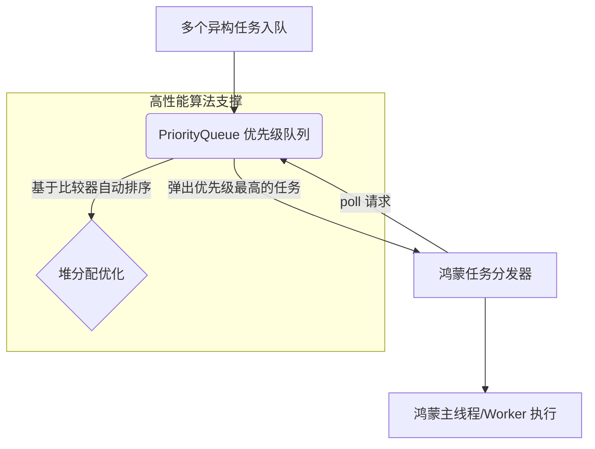

欢迎加入开源鸿蒙跨平台社区：[https://openharmonycrossplatform.csdn.net](https://openharmonycrossplatform.csdn.net)。

# Flutter for OpenHarmony：collection — 构建复杂容器的“百宝箱”


## 前言

在鸿蒙（OpenHarmony）应用开发中，数据结构的选择往往决定了逻辑的成败。当标准的 `List`、`Set`、`Map` 无法满足更高级的需求（例如：需要一个自动按优先级排序的任务队列，或者需要判断两个深度嵌套的 Map 是否完全一致）时，开发者就需要引入更强大的集合支持。

`collection` 是 Dart 官方维护的最核心基础库之一。它不仅补充了大量缺失的容器类型（如 `PriorityQueue`、`Heap`），还为原生集合提供了极其丰富的扩展工具类（如 `ListEquality`、`CanonicalizedMap`）。在 Flutter for OpenHarmony 的底层架构实践中，它是处理复杂业务逻辑、优化检索效率的必备“基石”。

## 一、原理解析 / 概念介绍

### 1.1 基础模型

`collection` 提供了多种特殊用途的容器，其中最典型的是基于堆排序的优先级队列。



### 1.2 核心要点

- **补充容器类型**：填补了 `List` 无法实现自动排队的空白。
- **深度对比工具**：提供了超越引用对比的 `DeepCollectionEquality`，在处理鸿蒙 UI 状态 diff 时极其有用。
- **高效的分组算法**：支持通过 `groupBy` 快速对大规模列表进行聚类。

## 二、核心 API / 工具详解

### 2.1 依赖引入

在鸿蒙工程的 `pubspec.yaml` 中添加以下依赖：

```yaml
dependencies:
  collection: ^1.18.0
```

### 2.2 要点讲解

💡 **技巧**：在鸿蒙端处理多任务调度时，`PriorityQueue` 能让逻辑极其丝滑。

```dart
import 'package:collection/collection.dart';

void harmonyQueueDemo() {
  // ✅ 推荐做法：创建带自定义权重的优先级队列
  final queue = PriorityQueue<int>((a, b) => b.compareTo(a)); // 从大到小排列

  queue.add(10);
  queue.add(5);
  queue.add(100);

  // 始终弹出最大值
  while (queue.isNotEmpty) {
    print('正在执行鸿蒙高优先级任务: ${queue.removeFirst()}');
  }
}
```

## 三、典型应用场景

### 3.1 场景一：鸿蒙端分布式设备发现
当同时扫描到多个鸿蒙设备时，通过 `PriorityQueue` 根据信号强度（RSSI）自动排序，将连接最稳定的设备排在最前供用户选择。

### 3.2 场景二：复杂 UI 的 Immutable 对比
在处理 BLoC 或 Riverpod 的状态变更时，利用该库对复杂的 `Map<String, dynamic>` 进行深度内容对比，确保鸿蒙界面仅在业务字段值改变时重绘。

## 四、OpenHarmony 平台适配挑战

### 4.1 内存与大数据量的均衡
有些特定集合（如 `CanonicalizedMap`）会通过缓存键值来换取查询速度。

✅ **适配建议**：
1. **控制缓存规模**：在鸿蒙端处理大数据采集记录时，如果数据量级超过万级，建议手动限制集合深度，防止由于 `collection` 内部引用池过大导致的内存抖动。
2. **组合扩展函数**：多利用 `firstWhereOrNull` 等扩展，能让处理鸿蒙本地数据库结果的代码更加精简且抗风险（防止抛出 `StateError`）。

## 五_、综合实战演示

下面是一个演示如何在鸿蒙端利用该库进行深度对象对比的例子：

```dart
import 'package:flutter/material.dart';
import 'package:collection/collection.dart';

class HarmonyCollectionLab extends StatelessWidget {
  const HarmonyCollectionLab({super.key});

  @override
  Widget build(BuildContext context) {
    // 模拟两个内容相同但引用不同的配置
    final configA = {'theme': 'dark', 'langs': ['zh', 'en']};
    final configB = {'theme': 'dark', 'langs': ['zh', 'en']};

    // 标准 == 会返回 false
    // ✅ 利用 collection 库进行深度判定
    final bool isDeepEqual = const DeepCollectionEquality().equals(configA, configB);

    return Scaffold(
      appBar: AppBar(title: const Text('算法集合实验室')),
      body: Center(
        child: Column(
          children: [
            const Icon(Icons.compare_arrows, size: 80, color: Colors.orange),
            Text('引用对比: ${configA == configB} (False)'),
            Text('深度内容对比: $isDeepEqual (True)', 
                 style: const TextStyle(fontSize: 22, fontWeight: FontWeight.bold)),
          ],
        ),
      ),
    );
  }
}
```

## 六、总结

`collection` 是鸿蒙开发者武器库里的“重火器”。它不仅提供了更高效率的算法实现，更让本来复杂的容器操作变得符合直觉。

✅ **核心建议**：
1. **多看 API 文档**：该库中包含许多隐形的便捷方法（如 `sumBy`），能显著减少你的业务循环代码。
2. **结合 Linq 风格**：配合 `extension` 增强后的集合方法，能写出极具函数式韵味的鸿蒙业务逻辑。

📦 **参考源码**：见 AtomGit 示例。

🌐 **欢迎加入**：[开源鸿蒙跨平台开发者社区](https://openharmonycrossplatform.csdn.net)
