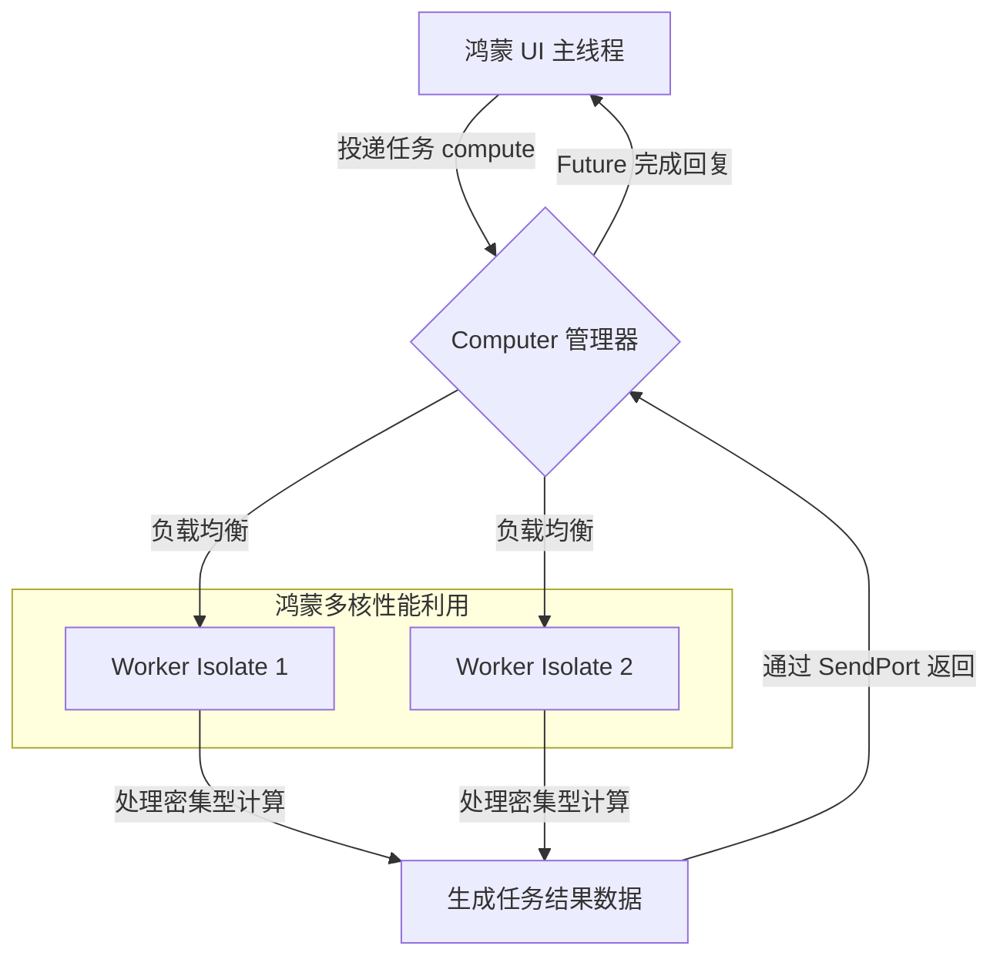

欢迎加入开源鸿蒙跨平台社区：[https://openharmonycrossplatform.csdn.net](https://openharmonycrossplatform.csdn.net)。

# Flutter for OpenHarmony：computer — 解放鸿蒙 UI 主线程


## 前言

在鸿蒙（OpenHarmony）应用开发中，流畅度（Fluency）是用户体验的第一准则。由于 Flutter 的 UI 渲染运行在单个主隔离区（Main Isolate）中，如果开发者在此线程中执行过重的任务（如解析 10MB 的 JSON、复杂的加解密运算、或者是大量图片的像素级处理），会导致界面出现明显的掉帧或卡顿（Jank）。

`computer` 是一个精心设计的、能够显著简化单进程多线程并发操作的库。它封装了复杂的 `Isolate` 创建与通信逻辑，让开发者能够像调用普通异步函数一样，将 CPU 密集型任务分发到后台线程。在 Flutter for OpenHarmony 的深度性能优化阶段，`computer` 是每一位高级开发者的必备工具。

## 一、原理解析 / 概念介绍

### 1.1 基础模型

`computer` 内部维护了一组活动的 `Isolate`（工作线程池），通过消息管道实现主线程与后台线程的任务交换。



### 1.2 核心要点

- **线程池复用**：不同于常规的一次性 `compute` 函数，`computer` 支持复用 Isolate，极大减小了线程频繁创建与销毁的开销。
- **类型安全**：支持通过泛型定义输入与输出，减少类型强转带来的潜在 Bug。
- **自动生命周期**：支持手动开启和关闭（turnOn/turnOff），让资源管理更加精细化。

## 二、核心 API / 工具详解

### 2.1 依赖引入

在鸿蒙工程的 `pubspec.yaml` 中添加以下依赖：

```yaml
dependencies:
  computer: ^1.0.1
```

### 2.2 要点讲解

💡 **技巧**：建议将 `Computer` 实例作为单例，并在鸿蒙应用启动初期进行预开启。

```dart
import 'package:computer/computer.dart';

// ✅ 推荐做法：初始化线程池
final harmonyWorker = Computer();

Future<void> initHarmonyIsolates() async {
  await harmonyWorker.turnOn(
    workersCount: 2, // 根据鸿蒙设备的 CPU 核心数灵活设置
  );
}
```

## 三、典型应用场景

### 3.1 场景一：离线地图瓦片解析
针对鸿蒙设备存储在本地的大量地图矢量数据，利用后台线程进行多线程解码，确保地图滑动过程中 UI 无卡顿。

### 3.2 场景二：后台大量日志上传清洗
在鸿蒙应用闲置时，利用 `computer` 对积压的业务日志进行过滤和压缩，防止上传过程占用用户操作带宽。

## 四、OpenHarmony 平台适配挑战

### 4.1 内存隔离问题
由于 Isolate 之间是物理内存隔离的。

✅ **适配建议**：
1. **减少大数据拷贝**：不要在 `computer` 的输入输出中传输过于巨大的复杂对象。建议传输序列化后的 `Uint8List` 或简单的字符串。
2. **处理鸿蒙系统调度**：在鸿蒙低能耗模式下，多线程可能会被系统限频。应做好任务超时的预防处理，通过 `Future.timeout` 保证 UI 的响应。

## 五、综合实战演示

下面是一个演示如何在后台计算大规模数组平均值的例子：

```dart
import 'package:flutter/material.dart';
import 'package:computer/computer.dart';

// 💡 注意：计算函数必须是静态的或全局函数
double calculateAverage(List<double> data) {
  if (data.isEmpty) return 0;
  return data.reduce((a, b) => a + b) / data.length;
}

class HarmonyComputeLab extends StatelessWidget {
  const HarmonyComputeLab({super.key});

  @override
  Widget build(BuildContext context) {
    return Scaffold(
      appBar: AppBar(title: const Text('多线程计算中心')),
      body: Center(
        child: ElevatedButton(
          onPressed: () async {
            // 构造大数据
            final List<double> bigData = List.generate(1000000, (i) => i.toDouble());
            
            // ✅ 发送到后台计算
            final avg = await harmonyWorker.compute<List<double>, double>(
              calculateAverage,
              param: bigData,
            );
            
            print('鸿蒙端异步计算结果: $avg');
          },
          child: const Text('开始百万级数据运算'),
        ),
      ),
    );
  }
}
```

## 六、总结

`computer` 是提升鸿蒙应用运行“上限”的秘密武器。它通过合理的任务分发，让鸿蒙强大的多核性能能够真正为用户体验服务。

✅ **核心建议**：
1. **控制核心数**：在手机端建议设置 1-2 个 Worker，在平板或车机端可适当增加。
2. **异常捕获**：在后台执行逻辑中务必增加 `try-catch`，并及时将错误信号传回鸿蒙 UI 线程进行用户提示。

📦 **参考源码**：见 AtomGit。

🌐 **欢迎加入**：[开源鸿蒙跨平台开发者社区](https://openharmonycrossplatform.csdn.net)
