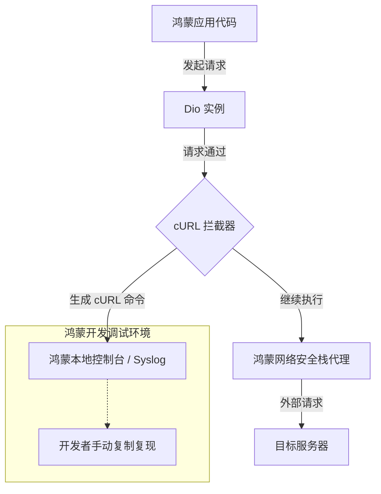

欢迎加入开源鸿蒙跨平台社区：[https://openharmonycrossplatform.csdn.net](https://openharmonycrossplatform.csdn.net)。

# Flutter for OpenHarmony：curl_logger_dio_interceptor — 网络调试黑科技


## 前言

在鸿蒙（OpenHarmony）应用开发过程中，排查后端接口问题往往占据了开发者大量的时间。当一个复杂的 POST 请求在鸿蒙真机上失败时，由于环境差异，开发者很难直接复制请求参数到 Postman 或桌面端浏览器进行复现。

`curl_logger_dio_interceptor` 是一个专为 `Dio` 网络库设计的拦截器。它的核心价值在于：能将每一个通过请求自动转化为标准的 `cURL` 命令并打印在控制台。这意味着你可以直接从 DevEco Studio 或命令行控制台复制该 cURL，并在终端瞬间重现鸿蒙端的请求现场。

## 一、原理解析 / 概念介绍

### 1.1 基础模型

该库作为 Dio 拦截器链的一环，在请求发起前或结束后，通过读取 `RequestOptions` 中的方法、头部、数据和查询参数，格式化为符合 Bash 语法的字符串。



### 1.2 核心价值

- **跨环境复现**：完美消除鸿蒙端与后端开发环境的“信息差”。
- **无侵入性**：仅需在初始化 Dio 时添加一行代码，无需修改任何业务逻辑。
- **敏感信息脱敏**：支持自定义设置，保护鸿蒙应用中的用户鉴权 Token 不被随意打印。

## 二、核心 API / 工具详解

### 2.1 依赖引入

在鸿蒙工程的 `pubspec.yaml` 中添加以下依赖：

```yaml
dependencies:
  dio: ^5.0.0
  curl_logger_dio_interceptor: ^1.0.0 # 建议使用稳定版本
```

### 2.2 要点讲解

💡 **技巧**：为了避免生产环境下泄露接口细节，建议仅在 Debug 模式下开启此拦截器。

```dart
import 'package:dio/dio.dart';
import 'package:curl_logger_dio_interceptor/curl_logger_dio_interceptor.dart';
import 'package:flutter/foundation.dart';

Dio createHarmonyDio() {
  final dio = Dio();

  // ✅ 推荐做法：通过 kDebugMode 判断
  if (kDebugMode) {
    dio.interceptors.add(CurlLoggerDioInterceptor(
      printOnSuccess: true, // 成功也打印，方便调试对照
    ));
  }
  
  return dio;
}
```

## 三、典型应用场景

### 3.1 场景一：后端接口联调
当对接鸿蒙原生服务接口出现报错时，直接把生成的 cURL 发给后端同学，让他们一键排查参数错误。

### 3.2 场景二：性能分析与重测
在鸿蒙低功耗设备上观察长耗时请求的结构，利用生成的 cURL 在高性能桌面机器上进行压测对比。

## 四、OpenHarmony 平台适配挑战

### 4.1 控制台输出限制
鸿蒙系统的 `Hilog` 或是 Flutter 在鸿蒙端的 `debugPrint` 对单行日志长度可能有上限（例如 1024 或 4096 字节）。

✅ **适配建议**：
1. **自动截断过滤**：针对带超大 Base64 图片数据的 POST 请求，建议通过拦截器参数跳过打印 body 部分，防止日志崩溃或关键调试信息被冲掉。
2. **字符集转义**：确保 cURL 中的中文字符在鸿蒙控制台能够正常显示，通常该库已处理好 UTF-8 的兼容。

## 五、综合实战演示

下面演示了一次带 Header 的模拟请求，以及在控制台你会看到的输出效果：

```dart
Future<void> testHarmonyApi() async {
  final dio = createHarmonyDio();
  
  try {
    await dio.get(
      'https://api.harmony.example/v1/user',
      queryParameters: {'type': 'tester'},
      options: Options(headers: {'Harmony-Token': 'shield-12345'}),
    );
  } catch (e) {
    // 错误处理逻辑
  }
}
```

**控制台此时会输出：**

```bash
curl --location --request GET 'https://api.harmony.example/v1/user?type=tester' \
--header 'Harmony-Token: shield-12345' \
--header 'Content-Type: application/json'
```

开发者只需复制这一段到终端即可。

## 六、总结

`curl_logger_dio_interceptor` 是助力鸿蒙开发者在繁琐网络通信中“拨云见日”的小而美工具。通过将复杂的对象操作转化为直观的脚本命令，它极大地压缩了 Bug 定位的时间。

✅ **核心建议**：
1. **配置白名单**：对于极敏感的接口（如支付），建议通过代码判断跳过拦截器。
2. **配合 IDE 使用**：在 DevEco Studio 的 Log 窗口利用关键字 `curl` 快速过滤，能显著提高筛选效率。

📦 **参考资源**：代码已开源并托管至 AtomGit。

🌐 **欢迎加入**：[开源鸿蒙跨平台开发者社区](https://openharmonycrossplatform.csdn.net)
