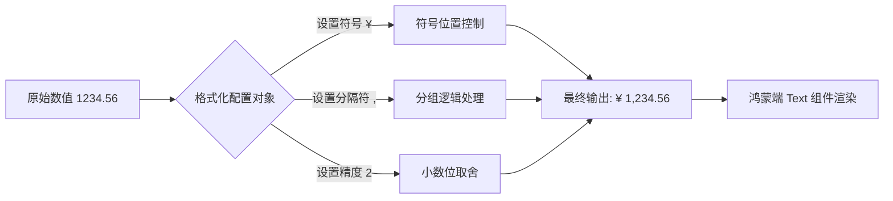

欢迎加入开源鸿蒙跨平台社区：[https://openharmonycrossplatform.csdn.net](https://openharmonycrossplatform.csdn.net)。

# Flutter for OpenHarmony：currency_formatter — 全球化财务适配方案


## 前言

在鸿蒙（OpenHarmony）生态进军全球市场的进程中，金融支付与电商应用是其中的重要组成部分。对于这类应用而言，准确、合规地展示不同国家和地区的货币格式（如人民币、美元、欧元等）不仅关乎用户体验，更是业务严谨性的体现。

`currency_formatter` 是一个轻量且功能强大的货币格式化库，能够支持自定义符号、千位分隔符、精度控制等功能。在 Flutter for OpenHarmony 的跨平台开发中，它能帮助开发者快速实现复杂的货币显示逻辑，确保财务数据在鸿蒙各型设备上的完美呈现。

## 一、原理解析 / 概念介绍

### 1.1 基础模型

`currency_formatter` 主要是将数值型（num/double）数据转化为符合特定文化习俗的字符串。它通过定义 `CurrencyFormatterSettings` 来描述不同货币的排版规则。



### 1.2 进阶机制

- **灵活的符号定位**：支持前置、后置以及符号与数字间的间距调整。
- **动态语言敏感**：可以根据鸿蒙系统的本地化设置，动态切换货币符号与排版风格。

## 二、核心 API / 组件详解

### 2.1 依赖引入

在鸿蒙工程的 `pubspec.yaml` 中添加依赖：

```yaml
dependencies:
  currency_formatter: ^3.0.0
```

### 2.2 要点讲解

💡 **技巧**：在鸿蒙端处理多国货币时，建议预定义一个 `CurrencySettings` 的配置常量池，方便全局调用。

```dart
// ✅ 推荐做法：预设常用货币格式
class HarmonyCurrencyConfig {
  static const CurrencyFormatterSettings rmb = CurrencyFormatterSettings(
    symbol: '¥',
    symbolSide: SymbolSide.left,
    thousandSeparator: ',',
    decimalSeparator: '.',
    symbolSeparator: ' ',
  );

  static const CurrencyFormatterSettings usd = CurrencyFormatterSettings(
    symbol: '$',
    symbolSide: SymbolSide.left,
    thousandSeparator: ',',
    decimalSeparator: '.',
    symbolSeparator: '',
  );
}
```

## 三、典型应用场景

### 3.1 场景一：鸿蒙电商购物车结算
在结算页面展示总价时，根据用户选中的结算货币实时调整格式，确报价格清晰无误。

### 3.2 场景二：跨境财务报表
在平板或折叠屏的鸿蒙设备上，以高密度列表形式展示多币种流水，利用 `currency_formatter` 统一视觉对齐感。

## 四、OpenHarmony 平台适配挑战

### 4.1 字体自适应与排版
鸿蒙系统使用的 HarmonyOS Sans 字体对不同符号的宽度处理有所差异。

✅ **适配建议**：
1. **等宽字符处理**：在展示金额列表时，建议配合 `TextStyle(fontFamily: 'HarmonyOS_Sans_Monospaced')`，确保金额的小数位对齐。
2. **文本镜像支持（RTL）**：对于阿语等国家，货币符号位置可能需要反转，应结合鸿蒙提供的 `Directionality` 进行适配。

## 五、综合实战演示

下面是一个演示如何在鸿蒙端构建一个实时汇率换算并格式化显示的组件：

```dart
import 'package:flutter/material.dart';
import 'package:currency_formatter/currency_formatter.dart';

class CurrencyHarmonyLab extends StatelessWidget {
  const CurrencyHarmonyLab({super.key});

  @override
  Widget build(BuildContext context) {
    const double price = 9999.9;

    // 格式化处理逻辑
    String formattedPrice = CurrencyFormatter.format(
      price,
      HarmonyCurrencyConfig.rmb,
    );

    return Scaffold(
      appBar: AppBar(title: const Text('鸿蒙支付适配实验室')),
      body: Center(
        child: Column(
          mainAxisAlignment: MainAxisAlignment.center,
          children: [
            const Icon(Icons.account_balance_wallet, size: 80, color: Colors.blue),
            const SizedBox(height: 20),
            const Text('待支付总额：', style: TextStyle(fontSize: 18)),
            const SizedBox(height: 10),
            // ✅ 使用格式化后的金额
            Text(
              formattedPrice,
              style: const TextStyle(
                fontSize: 32,
                fontWeight: FontWeight.bold,
                color: Colors.redAccent,
              ),
            ),
            const SizedBox(height: 30),
            ElevatedButton(
              onPressed: () {
                 // 业务逻辑：发起鸿蒙端原生支付调用
              },
              child: const Text('立即在鸿蒙端结算'),
            ),
          ],
        ),
      ),
    );
  }
}
```

## 六、总结

`currency_formatter` 虽小，但在处理鸿蒙应用的全球化适配中起到了“画龙点睛”的作用。它有效地隔离了业务逻辑与格式化细节，让账单和价格的展示更加专业。

✅ **核心建议**：
1. **统一封装**：不要在 UI 代码中随处定义格式化规则，应建立统一的 `FormatterUtil`。
2. **结合系统语言**：在鸿蒙端初次启动时，建议通过 `PlatformDispatcher.instance.locale` 获取系统语言，从而自动匹配默认的货币配置。

📦 **完整示例**：代码已同步至开源社区。

🌐 **欢迎加入**：[开源鸿蒙跨平台开发者社区](https://openharmonycrossplatform.csdn.net)
