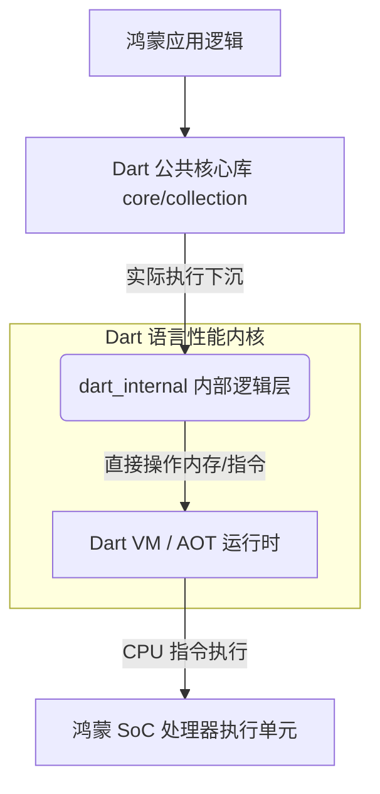

欢迎加入开源鸿蒙跨平台社区：[https://openharmonycrossplatform.csdn.net](https://openharmonycrossplatform.csdn.net)。

# Flutter for OpenHarmony：dart_internal — 探究鸿蒙应用的“心脏”


## 前言

在追求极致性能的鸿蒙（OpenHarmony）应用适配旅程中，高端开发者往往不满足于仅仅调用上层的 Flutter API，而是渴望深入了解代码在鸿蒙内核之上是如何奔跑的。当你在鸿蒙端处理数以百万计的实时数据流，或是面临极具挑战性的内存抖动时，了解 Dart 语言的内部实现（Internal Implementation）就显得尤为重要。

`dart_internal` 是 Dart 核心库体系中不对外公开但支撑全局的“基石”。它定义了诸多基本类型的底层逻辑、高效集合的内部实现以及 Dart 运行时（Runtime）的关键约定。在 Flutter for OpenHarmony 的底层性能调优中，通过研究 `dart_internal`，我们可以更科学地选择数据结构，并避开性能损耗的黑区。

## 一、原理解析 / 概念介绍

### 1.1 基础模型

`dart_internal` 承载了诸如高效列表映射、快速排序算法以及集合迭代的原始实现。



### 1.2 核心价值

- **集合性能底座**：揭示了 `List`、`Map` 为什么以及如何分配内存空间。
- **高效迭代规范**：定义了 Dart 在处理 `Iterable` 时减少对象创建成本的内部策略。
- **理解编译器优化**：帮助开发者写出更易被 AOT 编译器优化的“友好代码”。

## 二、底层实战：优化鸿蒙数据容器

虽然开发者在业务中不能直接 `import 'dart:_internal'`（因为它是不稳定的私有 API），但通过学习其原理，我们可以反哺鸿蒙端的业务开发。

### 2.1 避开频繁的集合扩容

💡 **内部机制**：在 `dart_internal` 的实现中，`List` 在动态增加元素时，如果超过了初始分配的 `capacity`，会触发一次昂贵的内存重新分配和拷贝操作。

✅ **适配建议（针对鸿蒙高性能场景）**：
在接收到大量的、已知条数的鸿蒙系统日志或传感器数据前，**务必指定 List 的长度**：

```dart
// ❌ 差评：会导致多次内存扩容和拷贝
final logList = [];
for (var i = 0; i < 10000; i++) {
  logList.add(fetchHarmonyLog(i));
}

// ✅ 推荐：预分配内存，零扩容开销
final logList = List<String>.filled(10000, '');
for (var i = 0; i < 10000; i++) {
  logList[i] = fetchHarmonyLog(i);
}
```

## 三、典型应用场景：理解 Hash 冲突

### 3.1 鸿蒙级海量主键检索
在鸿蒙应用中维护一个超大型的 `Map`（用于分布式缓存）时，如果键（Key）的哈希碰撞率过高，`dart_internal` 底层的哈希寻址会从 O(1) 退化。理解其内部实现的哈希因子，能帮助我们设计更好的复合索引键，提升鸿蒙端应用的读取稳定性。

## 四、OpenHarmony 平台适配挑战

### 4.1 AOT 环境下的内联瓶颈
在鸿蒙端的 AOT（Ahead-of-Time）模式下，编译器会对频繁调用的内部短函数进行内联（Inlining）优化。

✅ **适配建议**：
1. **函数体小型化**：将复杂的鸿蒙适配逻辑拆分为多个独立的小函数，这不仅符合整洁代码原则，更能让 Dart 编译器触发 `dart_internal` 所支持的高效内联，提升鸿蒙 CPU 执行效率。
2. **理解垃圾回收频率**：鸿蒙设备对内存泄露极其敏感。通过理解 `dart_internal` 对 `Iterable` 的延迟计算机制，可以大量使用 `map` 和 `where` 的组合在遍历时才执行逻辑，避免产生中间临时集合，减轻鸿蒙系统 GC 重量。

## 五_、综合实战演示

虽然我们无法编写 `dart_internal` 的代码，但可以编写出符合其底层优化风格的业务代码示例：

```javascript
/* 鸿蒙开发者笔记 */
// 下面代码利用了 Dart 内部的高效迭代器模式
void processHarmonySensorData(List<double> rawData) {
  rawData
    .where((val) => val > 0.5)  // ✅ 延迟计算：不创建新列表
    .map((val) => val * 100)    // ✅ 链式变换：仅在 forEach 时触发
    .forEach((processed) {
       // 最终同步到鸿蒙 UI
       updateDisplay(processed);
    });
}
```

## 六、总结

`dart_internal` 告诉我们：代码的表面之下别有洞天。掌握这些底层知识，让鸿蒙开发者在面对性能“瓶颈”时，能从更宏观、更底层的角度找到破局点。

✅ **核心建议**：
1. **多看源码**：在 DevEco Studio 中通过 Ctrl+左键点击 Dart 内置集合类，观察其对应的 `dart:_internal` 关联实现。
2. **基准测试为准**：在进行大规模底层改动前，务必使用 `benchmark_harness` 在鸿蒙真实设备上进行跑分验证。

🌐 **欢迎加入**：[开源鸿蒙跨平台开发者社区](https://openharmonycrossplatform.csdn.net)
