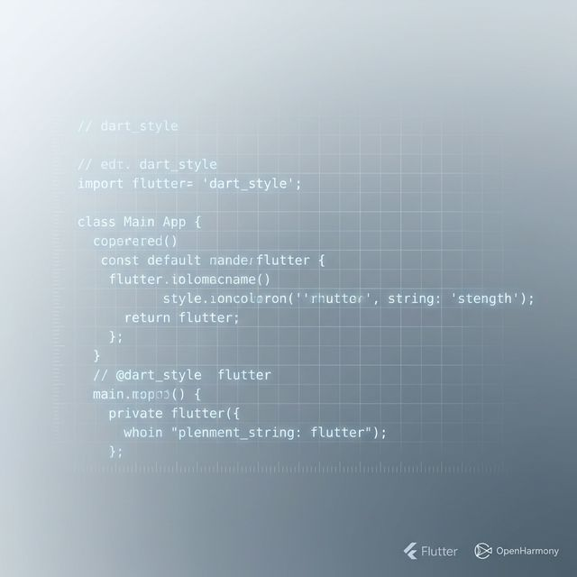
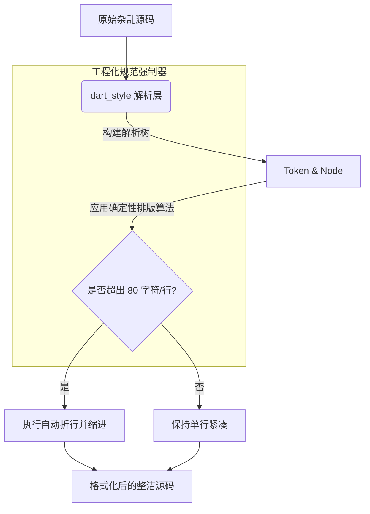

欢迎加入开源鸿蒙跨平台社区：[https://openharmonycrossplatform.csdn.net](https://openharmonycrossplatform.csdn.net)。

# Flutter for OpenHarmony：dart_style — 鸿蒙开发中的“秩序维护者”



## 前言

在鸿蒙（OpenHarmony）大型项目的多人协作中，代码风格的不统一是引发合并冲突（Merge Conflict）和降低 Code Review 效率的首要原因。有人喜欢两格缩进，有人喜欢四格；有人喜欢在 Widget 的末尾加逗号，有人则反其道而行。

`dart_style` 提供了一个官方推荐的、具有“强迫症风格”的代码格式化程序。它是 `dart format` 指令背后的灵魂所在。在 Flutter for OpenHarmony 的工程化体系中，强制落地 `dart_style` 规范，不仅能让鸿蒙应用的代码变得美观统一，更能通过消除非必要的空白字符差异，显著降低 Git 的代码流动复杂度。

## 一、原理解析 / 概念介绍

### 1.1 基础模型

`dart_style` 不仅仅是简单的正则查找替换，它先将代码解析为 AST，然后应用官方定义的布局算法进行重新编排。



### 1.2 核心价值

- **客观中立**：提供单一的规范，终结“括号位置”的无效争论。
- **一致性保障**：无论代码在谁的电脑上修改，格式化结果完全一致。
- **与 IDE 深度集成**：与 DevEco Studio 无缝融合，支持保存即格式化。

## 二、核心 API / 工具详解

### 2.1 依赖引入

在鸿蒙工程中，该工具通常内置在 SDK 中，也可以通过依赖包的形式作为脚本工具使用：

```yaml
dev_dependencies:
  dart_style: ^2.3.2
```

### 2.2 要点讲解

💡 **技巧**：在鸿蒙项目的 CI 流水线中，使用 `--set-exit-if-changed` 参数是监控代码质量的关键。

```bash
# ✅ 推荐做法：在本地终端一键格式化整个鸿蒙项目
dart format .

# 💡 CI 适配点：如果检测到代码未格式化，则让构建失败
dart format --output=none --set-exit-if-changed .
```

## 三、典型应用场景

### 3.1 场景一：Git Pre-commit 钩子
在代码提交到码云（Gitee）或 AtomGit 仓储库前，利用 `dart_style` 自动统一格式环境，确保团队仓库中的每一行代码都是极致整洁的。

### 3.2 场景二：代码生成器输出优化
在编写生成业务逻辑代码的工具时（如生成的鸿蒙 API 桥接层），利用 `dart_style` 对输出的字符串进行美化，让生成的代码也具备人工编写的可读性。

## 四_、OpenHarmony 平台适配挑战

### 4.1 自动折行对鸿蒙布局嵌套的影响
Flutter 的声明式 UI 嵌套极深，`dart_style` 的自动折行逻辑有时会导致视觉上的“超长垂直代码块”。

✅ **适配建议**：
1. **善用尾随逗号 (Trailing Commas)**：在鸿蒙 Widget 的构造函数最后一个参数后面加上逗号，`dart_style` 会将其格式化为每个参数占用一行的模式，这极大提升了嵌套 UI 树的可读性。
2. **遵守 80 字符准则**：虽然现代显示器很宽，但遵循 80 字符折行能有效提升在鸿蒙分布式设备小屏上阅读代码的体验。

## 五_、综合实战演示

下面是一个演示如何在鸿蒙端通过代码程序化调用格式化引擎的例子：

```dart
import 'package:dart_style/dart_style.dart';

void formatHarmonyCode() {
  const String unformattedCode = "void main() {  print('hello harmony');  int a=1;}";
  
  // ✅ 实例化格式化器
  final formatter = DartFormatter();

  try {
    // 执行格式化
    String formatted = formatter.format(unformattedCode);
    print('格式化后的鸿蒙代码:\n$formatted');
  } catch (e) {
    print('源码解析失败: $e');
  }
}
```

## 六、总结

`dart_style` 是鸿蒙开发者保持“卓越匠心”的辅助仪。它让开发者从对排版的纠结中解放出来，将精力全身心地投入到业务逻辑的构建中。

✅ **核心建议**：
1. **IDE 全员同步**：团队所有成员在 DevEco Studio 中开启 “Format on Save” 选项。
2. **规范文档对齐**：在鸿蒙项目的 `README.md` 中明确说明项目遵循的标准 Dart 规范，降低外部贡献者的门槛。

📦 **参考资源**：见项目根目录下的格式化配置文件。

🌐 **欢迎加入**：[开源鸿蒙跨平台开发者社区](https://openharmonycrossplatform.csdn.net)
