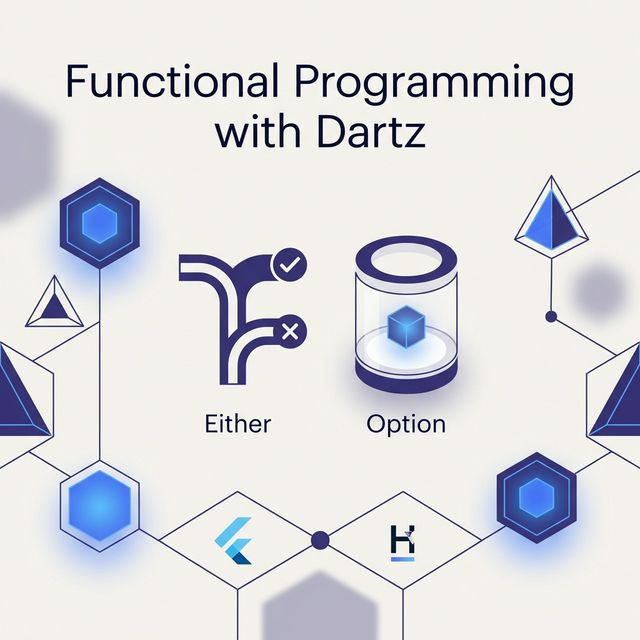
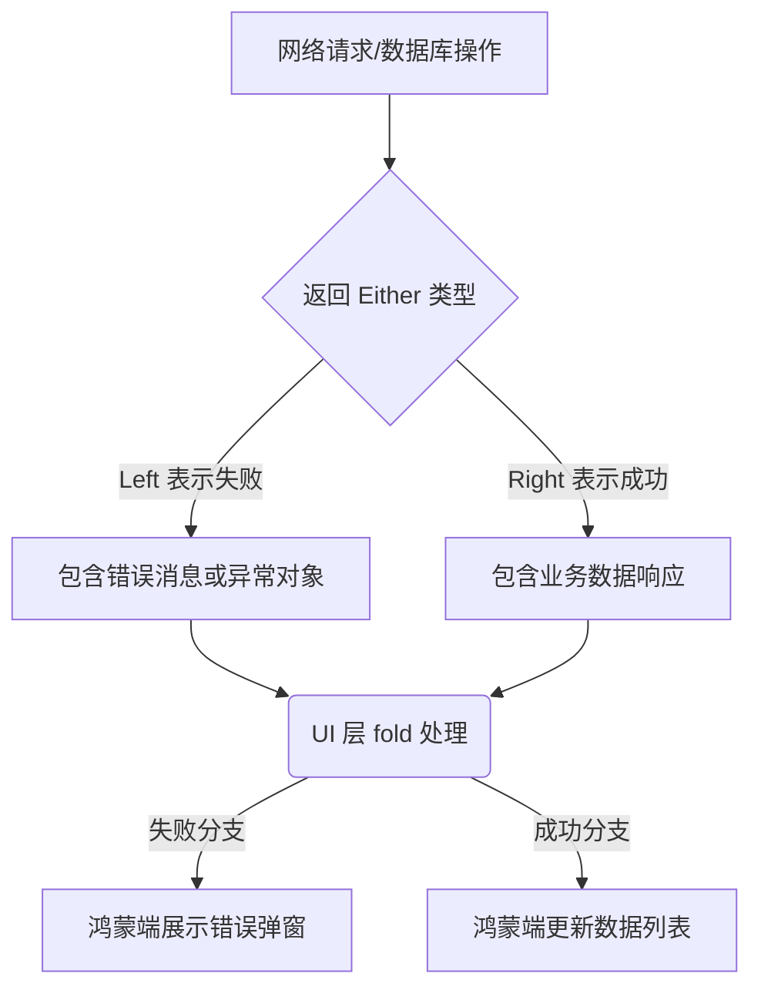

欢迎加入开源鸿蒙跨平台社区：[https://openharmonycrossplatform.csdn.net](https://openharmonycrossplatform.csdn.net)。

# Flutter for OpenHarmony：dartz — 函数式编程的健壮力量



## 前言

在鸿蒙（OpenHarmony）环境下的业务开发中，开发者面临的最头疼问题之一就是“异常处理”。传统的 `try-catch` 虽然能捕获错误，但往往会导致代码逻辑支离破碎，且难以保证所有分支都得到了正确处理。

`dartz` 为 Dart 带来了函数式编程（Functional Programming）的精髓。它提供的 `Either`、`Option` 等类型，让代码在表达逻辑时更加严谨和明确。在 Flutter for OpenHarmony 的大规模工程实践中，`dartz` 能够显著降低由于“未捕获异常”或“空指针”导致的鸿蒙端奔溃，极大提升了应用的健壮性。

## 一、原理解析 / 概念介绍

### 1.1 基础模型

`dartz` 倡导通过返回值的类型来表达各种状态，而不是通过抛出异常。



### 1.2 核心要点

- **Either<L, R>**：明确区分失败与成功的分支，强制开发者必须处理两种情况。
- **Option<T>**：替代 Null，通过 `Some` 和 `None` 消灭“空指针幻觉”。
- **链式组合**：支持通过 `fmap`、`bind` 等方法进行业务逻辑的无损串联。

## 二、核心 API / 工具详解

### 2.1 依赖引入

在鸿蒙工程的 `pubspec.yaml` 中添加：

```yaml
dependencies:
  dartz: ^0.10.1
```

### 2.2 要点讲解

💡 **技巧**：在鸿蒙端处理网络请求时，使用 `Either` 能让你的 Model 层非常清晰。

```dart
import 'package:dartz/dartz.dart';

// ✅ 推荐做法：通过命名类型增强可读性
typedef HarmonyResponse = Future<Either<String, List<String>>>;

HarmonyResponse fetchUsers() async {
  try {
     // 执行网络调用
     return right(['鸿蒙1号', '鸿蒙2号']);
  } catch (e) {
     return left("连接鸿蒙服务失败：$e");
  }
}
```

## 三、典型应用场景

### 3.1 场景一：鸿蒙多端认证流程
对于涉及多个异步步骤（验证码 -> 登录 -> 获取 Token）的登录流程，通过 `dartz` 的 `bind` 方法进行链式调用，确保任何一步失败都能立即反馈给 UI。

### 3.2 场景二：表单校验
利用 `Validation` 类同时收集多个校验错误，一次性向鸿蒙端用户展示完整的填写建议。

## 四、OpenHarmony 平台适配挑战

### 4.1 性能与代码量
函数式编程会创建较多的小型闭包对象。

✅ **适配建议**：
1. **适度使用**：在核心业务逻辑（数据层、状态转换层）使用 `dartz` 以保证安全，但在高性能动画或循环渲染中应保持谨慎。
2. **配合编译优化**：利用 Flutter 在鸿蒙端的编译优化，确保函数对象能得到有效内联。

## 五、综合实战演示

下面是一个演示如何在鸿蒙端处理获取位置信息并展示结果的例子：

```dart
import 'package:flutter/material.dart';
import 'package:dartz/dartz.dart' as dartz;

class HarmonyDartzLab extends StatelessWidget {
  const HarmonyDartzLab({super.key});

  @override
  Widget build(BuildContext context) {
    // 模拟业务逻辑返回的选择结果
    final dartz.Either<String, String> locationResult = dartz.left("鸿蒙系统定位权限未开启");

    return Scaffold(
      appBar: AppBar(title: const Text('健壮逻辑实验室')),
      body: Center(
        child: locationResult.fold(
          (error) => Column(
            mainAxisAlignment: MainAxisAlignment.center,
            children: [
              const Icon(Icons.error_outline, color: Colors.orange, size: 60),
              Text(error, style: const TextStyle(fontSize: 18)),
            ],
          ),
          (data) => Text("当前所在位置：$data"),
        ),
      ),
    );
  }
}
```

## 六、总结

`dartz` 不仅仅是一个库，更是一种“逻辑确定性”的思维方式。通过消灭隐式异常，它让鸿蒙应用的开发变得更加像是一门精密的艺术。

✅ **核心建议**：
1. **封装统一错误类**：定义一个全局的 `Failure` 基类。
2. **团队规范**：在代码评审中强制要求对 `Either` 类型的返回值使用 `fold` 处理。

📦 **参考源码**：见 AtomGit 示例工程。

🌐 **欢迎加入**：[开源鸿蒙跨平台开发者社区](https://openharmonycrossplatform.csdn.net)
