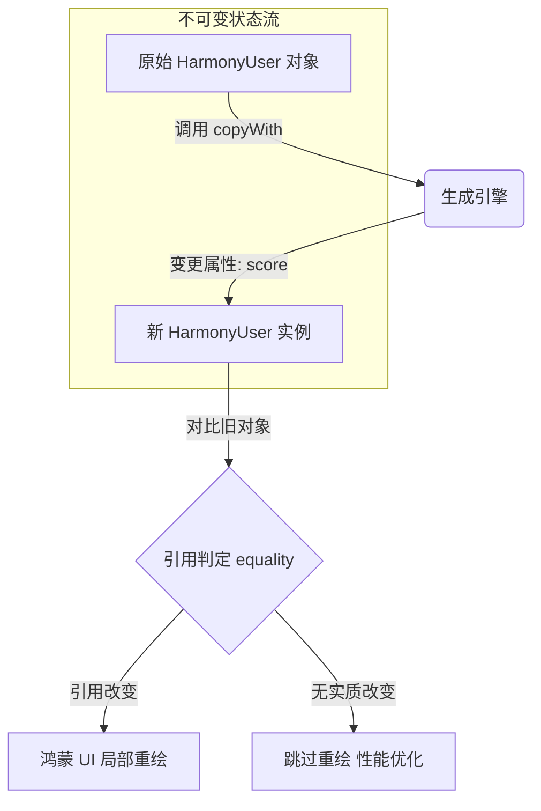

欢迎加入开源鸿蒙跨平台社区：[https://openharmonycrossplatform.csdn.net](https://openharmonycrossplatform.csdn.net)。

# Flutter for OpenHarmony：data — 重新定义鸿蒙应用的数据骨架


## 前言

在维护复杂的鸿蒙（OpenHarmony）应用（比如带有复杂筛选条件的电商列表、或者多层嵌套的系统配置）时，数据的逻辑一致性和状态追踪是最大的挑战。传统的 Dart 类在处理 `equals` 比较、`hashCode` 生成以及不可变更新（copyWith）时，代码量巨大且极易出错。

`data` (或同类优秀的 `freezed`) 提供了一种声明式的数据建模方案。它通过代码生成技术，自动为你补齐所有的样板代码。在 Flutter for OpenHarmony 的工程化开发中，采用不可变数据模型（Immutable Data Models）不仅能显著提升应用的并发安全性，还能让 UI 层的刷新逻辑变得更加精准、高效。

## 一、原理解析 / 概念介绍

### 1.1 基础模型

不可变数据模型意味着一旦对象被创建，其属性就不能被修改。如果需要改变一个字段，必须创建一个新的对象实例。



### 1.2 核心要点

- **值相等（Value Equality）**：只要属性值相同，两个不同引用及的对象亦判定为相同。
- **极简更新**：提供链式的 `copyWith` 方法，解决多层深拷贝难题。
- **鸿蒙适配优势**：减少了运行时对象状态的隐式修改，特别适合鸿蒙多任务并发和分布式状态同步场景。

## 二、核心 API / 工具详解

### 2.1 依赖引入

在鸿蒙工程中通常配置为代码生成模式：

```yaml
dependencies:
  freezed_annotation: ^2.4.0

dev_dependencies:
  build_runner: ^2.4.0
  freezed: ^2.4.0 # 或者 data 库
```

### 2.2 要点讲解

💡 **技巧**：定义鸿蒙系统的配置模型时，开启 `union types` 能够极大地简化 UI 状态切换（如 加载中/成功/失败）。

```dart
import 'package:freezed_annotation/freezed_annotation.dart';

part 'harmony_user.freezed.dart';

@freezed
class HarmonyUser with _$HarmonyUser {
  // ✅ 推荐做法：通过简洁注解声明
  const factory HarmonyUser({
    required String name,
    required int level,
    @Default(false) bool isAdmin,
  }) = _HarmonyUser;
}
```

## 三、典型应用场景

### 3.1 场景一：鸿蒙端分布状态同步
在手机与平板间同步播放状态时，通过发送不可变的 Data 对象，确保两端对状态的理解完全一致。

### 3.2 场景二：复杂 UI 的 Diff 优化
利用 Data 类自带的 `operator ==`，配合 `ListView` 或 `Sliver` 进行精准的差异比较，减少鸿蒙高刷新率屏幕下的非必要渲染开销。

## 四、OpenHarmony 平台适配挑战

### 4.1 编译性能权衡
大量的代码生成会显著增加鸿蒙端开发时的热重载（Hot Reload）时长。

✅ **适配建议**：
1. **模块化建模**：将不同的业务 Data 类拆分到不同的文件和 packages 中，确保 `build_runner` 每次只需重新生成变更的那一小部分。
2. **避免深度嵌套逻辑**：虽然 `copyWith` 很强大，但过度嵌套的数据模型会产生复杂的解析逻辑，在鸿蒙端性能一般的低功耗芯片上建议控制嵌套深度在 3 层内。

## 五、综合实战演示

下面是一个演示如何在鸿蒙端利用不可变 Data 对象更新应用配置的片段：

```dart
// 1. 定义不可变配置
final config = HarmonyAppConfig(theme: 'light', fontSize: 16);

// 2. 模拟用户修改字号
final updatedConfig = config.copyWith(fontSize: 18);

// 3. UI 层的极简使用
void updateUI(HarmonyAppConfig newConfig) {
  if (newConfig == oldConfig) return; // ⚡️ 极速值对比
  
  print('检测到鸿蒙配置变更：正在以 ${newConfig.fontSize}px 重新渲染主题');
  // 执行具体的渲染通知
}
```

## 六、总结

`data` 风格的数据建模是现代 Flutter 应用架构的底座。它将脆弱的变量修改转化为稳固的状态流导向。

✅ **核心建议**：
1. **强制开启 final**：养成所有的 Model 类属性都设为 `final` 的习惯。
2. **结合 JSON 支持**：利用 `json_serializable` 配合，实现从鸿蒙网络层接口到本地强类型 Data 对象的无缝转换。

📦 **参考源码**：见 AtomGit 示例。

🌐 **欢迎加入**：[开源鸿蒙跨平台开发者社区](https://openharmonycrossplatform.csdn.net)
