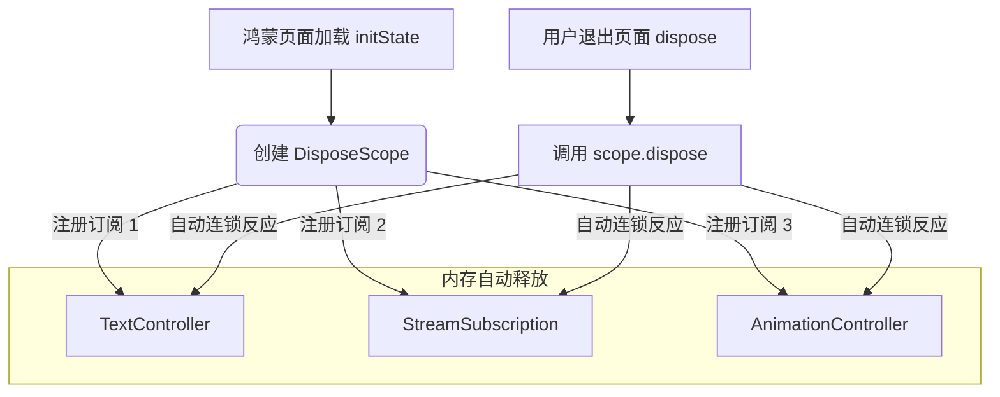

欢迎加入开源鸿蒙跨平台社区：[https://openharmonycrossplatform.csdn.net](https://openharmonycrossplatform.csdn.net)。

# Flutter for OpenHarmony：dispose_scope — 优雅终结资源泄露


## 前言

在鸿蒙（OpenHarmony）应用开发中，内存管理（Memory Management）是衡量应用品质的核心指标。初学者往往记得在 `initState` 中注册监听，却常常在 `dispose` 时因为疏忽而忘记销毁 `StreamSubscription`、`Timer` 或 `ScrollController`。

这种资源的累积会导致严重的内存泄露，在鸿蒙低能耗设备上尤其容易引发应用响应慢、崩溃（OOM）等严重问题。`dispose_scope` 引入了类似 C++/Kotlin 中的作用域管理概念，通过一个统一的“作用域容器”来管理所有需要销毁的资源。在 Flutter for OpenHarmony 的工程化实践中，它能显著降低维护资源清理逻辑的复杂度。

## 一、原理解析 / 概念介绍

### 1.1 基础模型

`dispose_scope` 提供了一个名为 `DisposeScope` 的容器。它像是一个“资源口袋”，你把所有临时开启的监听、控制器都放进去。当组件或页面销毁时，只需清空这个口袋。



### 1.2 核心特性

- **聚合清理**：一行代码销毁几十个资源，极大减少样板代码。
- **扩展性强**：支持通过 `disposedBy` 语法扩展任何自定义的可销毁资源。
- **层级化支持**：支持子作用域，适应复杂的鸿蒙多端组件嵌套。

## 二、核心 API / 工具详解

### 2.1 依赖引入

在鸿蒙工程的 `pubspec.yaml` 中添加以下依赖：

```yaml
dependencies:
  dispose_scope: ^1.2.0
```

### 2.2 要点讲解

💡 **技巧**：在鸿蒙端处理多重 Stream 监听时，通过 `disposedBy` 进行链式注册是最优雅的。

```dart
import 'package:dispose_scope/dispose_scope.dart';

class HarmonyResourceController {
  final _scope = DisposeScope();

  void init() {
    // ✅ 推荐做法：通过扩展方法绑定作用域
    Stream.periodic(const Duration(seconds: 1))
        .listen(print)
        .disposedBy(_scope);
        
    final controller = TextEditingController().disposedBy(_scope);
  }

  void destroy() {
    _scope.dispose(); // 一次性释放
  }
}
```

## 三、典型应用场景

### 3.1 场景一：鸿蒙复杂表单控制器
对于一个拥有 20 个输入框和 10 个监听器的鸿蒙表单页，利用 `dispose_scope` 确保退出页面时所有资源百分百释放。

### 3.2 场景二：分布式传感器数据流
在鸿蒙端监听分布式步数、心率等实时数据流时，通过作用域管理，确保这些高强度的跨端订阅在不活跃时及时切断。

## 四、OpenHarmony 平台适配挑战

### 4.1 自动释放与垃圾回收时机
虽然作用域清理了引用，但鸿蒙端的垃圾回收（GC）仍有其节奏。

✅ **适配建议**：
1. **显式取消**：某些鸿蒙原生桥接资源（如 MethodChannel 的监听）不仅需要 Dart 层解除，还需要原生层回调。建议在自定义 `Disposable` 类中显式调用 native 销毁方法。
2. **配合生命周期库**：在鸿蒙应用中使用 `flutter_hooks` 或注入框架时，注意 `DisposeScope` 与 `useEffect` 的清理节奏对齐。

## 五、综合实战演示

下面是一个在鸿蒙端实现定时扫描并自动清理监听的 UI 示例：

```dart
import 'package:flutter/material.dart';
import 'package:dispose_scope/dispose_scope.dart';

class HarmonyMemoryLab extends StatefulWidget {
  const HarmonyMemoryLab({super.key});

  @override
  State<HarmonyMemoryLab> createState() => _HarmonyMemoryLabState();
}

class _HarmonyMemoryLabState extends State<HarmonyMemoryLab> {
  // 1. 定义资源作用域
  final _disposeScope = DisposeScope();

  @override
  void initState() {
    super.initState();
    // 2. 模拟多个资源绑定
    for (int i = 0; i < 5; i++) {
       Stream.value(i).listen((_) {}).disposedBy(_disposeScope);
    }
  }

  @override
  void dispose() {
    // 3. 核心：在鸿蒙销毁钩子中释放
    _disposeScope.dispose(); 
    super.dispose();
  }

  @override
  Widget build(BuildContext context) {
    return Scaffold(
      appBar: AppBar(title: const Text('内存安全实验室')),
      body: const Center(child: Text('当前资源已受 DisposeScope 守护')),
    );
  }
}
```

## 六、总结

`dispose_scope` 让鸿蒙开发者的“洁癖”变得有条不紊。它将松散的清理逻辑收口，从根本上杜绝了因“疏忽”导致的资源泄露。

✅ **核心建议**：
1. **形成习惯**：凡是创建带 `close()`、`dispose()` 或 `cancel()` 的对象，第一时间接上 `.disposedBy(scope)`。
2. **监控堆栈**：在鸿蒙端进行压力测试时，观察 Profile 里的 Object 存留，确保销毁操作确实生效。

📦 **参考源码**：见 AtomGit 存储库。

🌐 **欢迎加入**：[开源鸿蒙跨平台开发者社区](https://openharmonycrossplatform.csdn.net)
