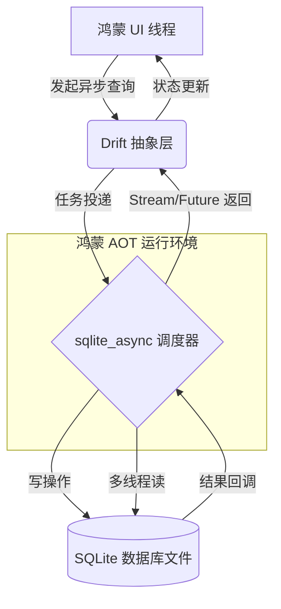

欢迎加入开源鸿蒙跨平台社区：[https://openharmonycrossplatform.csdn.net](https://openharmonycrossplatform.csdn.net)。

# Flutter for OpenHarmony：drift_sqlite_async — 释放本地存储性能


## 前言

在追求纯净、高性能的鸿蒙（OpenHarmony）应用开发中，数据持久化（Data Persistence）是架构设计的核心。相比于简单的键值对存储，关系型数据库（SQLite）能够承载更加复杂的业务逻辑，如多层级的任务管理、本地缓存映射或高频的流水记录。

虽然 Drift 已经是 Flutter 领域最成熟的 ORM 库，但在鸿蒙端的特殊运行环境下，如何进一步压榨数据库读写性能？如何保证长时查询不会导致 UI 假死？`drift_sqlite_async` 通过高效的异步线程模型，将数据库操作与主线程彻底分离。在 Flutter for OpenHarmony 的深度性能优化实践中，它是构建企业级“秒开”应用的底座。

## 一、原理解析 / 概念介绍

### 1.1 基础模型

`drift_sqlite_async` 利用底层的原生异步接口或是独立的线程 Worker，实现了真正的并发读写分离。



### 1.2 核心价值

- **非阻塞主线程**：即使是涉及数万条记录的复杂 Join 连表查询，也不会占用鸿蒙 UI 渲染资源。
- **强类型安全**：继承了 Drift 优秀的 DSL 和代码生成，所有的 SQL 操作在编译期即能发现错误。
- **响应式监听**：支持 Watch 机制，数据库数据的任何变动，UI 层都能通过 Stream 自动刷新。

## 二、核心 API / 工具详解

### 2.1 依赖引入

在鸿蒙工程的 `pubspec.yaml` 中添加以下依赖：

```yaml
dependencies:
  drift: ^2.14.0
  drift_sqlite_async: ^0.1.0 # 建议关注其与底层引擎的匹配

dev_dependencies:
  drift_dev: ^2.14.0
  build_runner: ^2.4.0
```

### 2.2 要点讲解

💡 **技巧**：在鸿蒙端定义表结构时，建议利用 `drift` 的 Table 定义方式。

```dart
import 'package:drift/drift.dart';

// ✅ 推荐做法：声明模型类
class HarmonyTasks extends Table {
  IntColumn get id => integer().autoIncrement()();
  TextColumn get title => text().withLength(min: 1, max: 50)();
  BoolColumn get isCompleted => boolean().withDefault(const Constant(false))();
}
```

## 三、典型应用场景

### 3.1 场景一：离线同步中心
针对鸿蒙应用在弱网环境下的本地修改进行缓存，通过异步事务处理大批量的状态更新，确保首页列表流畅如初。

### 3.2 场景二：复杂全文索引检索
利用 SQLite 的 FTS5 插件配合 `drift_sqlite_async` 的并发读能力，在鸿蒙端实现毫秒级的本地全局搜索。

## 四、OpenHarmony 平台适配挑战

### 4.1 数据库路径与权限
鸿蒙应用对沙箱文件路径有严格定义。

✅ **适配建议**：
1. **获取沙箱目录**：利用 `path_provider` 库获取鸿蒙系统的 `Documents` 或 `Support` 目录，并在此目录下初始化 `.sqlite` 文件。
2. **连接池控制**：由于鸿蒙低端设备的 I/O 吞吐有限，建议通过 `drift_sqlite_async` 合理限制连接池的最大连接数，防止过度竞争导致的响应延迟。

## 五、综合实战演示

下面展示如何连接并初始化一个异步鸿蒙数据库：

```dart
import 'package:drift_sqlite_async/drift_sqlite_async.dart';
import 'package:drift/drift.dart';

part 'harmony_db.g.dart'; // 代码生成生成产物

@DriftDatabase(tables: [HarmonyTasks])
class MyHarmonyDatabase extends _$MyHarmonyDatabase {
  // ✅ 核心适配点：使用异步查询执行器
  MyHarmonyDatabase(QueryExecutor executor) : super(executor);

  @override
  int get schemaVersion => 1;
}

// 初始化逻辑
void initDatabase() {
  final executor = SqliteAsyncDriftConnection(
    'harmony_storage.db', // 数据库文件名
  );
  final db = MyHarmonyDatabase(executor);
}
```

## 六、总结

`drift_sqlite_async` 让鸿蒙应用的“离线能力”和“数据响应力”提升到了全新的高度。它证明了即使在跨平台框架下，本地存储也能拥有媲美原生的极致体验。

✅ **核心建议**：
1. **事务即正义**：在大批量插入数据时，务必使用 `transaction` 包装，以获得最高的 I/O 效率。
2. **逻辑分流**：将复杂的统计、聚合 SQL 放入独立的 `Dao` 类中，保持主数据库类逻辑的清晰。

📦 **参考源码**：见项目 `examples/drift_adapter`。

🌐 **欢迎加入**：[开源鸿蒙跨平台开发者社区](https://openharmonycrossplatform.csdn.net)
