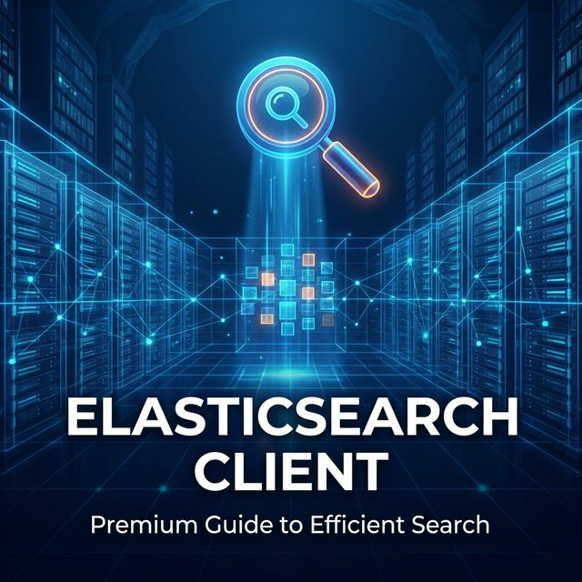

欢迎加入开源鸿蒙跨平台社区：[https://openharmonycrossplatform.csdn.net](https://openharmonycrossplatform.csdn.net)。

# Flutter for OpenHarmony：elastic_client — 鸿蒙直连大数据引擎



## 前言

在构建企业级鸿蒙（OpenHarmony）应用（如办公 OA、海量日志查看器、大型电商搜索平台）时，前端往往需要与后端的 Elasticsearch 系统进行高效的数据交互。Elasticsearch 作为目前最流行的分布式搜索和分析引擎，为大规模数据的实时检索提供了强大支撑。

`elastic_client` 是一个纯 Dart 编写的 Elasticsearch 客户端，它简单、直观且支持高度定制。在 Flutter for OpenHarmony 的开发中，通过该库，开发者无需通过繁琐的中转网关，即可在遵循安全规范的前提下，让鸿蒙端应用具备直接与 ES 集群“对话”的能力。

## 一、原理解析 / 概念介绍

### 1.1 基础模型

`elastic_client` 封装了标准的 RESTful 接口调用，将 Dart 的 Map/List 结构转化为 ES 所需的 JSON 查询 DSL。

```mermaid
graph LR
    A[鸿蒙应用 UI 检索框] --> B(elastic_client 实例)
    B -->|构建 DSL 语句| C[HTTP(S) 请求层]
    C -->|跨网络访问| D[(Elasticsearch 集群)]
    D -->|返回命中结果 JSON| C
    C -->|反序列化为 Dart 对象| B
    B -->|驱动列表刷新| E[鸿蒙端分页列表显示]
```

### 1.2 核心要点

- **CRUD 全涵盖**：支持索引创建、文档增删改查及复杂的多维聚合检索。
- **自定义连接器**：开发者可以轻松切换底层的 HTTP 实现，以适配鸿蒙端的特定网络控制策略。
- **强类型映射**：利用 Dart 的类型系统对 ES 返回的 `hits` 进行安全封装。

## 二、核心 API / 工具详解

### 2.1 依赖引入

在鸿蒙工程的 `pubspec.yaml` 中添加以下依赖：

```yaml
dependencies:
  elastic_client: ^0.4.0
```

### 2.2 要点讲解

💡 **技巧**：在鸿蒙端初始化客户端时，务必处理好传输层协议（建议强制开启 HTTPS）。

```dart
import 'package:elastic_client/elastic_client.dart';

Future<Client> getHarmonyESClient() async {
  // ✅ 推荐做法：使用 HttpConnector 初始化
  final transport = HttpConnector(
    nodes: [Uri.parse('https://es-cluster.harmony.example:9200')],
  );
  return Client(transport);
}
```

## 三、典型应用场景

### 3.1 场景一：企业知识库搜索
针对存储在鸿蒙企业云盘中的海量文档，提供实时、语法高亮的全文本检索建议。

### 3.2 场景二：鸿蒙智慧城市监控大屏
利用 ES 的聚合分析能力，在鸿蒙端实时展示城市交通、人流数据的统计图表。

## 四、OpenHarmony 平台适配挑战

### 4.1 网络安全性与证书
鸿蒙系统对不明来源的自签名证书有严格拦截。

✅ **适配建议**：
1. **安全证书链**：确保 ES 集群配置了鸿蒙系统认可的商用证书（如 Let's Encrypt 等）。
2. **连接保护**：建议在鸿蒙端通过 API 网关转发 ES 请求，不仅能减小客户端包体积，还能更好地进行访问控制（ACL）审计。

## 五、综合实战演示

下面演示了如何在鸿蒙端发起一次简单的模糊搜索：

```dart
import 'package:elastic_client/elastic_client.dart';

Future<void> searchOnHarmony() async {
  final client = await getHarmonyESClient();

  // 1. 构建布尔查询逻辑
  final result = await client.search(
    index: 'articles',
    query: {
      'match': {'title': '鸿蒙化适配'}
    },
    source: true, // 返回原始内容
  );

  print('找到命中的文档数量: ${result.total}');

  // 2. 循环处理结果
  for (final hit in result.hits) {
    print('文档 ID: ${hit.id}, 内容: ${hit.source}');
  }
}
```

## 六、总结

`elastic_client` 为鸿蒙应用开启了“上帝视角”，让前端也能调度后端的千亿级数据。在追求极致搜索体验的应用中，它是打通前后端数据流的关键环节。

✅ **核心建议**：
1. **分页机制**：务必配合 `from` 和 `size` 参数进行分页请求，避免一次性在鸿蒙端加载过多 JSON 数据导致内存波动。
2. **错误重试**：由于鸿蒙端网络环境可能不稳定，建议为 ES 请求配置退避重试（Exponential Backoff）算法。

📦 **参考源码**：代码已同步至 AtomGit 仓库。

🌐 **欢迎加入**：[开源鸿蒙跨平台开发者社区](https://openharmonycrossplatform.csdn.net)
