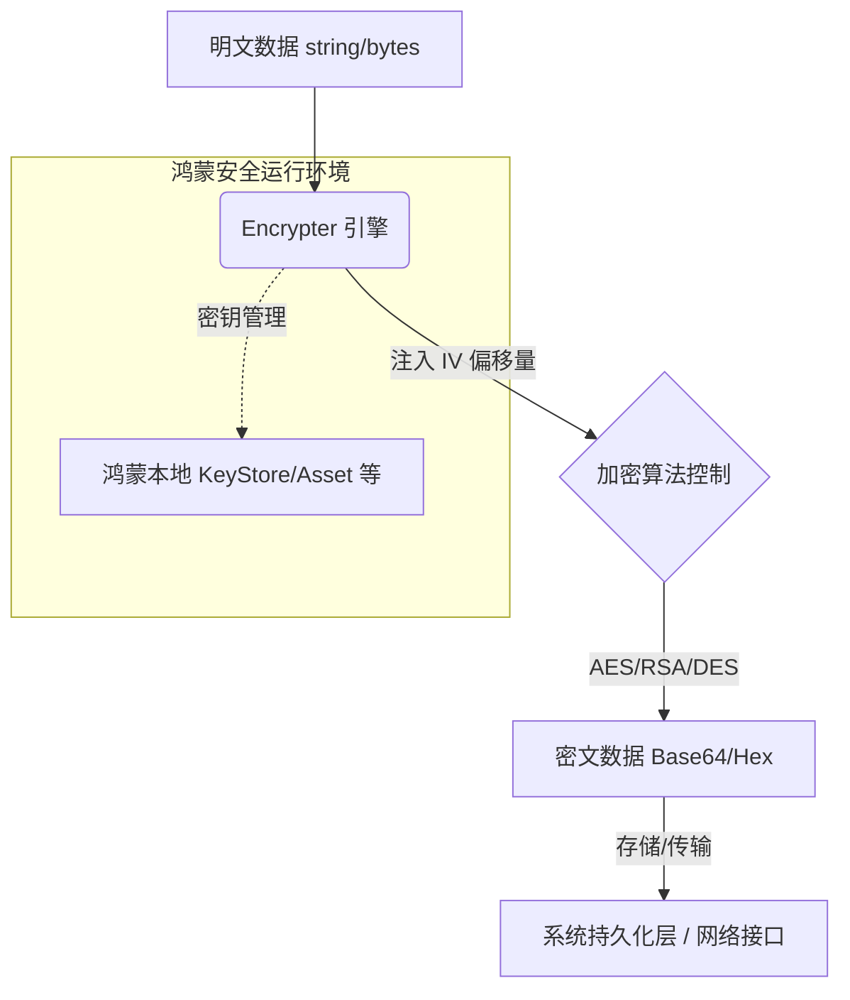

欢迎加入开源鸿蒙跨平台社区：[https://openharmonycrossplatform.csdn.net](https://openharmonycrossplatform.csdn.net)。

# Flutter for OpenHarmony：encrypt — 构建鸿蒙应用的数据安全堡垒


## 前言

随着鸿蒙（OpenHarmony）应用生态的日益成熟，金融、政企、社交等对隐私安全有极高要求的业务纷纷入场。在这些场景中，敏感信息的存储与传输（如用户身份 ID、支付凭证、私密聊天记录）必须经过高强度的加密处理。

`encrypt` 是 Flutter 生态中最流行的跨平台加密封装库。它通过底层调用高性能的算法实现，支持 AES、RSA、Salsa20、Fernet 等多种加密标准。在 Flutter for OpenHarmony 的工程实践中，`encrypt` 能够帮助开发者快速构建符合安全等保要求的加解密方案，守护鸿蒙端的数据隐私。

## 一、原理解析 / 概念介绍

### 1.1 基础模型

`encrypt` 库的核心是一套标准化的 `Encrypter` 接口，它将复杂的数学算法封装为语义明确的 API。



### 1.2 核心要点

- **算法丰富**：覆盖主流的对称加密（AES）与非对称加密（RSA）。
- **与 Base64 自动转换**：直接输出兼容 web 和后端接口的字符串格式。
- **鸿蒙适配优势**：由于其基于纯 Dart 逻辑编写或依赖成熟的 C 底层（通过 FFIn 或原生实现），在鸿蒙系统上运行非常稳定。

## 二、核心 API / 工具详解

### 2.1 依赖引入

在鸿蒙工程的 `pubspec.yaml` 中添加以下依赖：

```yaml
dependencies:
  encrypt: ^5.0.3
```

### 2.2 要点讲解

💡 **技巧**：在鸿蒙端使用时，务必注意密钥（Key）和初始向量（IV）的安全生成，切记不要硬编码。

```dart
import 'package:encrypt/encrypt.dart';

// ✅ 推荐做法：通过 32 位强随机数生成 Key
final key = Key.fromSecureRandom(32);
final iv = IV.fromSecureRandom(16);
final encrypter = Encrypter(AES(key));

// 执行加密
final encrypted = encrypter.encrypt("鸿蒙数据", iv: iv);
```

## 三、典型应用场景

### 3.1 场景一：鸿蒙本地敏感文件存储
对于通过 `PathProvider` 存储在鸿蒙文件系统的用户信息，先通过 AES 加密后再写入，防止设备 root 后的信息泄露。

### 3.2 场景二：支付请求签名
利用 RSA 非对称加密，在鸿蒙端对支付参数进行私钥签名，通过公钥在服务器端验签，确保支付流程的真实性。

## 四、OpenHarmony 平台适配挑战

### 4.1 硬件隔离与密钥安全
鸿蒙系统提供了 HUKS（HarmonyOS Universal KeyStore）服务。

✅ **适配建议**：
1. **结合 HUKS 存储**：建议不要将原始 Key 长期保存在内存。在需要时，通过桥接方式从鸿蒙原生的 HUKS 中提取密钥，再注入到 `encrypt` 的对象中使用。
2. **性能优化**：对于超大规模文件（如 500MB 以上的高清视频），加密会显著消耗 CPU。建议在加密过程中加入 `Isolate` 处理，避免阻塞鸿蒙端的 UI 响应。

## 五、综合实战演示

下面展示一个简单的工具类封装，演示在鸿蒙端如何实现 AES-128 加解密：

```dart
import 'package:encrypt/encrypt.dart';

class HarmonyEncryptUtil {
  static final _key = Key.fromUtf8('my_32_chars_long_key_for_harmony'); 
  static final _iv = IV.fromLength(16);

  /// 加密逻辑
  static String encryptText(String plainText) {
    final encrypter = Encrypter(AES(_key));
    final encrypted = encrypter.encrypt(plainText, iv: _iv);
    return encrypted.base64;
  }

  /// 解密逻辑
  static String decryptText(String base64Text) {
    final encrypter = Encrypter(AES(_key));
    final decrypted = encrypter.decrypt64(base64Text, iv: _iv);
    return decrypted;
  }
}
```

## 六、总结

`encrypt` 库为鸿蒙开发者提供了标准化、易用的安全工具集。通过合理的密钥管理与算法选择，我们能为鸿蒙应用构建起核心的数据护城河。

✅ **核心建议**：
1. **升级算法版本**：优先选择 AES-GCM 等具备验证性的模式。
2. **合规审计**：发布前应确保加解密逻辑符合目标市场的网络安全法律法规（如中国的等保三级要求）。

📦 **代码参考**：已上传至 CSDN 社区对应的 AtomGit 仓库。

🌐 **欢迎加入**：[开源鸿蒙跨平台开发者社区](https://openharmonycrossplatform.csdn.net)
