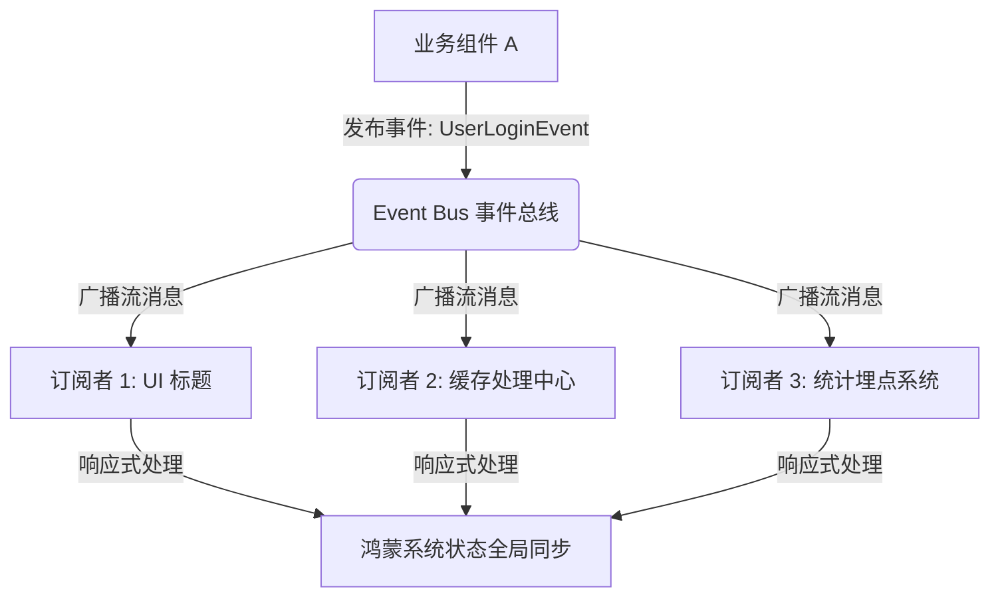

欢迎加入开源鸿蒙跨平台社区：[https://openharmonycrossplatform.csdn.net](https://openharmonycrossplatform.csdn.net)。

# Flutter for OpenHarmony：event — 跨组件通信的隐形枢纽


## 前言

在开发大型或复杂的鸿蒙（OpenHarmony）应用时，组件间的通信往往是一个棘手的问题。当两个距离很远的页面（例如：个人设置页与首页通知图标）需要共享一个状态更新时，传统的构造函数传参或单纯的状态管理可能显得过于繁重。

`event` 提供了一种优雅的基础事件总线（Event Bus）实现。它基于 Dart 的 `Stream` 机制，允许不同组件通过订阅特定的事件类来监听消息，从而实现完全解耦的通信模式。在 Flutter for OpenHarmony 的实际开发中，它是实现全局通知、统一错误处理以及跨页面刷新的一种轻量级级选择。

## 一、原理解析 / 概念介绍

### 1.1 基础模型

`event` 的核心是发布-订阅（Pub/Sub）模式。它不要求发布者知道订阅者的存在。



### 1.2 核心特性

- **强类型支持**：通过定义不同的 Dart 类来区分事件类型，避免了使用字符串键值对带来的拼写错误。
- **Stream 驱动**：利用 Dart `Stream` 带来的天然优势，支持过滤（map/where）和异步处理。

## 二、核心 API / 工具详解

### 2.1 依赖引入

在鸿蒙工程的 `pubspec.yaml` 中添加以下依赖：

```yaml
dependencies:
  event: ^2.1.0
```

### 2.2 要点讲解

💡 **技巧**：建议在应用内维护一个全局唯一的单例事件总线，方便在任何位置注入。

```dart
// ✅ 推荐做法：单例封装
class HarmonyBus {
  static final EventBus _instance = EventBus();
  static EventBus get it => _instance;
}

// 声明一个事件类
class ThemeChangedEvent {
  final bool isDarkMode;
  ThemeChangedEvent(this.isDarkMode);
}
```

## 三、典型应用场景

### 3.1 场景一：鸿蒙全局主题变更通知
当用户在系统设置中切换暗黑模式时，通过发送一个全局事件，通知所有已挂载的 Flutter 页面更新各自的 UI 细节。

### 3.2 场景二：后台任务完成回调
在鸿蒙端执行耗时的文件上传或资源离线下载任务完成后，向 UI 层发送一个“任务完成”事件，弹出 Toast 提醒。

## 四、OpenHarmony 平台适配挑战

### 4.1 内存泄露防范
在鸿蒙应用中，页面频繁跳转会导致订阅者不断增加。

✅ **适配建议**：
1. **及时取消订阅**：在 StatefulWidget 的 `dispose()` 方法中，务必取消对事件流的监听，防止由于 Stream 定向引用导致鸿蒙设备内存溢出。
2. **生命周期绑定**：建议利用 `AutoCancelEvent` 等工具，或配合 `flutter_hooks` 来管理订阅生命周期。

## 五、综合实战演示

下面展示了一个简单的模拟：用户在“个人信息页”更新头像后，自动通知“首页”同步刷新的过程。

```dart
import 'dart:async';
import 'package:flutter/material.dart';
import 'package:event/event.dart';

// 定义总线
final EventBus harmonyBus = EventBus();

// 定义事件
class AvatarUpdatedEvent extends EventArgs {
  final String newUrl;
  AvatarUpdatedEvent(this.newUrl);
}

class HarmonyPageA extends StatefulWidget {
  const HarmonyPageA({super.key});

  @override
  State<HarmonyPageA> createState() => _HarmonyPageAState();
}

class _HarmonyPageAState extends State<HarmonyPageA> {
  String _avatar = "默认头像";
  late final StreamSubscription _sub;

  @override
  void initState() {
    super.initState();
    // ✅ 订阅事件
    _sub = harmonyBus.on<AvatarUpdatedEvent>().listen((event) {
      setState(() {
        _avatar = event.newUrl;
      });
    });
  }

  @override
  void dispose() {
    _sub.cancel(); // 💡 鸿蒙适配重点：释放资源
    super.dispose();
  }

  @override
  Widget build(BuildContext context) {
    return ListTile(
      title: const Text("主页组件"),
      subtitle: Text("当前状态: $_avatar"),
    );
  }
}

// 发布者示例
void onSave() {
   harmonyBus.fire(AvatarUpdatedEvent("https://new.url/icon.png"));
}
```

## 六、总结

`event` 将复杂的跨层级通信简化为了一次次干净的“消息投递”。在鸿蒙化适配中，它能够帮助我们保持工程结构的整洁。

✅ **核心建议**：
1. **控制事件粒度**：不要把所有逻辑都封装在一个巨型事件中，建议按功能模块拆分事件类。
2. **结合系统能力**：在鸿蒙端，可以配合 `CommonEvent` 系统广播，将鸿蒙原生系统的系统级事件（如电量、网络）转接至 `event` 总线中，实现统一的跨平台处理逻辑。

📦 **代码参考**：已提交至 AtomGit 示例仓库。

🌐 **欢迎加入**：[开源鸿蒙跨平台开发者社区](https://openharmonycrossplatform.csdn.net)
