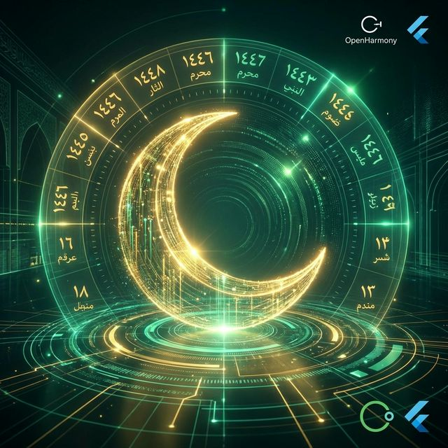
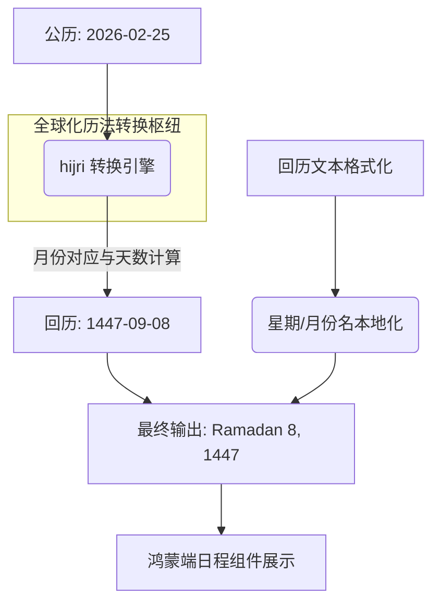

欢迎加入开源鸿蒙跨平台社区：[https://openharmonycrossplatform.csdn.net](https://openharmonycrossplatform.csdn.net)。

# Flutter for OpenHarmony：hijri — 跨越文化边界的精准历法



## 前言

随着鸿蒙（OpenHarmony）生态走向中东等全球市场，应用对于本地历法的适配成为了产品能否在当地扎根的关键。在许多伊斯兰文化区域，传统的伊斯兰历（Hijri，也称回历）在日常生活、宗教节日计算和政府办公中占据主导地位。

`hijri` 是一个专注于公历（Gregorian）与回历（Hijri）相互转换的高精度 Dart 库。在 Flutter for OpenHarmony 的全球化（i18n）适配中，通过引用此库，开发者可以轻松地在鸿蒙应用中集成本地化的日历展示、日期选择与提醒功能，彰显鸿蒙应用对全球多元文化的深度尊重。

## 一、原理解析 / 概念介绍

### 1.1 基础模型

`hijri` 库内部基于复杂的数学天文算法，实现两种历法体系的映射与偏移量修正。



### 1.2 核心特性

- **双向转换**：极简的 API 实现公历与回历的互相切换。
- **自定义格式化**：全方位支持自定义日期展示格式（类似 intl）。
- **语言包集成**：内置了包括阿拉伯语在内的多种主流语言翻译。

## 二、核心 API / 工具详解

### 2.1 依赖引入

在鸿蒙工程的 `pubspec.yaml` 中添加以下依赖：

```yaml
dependencies:
  hijri: ^3.0.0
```

### 2.2 要点讲解

💡 **技巧**：在鸿蒙端获取当前日期的回历表示时，利用 `HijriCalendar.now()` 能快速成型。

```dart
import 'package:hijri/hijri_calendar.dart';

void getHarmonyHijriDate() {
  // ✅ 推荐做法：初始化日历对象
  var _today = HijriCalendar.now();
  
  print('当前回历年份: ${_today.hYear}');
  print('当前回历月份名: ${_today.longMonthName}');
  
  // 转换特定日期
  var specific = HijriCalendar.fromDate(DateTime(2026, 2, 25));
  print('2026-02-25 对应的回历: ${specific.toString()}');
}
```

## 三、典型应用场景

### 3.1 场景一：全球化酒店/旅游应用
旅客在预订中东地区酒店时，系统在展示公历的同时，同步提供回历日期参考，方便核对当地节假日。

### 3.2 场景二：宗教/文化仪式提醒
在鸿蒙手表（Watch）或通知栏推送伊斯兰重要节点的自动提醒，提升用户在特定文化背景下的亲密度。

## 四、OpenHarmony 平台适配挑战

### 4.1 天文测算的误差与调整
由于回历基于月相观测，不同国家可能会有 1-2 天的人为调整（Adjustment）。

✅ **适配建议**：
1. **动态偏移量支持**：建议在应用设置中允许经验丰富的用户手动加减回历的 `adjustment` 值，以对齐当地政府的官方发布。
2. **多语言 UI 布局（RTL）**：在使用回历的地区，UI 布局大多是右往左（RTL）的。在鸿蒙端设计日历组件时，务必配合 `Directionality` 进行镜像适配。

## 五、综合实战演示

下面演示了一个简单的回历与公历双历对比显示的 UI 组件：

```dart
import 'package:flutter/material.dart';
import 'package:hijri/hijri_calendar.dart';

class HarmonyHijriLab extends StatelessWidget {
  const HarmonyHijriLab({super.key});

  @override
  Widget build(BuildContext context) {
    // 1. 设置日历语言
    HijriCalendar.setLocal('ar'); // 设置为阿拉伯语输出

    final hDate = HijriCalendar.now();
    final gDate = DateTime.now();

    return Scaffold(
      appBar: AppBar(title: const Text('全球化历法实验室')),
      body: Center(
        child: Column(
          mainAxisAlignment: MainAxisAlignment.center,
          children: [
            const Icon(Icons.calendar_month, size: 60, color: Colors.green),
            const SizedBox(height: 10),
            Text('公历：${gDate.year}-${gDate.month}-${gDate.day}', style: const TextStyle(fontSize: 18)),
            const Divider(indent: 50, endIndent: 50, height: 40),
            // ✅ 显示回历
            Text(
              '回历: ${hDate.fullDate()}', 
              style: const TextStyle(fontSize: 24, fontWeight: FontWeight.bold),
              textDirection: TextDirection.rtl, // 💡 鸿蒙适配重点：RTL 文字方向
            ),
          ],
        ),
      ),
    );
  }
}
```

## 六、总结

`hijri` 库不仅是数学工具，更是桥接文化的桥梁。它让鸿蒙应用具备了走向更广阔世界的“出海通行证”。

✅ **核心建议**：
1. **全局配置**：在应用生命周期开始时即设定好默认的历法语言包和偏移量。
2. **结合系统时空能力**：根据鸿蒙系统所在地的地理经纬度，动态微调与日落相关的历法切换逻辑。

📦 **参考源码**：见 AtomGit 相关库。

🌐 **欢迎加入**：[开源鸿蒙跨平台开发者社区](https://openharmonycrossplatform.csdn.net)
