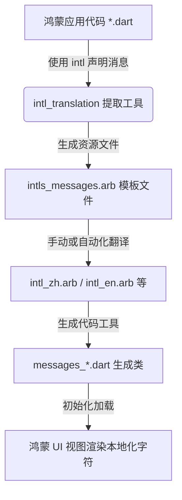

欢迎加入开源鸿蒙跨平台社区：[https://openharmonycrossplatform.csdn.net](https://openharmonycrossplatform.csdn.net)。

# Flutter for OpenHarmony：intl_translation — 鸿蒙化适配多语言翻译枢纽


## 前言

随着鸿蒙（OpenHarmony）生态的国际化步伐加快，开发者面临着如何高效地让应用适配全球不同语言和文化环境的挑战。在 Flutter 开发中，`intl_translation` 是一款用于从 Dart 代码中提取待翻译字符串并生成翻译资源文件的核心工具。它与 `intl` 库紧密配合，为鸿蒙端提供了稳定、高效的国际化工作流解决方案。

本文将深入探讨如何在鸿蒙系统环境下，利用 `intl_translation` 实现自动化的多语言资源管理，助力开发者构建全适配的全球化鸿蒙应用。

## 一、原理解析 / 概念介绍

### 1.1 基础模型

`intl_translation` 的工作原理是基于代码静态分析（Static Analysis）。它会扫描 Dart 代码中的 `Intl.message` 调用，根据其内容生成 `.arb` (Application Resource Bundle) 文件。



### 1.2 核心要点

- **静态提取**：无需运行应用即可获取所有需要翻译的文本。
- **ARB 标准支持**：ARB 文件是一种基于 JSON 的格式，易于与专业翻译工具集成。
- **鸿蒙适配性**：由于其纯 Dart 实现特性，完美兼容鸿蒙的安全沙箱与运行环境。

## 二、核心 API / 工具详解

### 2.1 依赖配置

在鸿蒙工程的 `pubspec.yaml` 中，需要将该工具放入 `dev_dependencies`：

```yaml
dependencies:
  intl: ^0.19.0 # 运行时依赖

dev_dependencies:
  intl_translation: ^0.17.10+1 # 开发时工具
```

### 2.2 核心要点讲解

💡 **技巧**：使用 `Intl.message` 声明时，务必提供 `name` 属性，这决定了 ARB 文件中的 Key 值。

```dart
// ✅ 推荐做法：通过命名确保 Key 的稳定性
String welcomeMessage(String name) => Intl.message(
      "欢迎来到鸿蒙系统，$name！",
      name: 'welcomeMessage',
      args: [name],
      desc: '应用首页的欢迎词',
      examples: const {'name': '鸿蒙开发者'},
    );
```

## 三、典型应用场景

### 3.1 场景一：鸿蒙多端统一国际化
在手机、折叠屏和平板等不同尺寸的鸿蒙设备上，通过 `intl_translation` 确保同一套多语言文案在各端表现一致。

### 3.2 场景二：动态语言切换
结合鸿蒙系统的系统设置，监听语言变更事件，实现应用内文案的实时刷新。

## 四、OpenHarmony 平台适配挑战

### 4.1 资源访问权限
鸿蒙对私有目录的访问有严格管控。虽然 `intl_translation` 仅在开发阶段运行，但其生成的代码在运行时需要通过 `Localizations` 进行加载。

✅ **适配建议**：
1. **生成路径对齐**：确保生成的 `.dart` 消息解析类包含在鸿蒙应用的静态资源编译流程中。
2. **字符集兼容**：鸿蒙系统原生支持 UTF-8，建议 ARB 资源文件统一使用 UTF-8 编码，防止中文字符乱码。

## 五、综合实战演示

下面是一个完整的国际化初始化与使用的闭环示例。

### 5.1 声明消息类

```dart
import 'package:intl/intl.dart';
import 'generated/messages_all.dart'; // 此文件由工具生成

class HarmonyLocalizations {
  // 加载特定语言的资源
  static Future<HarmonyLocalizations> load(Locale locale) {
    final String name = locale.countryCode == null || locale.countryCode!.isEmpty
        ? locale.languageCode
        : locale.toString();
    final String localeName = Intl.canonicalizedLocale(name);

    return initializeMessages(localeName).then((_) {
      Intl.defaultLocale = localeName;
      return HarmonyLocalizations();
    });
  }

  // 待翻译的消息
  String get appTitle => Intl.message(
    '鸿蒙化适配实验室',
    name: 'appTitle',
    desc: '显示在主页应用条上的标题',
  );
}
```

### 5.2 提取与生成指令

在终端中执行（假设文件在 `lib/l10n/` 目录下）：

```bash
# 1. 提取生成 ARB 模板
flutter pub run intl_translation:extract_to_arb --output-dir=lib/l10n lib/main.dart

# 2. 翻译完成后，根据 ARB 生成 Dart 映射类
flutter pub run intl_translation:generate_from_arb \
    --output-dir=lib/l10n/generated \
    --no-use-deferred-loading \
    lib/main.dart lib/l10n/intl_*.arb
```

## 六、总结

`intl_translation` 是鸿蒙开发者在构建全球化应用时不可或缺的“后勤官”。通过规范的提取与生成流程，它将繁琐的手动翻译映射过程转变为数字化的自动化工作流。

✅ **核心建议**：
1. **持续维护 ARB**：将 ARB 文件纳入版本控制，并与翻译团队保持同步。
2. **结合鸿蒙特性**：利用鸿蒙系统的多设备协同特性，在通知栏、分布式卡片等位置也应统一使用经由该工具处理的语言资源，保持用户体验的一致性。

📦 **代码参考**：已上传至社区资源库。

🌐 **欢迎加入**：[开源鸿蒙跨平台开发者社区](https://openharmonycrossplatform.csdn.net)
