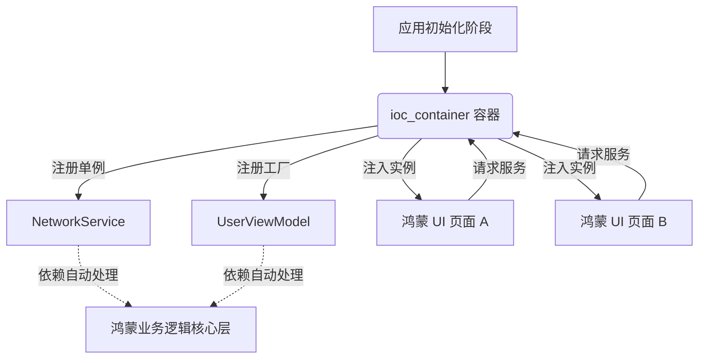

欢迎加入开源鸿蒙跨平台社区：[https://openharmonycrossplatform.csdn.net](https://openharmonycrossplatform.csdn.net)。

# Flutter for OpenHarmony：ioc_container — 构建解耦的鸿蒙应用架构


## 前言

随着鸿蒙（OpenHarmony）应用规模的扩张，代码中的耦合度（Coupling）成为了开发者维护的大忌。当你的 UI 层直接依赖具体的 API 实现类，或是多个 Service 之间交织引用时，代码将变得极其难以测试且脆弱。

`ioc_container` 是一个极其轻量且高性能的依赖注入（Dependency Injection）容器。它不依赖代码生成（Codegen），通过极简的 API 设计实现了服务注册与自动生命周期管理。在 Flutter for OpenHarmony 的模块化适配过程中，它是实现逻辑层与视图层完全隔离的理想选择。

## 一、原理解析 / 概念介绍

### 1.1 基础模型

IoC（控制反转）的基本思想是将“创建对象的权利”交给容器。



### 1.2 核心要点

- **无反射/无生成**：相比 `get_it` 或 `injectable`，它更轻量，不会对鸿蒙 AOT 编译造成任何负担。
- **作用域支持**：支持嵌套容器（Scoped Container），非常适合鸿蒙端按需加载的特性。
- **线程安全**：容器内部逻辑稳定，适用于鸿蒙并发模型下的多组件访问。

## 二、核心 API / 工具详解

### 2.1 依赖引入

在鸿蒙工程的 `pubspec.yaml` 中添加以下依赖：

```yaml
dependencies:
  ioc_container: ^1.1.0
```

### 2.2 要点讲解

💡 **技巧**：在鸿蒙端，建议将容器定义为顶层变量，并分模块进行初始化。

```dart
import 'package:ioc_container/ioc_container.dart';

// ✅ 推荐做法：集中式注册
final container = IocContainerBuilder()
  ..addSingleton((container) => HarmonyNetworkService())
  ..add((container) => ProductViewModel(network: container.get<HarmonyNetworkService>()))
  .toContainer();

class HarmonyNetworkService {
  void fetch() => print("鸿蒙网络请求中...");
}
```

## 三、典型应用场景

### 3.1 场景一：鸿蒙多端 Mock 适配
在开发环境下注入 `MockService`，在生产环境下通过 `ioc_container` 注入 `RealHarmonyService`，实现无感切换。

### 3.2 场景二：插件化解耦
在鸿蒙应用的主工程中定义抽象接口，由各个 Feature 插件通过 IoC 容器动态注入具体实现，实现工程物理结构的极简解耦。

## 四、OpenHarmony 平台适配挑战

### 4.1 内存回收监控
由于 `ioc_container` 的单例会长期保留在内存中。

✅ **适配建议**：
1. **适时销毁**：针对大型的、带大量图片缓存的 Service，建议开启 Scoped 模式，配合鸿蒙页面的销毁事件主动释放容器分支。
2. **初始化时机**：利用鸿蒙应用的 `onWindowStageCreate` 或 Flutter 的 `main` 入口精细控制容器加载顺序，防止首页启动时进行过重的依赖解析。

## 五、综合实战演示

下面是一个演示如何在鸿蒙端快速建立一个简单的服务注入系统：

```dart
import 'package:flutter/material.dart';
import 'package:ioc_container/ioc_container.dart';

// 定义业务接口
abstract class AuthService {
  bool get isLoggedIn;
}

// 模拟实现
class MockAuth implements AuthService {
  @override
  bool get isLoggedIn => true;
}

// 构建容器
final harmonyContainer = IocContainerBuilder()
  ..addSingleton<AuthService>((c) => MockAuth())
  .toContainer();

class HarmonyIoCLab extends StatelessWidget {
  const HarmonyIoCLab({super.key});

  @override
  Widget build(BuildContext context) {
    // ✅ 从容器动态获取服务
    final auth = harmonyContainer.get<AuthService>();

    return Scaffold(
      appBar: AppBar(title: const Text('IoC 架构实验室')),
      body: Center(
        child: Text(
          auth.isLoggedIn ? "鸿蒙用户已登录" : "请先登录鸿蒙系统",
          style: const TextStyle(fontSize: 22),
        ),
      ),
    );
  }
}
```

## 六、总结

`ioc_container` 以极具性价比的方式解决了鸿蒙应用中的依赖管理难题。它提倡“显式注册”而非“隐式查找”，极大提升了系统的可预测性。

✅ **核心建议**：
1. **面向接口编程**：永远注册接口类型而非具体类名。
2. **单元测试伴侣**：利用 IoC 容器在测试集中注入 Mock 依赖，确保鸿蒙业务逻辑的高覆盖率。

📦 **参考源码**：见 AtomGit 示例仓库。

🌐 **欢迎加入**：[开源鸿蒙跨平台开发者社区](https://openharmonycrossplatform.csdn.net)
