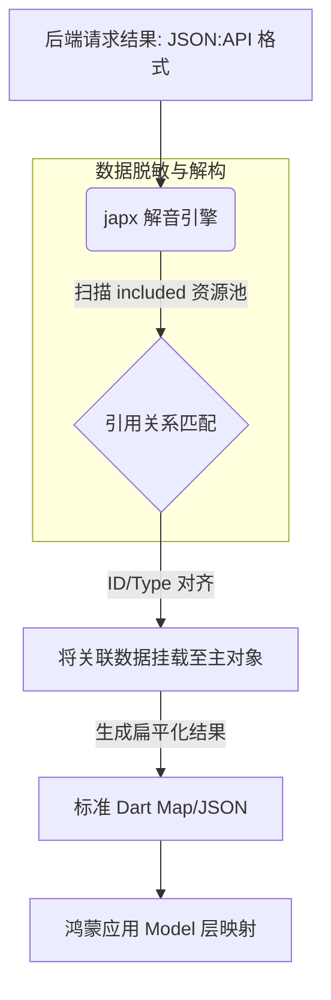

欢迎加入开源鸿蒙跨平台社区：[https://openharmonycrossplatform.csdn.net](https://openharmonycrossplatform.csdn.net)。

# Flutter for OpenHarmony：japx — 让 JSON:API 解析易如反掌


## 前言

在鸿蒙（OpenHarmony）应用对接复杂的后端微服务时，开发者经常会遇到遵循 **JSON:API** 规范的数据接口。虽然这种规范利于后端组织资源关系，但其特有的嵌套结构（如 `included` 节点与 `data` 节点的解耦）却让前端解析代码变得异常繁琐和“丑陋”。

`japx` 是一款高效且轻量级的 JSON:API 解析库。它能够将复杂的、符合 JSON:API 标准的数据结构一键转换为扁平化的 Dart Map。在 Flutter for OpenHarmony 的实际开发中，`japx` 是处理中大型微服务接口、减少解析层 Bug 的一剂“良药”。

## 一、原理解析 / 概念介绍

### 1.1 基础模型

`japx` 的核心逻辑是递归地根据 `id` 和 `type` 将 `included` 资源池中的数据填充回原始的主 `data` 节点中。



### 1.2 核心特性

- **双向转换**：支持将简单的 Map 编码为标准 JSON:API 格式，也支持解码回简化版。
- **高性能**：针对超大型、包含深层引用的响应体进行了递归算法优化。
- **与 JSON 解析库解耦**：不依赖具体的 JSON 库，通用性极强。

## 二、核心 API / 工具详解

### 2.1 依赖引入

在鸿蒙工程的 `pubspec.yaml` 中添加以下依赖：

```yaml
dependencies:
  japx: ^1.2.0
```

### 2.2 要点讲解

💡 **技巧**：在鸿蒙端处理带有附加关联数据（如文章带有作者信息）的请求时，其 API 调用极其直接。

```dart
import 'package:japx/japx.dart';

void decodeHarmonyApi(Map<String, dynamic> rawJson) {
  // ✅ 推荐做法：通过解码器进行转换
  final decoded = Japx.decode(rawJson);
  
  // 此时数据中的关系字段已经从简单的引用 ID 变为了完整的内容
  print('解析后的纯净数据: ${decoded['data']}');
}
```

## 三、典型应用场景

### 3.1 场景一：鸿蒙社区类 App
在处理包含大量评论、回复以及用户信息相互关联的 JSON:API 响应时，利用 `japx` 快速将其转换为 UI 渲染可以直接利用的扁平化列表。

### 3.2 场景二：复杂 ERP 或 CRM 构建
针对具有复杂实体关联（订单 - 客户 - 产品 - 仓库）的企业级应用，极大地减轻了手动维护引用关系表的负担。

## 四、OpenHarmony 平台适配挑战

### 4.1 大规模数据的解析时延
对于包含数百个关联对象的巨型 JSON，同步解析可能会在鸿蒙端性能一般的芯片上产生肉眼可见的卡顿。

✅ **适配建议**：
1. **异步计算桥接**：利用 `compute` 函数或我们在之前文章介绍过的 `computer` 库，将解析任务放入后台执行。
2. **局部解析**：如果业务逻辑只涉及部分数据，建议先初步裁剪 JSON 再交给 `japx`，降低算法的递归深度。

## 五、综合实战演示

下面演示了一次从后端原始请求体到最终鸿蒙 UI 状态更新的完整过程：

```dart
final Map<String, dynamic> response = {
  "data": {
    "type": "articles",
    "id": "1",
    "attributes": {"title": "鸿蒙适配实战"},
    "relationships": {
      "author": {"data": {"type": "people", "id": "99"}}
    }
  },
  "included": [
    {"type": "people", "id": "99", "attributes": {"name": "鸿蒙专家"}}
  ]
};

// 1. 进行转换
final cleanData = Japx.decode(response);

// 2. 此时 cleanData 结构如下：
// {
//    "data": {
//       "type": "articles", 
//       "title": "鸿蒙适配实战", 
//       "author": {"name": "鸿蒙专家"}
//    }
// }

// 3. 将结果应用至鸿蒙 UI
// Text(cleanData['data']['author']['name']);
```

## 六、总结

`japx` 虽然规模不大，但它精准解决了处理复杂行业标准的痛点。在遵循严格技术规范的项目中，它能让你的代码更具优雅感。

✅ **核心建议**：
1. **结合 Dio 拦截器**：可以将 `Japx.decode` 放置在 Dio 的 `onResponse` 拦截器中，让上层业务代码彻底感知不到 JSON:API 的存在。
2. **错误自检**：针对不规范的、缺少 `id` 的后端返回，应提前做好容错处理，防止解析引擎陷入异常。

📦 **参考资源**：相关博文源码已提交。

🌐 **欢迎加入**：[开源鸿蒙跨平台开发者社区](https://openharmonycrossplatform.csdn.net)
