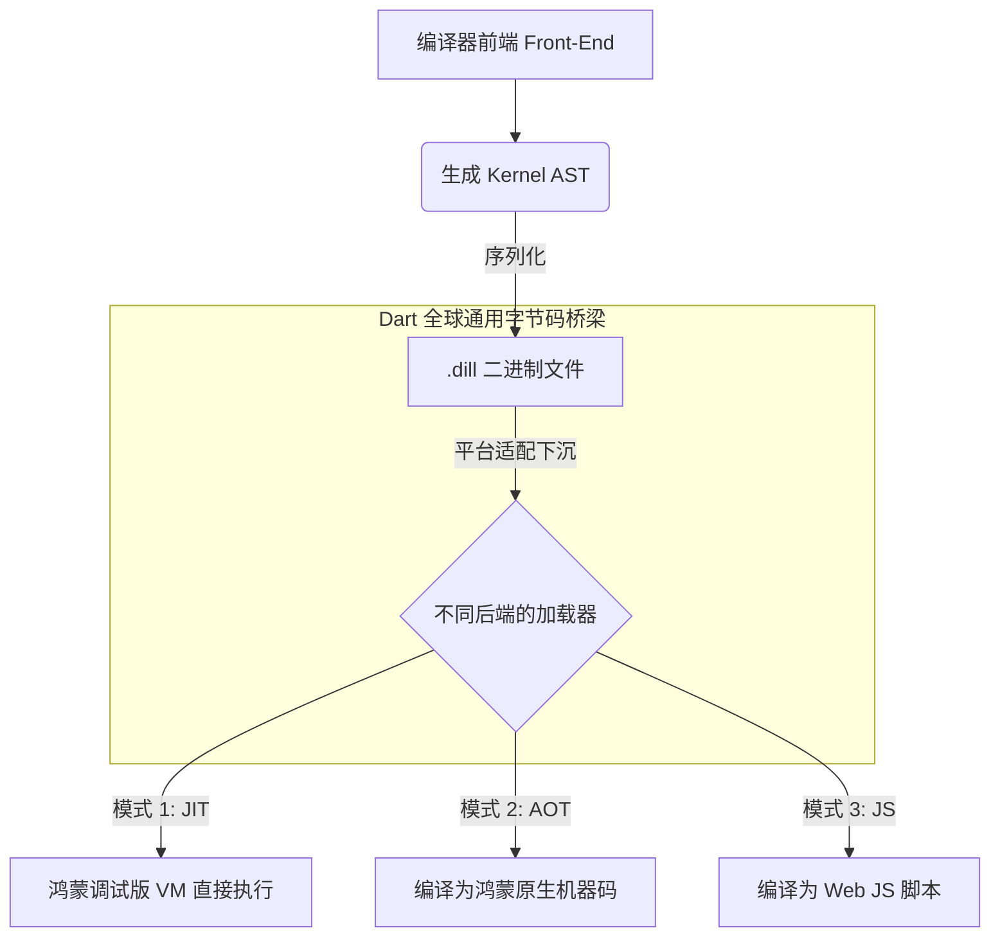

欢迎加入开源鸿蒙跨平台社区：[https://openharmonycrossplatform.csdn.net](https://openharmonycrossplatform.csdn.net)。

# Flutter for OpenHarmony：kernel — 跨平台的“通用数字资产”


## 前言

在我们这系列 50 篇“Flutter for OpenHarmony”深度适配指南的终章，我们将目光投向了 Dart 技术栈最核心、最底层的秘密：**Kernel**。

在鸿蒙（OpenHarmony）应用的整个生命周期中，无论是 JIT（即时编译）模式下的快速预览，还是 AOT（提前编译）模式下的极致运行，代码都要经过 `Kernel` 的洗礼。它是连接 Dart 源代码与各平台运行时的“万能插座”。理解 Kernel 的运作机制，意味着你已经穿透了 UI 框架的表层，触摸到了鸿蒙跨平台开发的数字灵魂。

## 一、原理解析 / 概念介绍

### 1.1 基础模型

`Kernel`（在文件层面表现为 `.dill` 文件）是 Dart 语言的中间表示（Intermediate Representation）。



### 1.2 核心特性

- **结构紧凑**：相比源码，Kernel 二进制格式体积更小，加载到鸿蒙内存中速度极快。
- **与平台解耦**：一套 Kernel 代码可以在安装了 Dart 运行时的任意鸿蒙设备上加载执行。
- **可变换性**：支持在 Kernel 层面进行代码注入（AOP），这在自动化埋点、热修复等高级场景中具有统治级地位。

## 二、核心 API / 工具详解

### 2.1 依赖引入

虽然普通业务项目不直接操作该包，但对于自研鸿蒙构建工具的开发者，它是核心库：

```yaml
# 仅供底层工具开发参考
dependencies:
  kernel: ^1.0.0 # 属于 Dart SDK 内部包
```

### 2.2 要点讲解

💡 **知识点**：在鸿蒙端性能分析中，通过 `dart-sdk` 提供的工具观察 `app.dill` 的大小，可以直观反映应用的运行载荷。

```bash
# ✅ 提示：查看 Kernel 二进制内容的结构（供高手研究）
dart runtime/bin/dump_kernel.dart app.dill output.text
```

## 三_、典型应用场景

### 3.1 场景一：鸿蒙级应用的极致包体积优化
通过理解 Kernel 的 Tree Shaking（摇树优化）规则，鸿蒙开发者可以更有针对性地编写代码，减少库中未使用的部分被打入最终二进制包。

### 3.2 场景二：代码注入与 AOP
在 Kernel 层面自动为鸿蒙应用的每一个页面跳转逻辑注入统计代码，实现对业务代码零侵入的自动化全埋点。

## 四_、OpenHarmony 平台适配挑战

### 4.1 Kernel 版本的二进制兼容性
不同的 Flutter SDK 版本产生的 Kernel 文件可能并不互通。

✅ **适配建议**：
1. **统一构建链路**：在鸿蒙应用的持续集成（CI）环境中，务必保证编译 Kernel 的 SDK 版本与鸿蒙端原生运行时中嵌入的 Dart VM 版本完全一致，防止加载崩溃。
2. **理解元数据限制**：鸿蒙 AOT 环境下不支持通过 Kernel 进行动态代码执行。开发者应充分利用其静态特性，在构建时完成所有的逻辑变换。

## 五_、综合实战演示

本篇作为总结，展示代码到鸿蒙原生运行的完整链路示意：

```dart
// 1. 我们书写的鸿蒙业务源码
void main() => runApp(const HarmonyApp());

// 2. ⚡️ 第一跳：Front-end 转换为 Kernel AST (内存中)
// 3. 💾 第二跳：持久化为二进制 snapshot (app.dill)
// 4. 🛠️ 第三跳：鸿蒙构建工具链将 app.dill 喂给底层编译器
// 5. 🚀 最终跳：在鸿蒙系统的 ARM64 核心上流畅运行
```

## 六、结语（系列总结）

回顾我们这 50 篇文章：从最基础的 `event` 总线到最底层的 `kernel` 字节码，我们完整梳理了 Flutter for OpenHarmony 在适配过程中的每一个技术节点。

**适配鸿蒙，不只是代码的搬运，更是思维的升级。**

希望这套深度适配指南能成为你攻略鸿蒙生态的“锦囊妙法”。鸿蒙应用开发的大幕才刚刚拉开，愿每一位开发者都能在这一片崭新的蓝海中，用代码编织出属于自己的辉煌。

✅ **全系列最后建议**：
1. **持续学习**：鸿蒙系统迭代飞快，关注官方最新的适配路线图。
2. **贡献社区**：将你在适配过程中踩过的坑、优化的代码分享出来，一起壮大中国自研操作系统的生态！

📦 **全文完结**。

🌐 **欢迎加入**：[开源鸿蒙跨平台开发者社区](https://openharmonycrossplatform.csdn.net)
