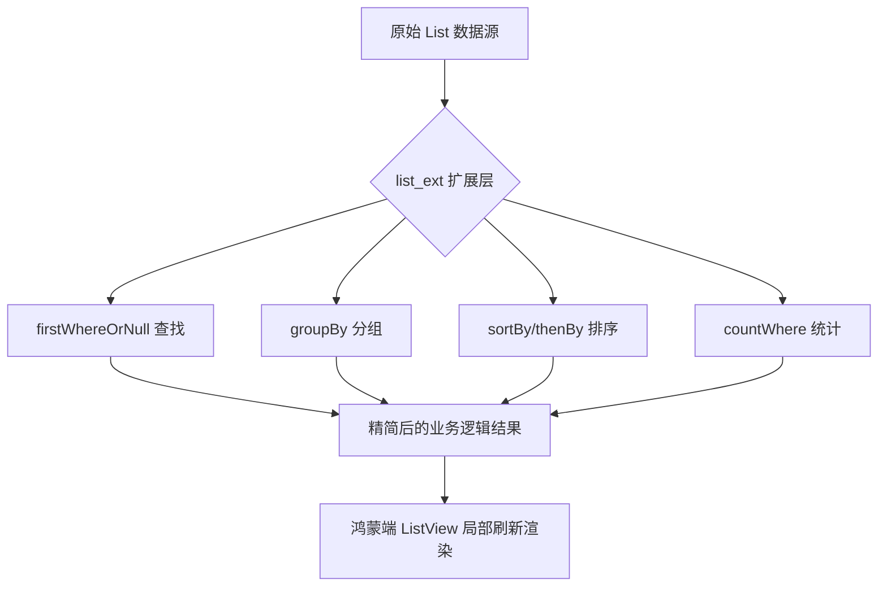

欢迎加入开源鸿蒙跨平台社区：[https://openharmonycrossplatform.csdn.net](https://openharmonycrossplatform.csdn.net)。

# Flutter for OpenHarmony：list_ext — 极简列表操作扩展


## 前言

在鸿蒙（OpenHarmony）应用开发中，数据流转和展示的核心通常是列表（List）。无论是处理来自网络请求的对象集合，还是管理本地状态，频繁的增删改查、排序和分组操作是家常便饭。尽管 Dart 原生提供了一些基础方法，但在复杂的业务场景下，代码往往显得冗长。

`list_ext` 为 Dart `List` 提供了丰富的 Extension 方法，旨在减少模板代码，提升可读性。在 Flutter for OpenHarmony 的高性能适配过程中，简洁的代码不仅能降低维护成本，更能帮助开发者通过链式调用快速构建复杂的数据处理逻辑。

## 一、原理解析 / 概念介绍

### 1.1 基础模型

`list_ext` 利用 Dart 的 `extension` 特性，在不改变原有 `List` 类型结构的前提下，通过“语法糖”式的方法注入，让开发者能够以更自然的方式操作数据。



### 1.2 核心要点解析

- **空安全优化**：大量扩展了 `OrNull` 系列方法，避免在鸿蒙应用运行时因找不到元素而抛出异常。
- **不可变操作**：多数方法支持返回新列表，符合现代响应式框架的状态管理原则。

## 二、核心 API / 组件详解

### 2.1 依赖引入

在鸿蒙工程的 `pubspec.yaml` 中添加：

```yaml
dependencies:
  list_ext: ^2.1.0
```

### 2.2 要点讲解

💡 **技巧**：在鸿蒙端处理多重过滤逻辑时，链式调用能让逻辑更直观。

```dart
import 'package:list_ext/list_ext.dart';

void processHarmonyData() {
  List<User> harmonyUsers = [...];

  // ✅ 推荐做法：链式处理数据
  var activeTesters = harmonyUsers
      .where((u) => u.isActive)
      .sortBy((u) => u.lastLogin) // 快速排序
      .take(10)                   // 取前10个
      .toList();
      
  // 查找不存在的元素，不报错
  var target = harmonyUsers.firstWhereOrNull((u) => u.id == '999');
}
```

## 三、典型应用场景

### 3.1 场景一：鸿蒙分布式设备发现列表
在多端发现场景下，通过 `groupBy` 将发现的设备按类型（手机、平板、手表）自动分组展示。

### 3.2 场景二：复杂配置项筛选
在鸿蒙应用的系统设置页中，利用 `firstWhereOrNull` 安全地读取用户的特定配置项，避免由于缺省配置导致的崩溃。

## 四、OpenHarmony 平台适配挑战

### 4.1 内存管理与性能
虽然扩展方法很方便，但过度创建中间态的临时 `List` 对象在鸿蒙低内存设备上可能有性能风险。

✅ **适配建议**：
1. **惰性求值**：在链式操作较长时，尽量配合 `.map().where()` 等 `Iterable` 方法，最后才调用 `.toList()` 以减少内存碎片。
2. **异步主线程保护**：针对超过 5000 条的数据处理，建议使用 `Isolate` 或鸿蒙端的并发机制执行筛选，防止导致鸿蒙 UI 线程掉帧。

## 五、综合实战演示

下面是一个模拟鸿蒙端实现消息聚合与排序显示的实战示例：

```dart
import 'package:flutter/material.dart';
import 'package:list_ext/list_ext.dart';

class MessageLab extends StatelessWidget {
  const MessageLab({super.key});

  @override
  Widget build(BuildContext context) {
    // 模拟从鸿蒙分布式数据库获取的原始消息
    final List<Map<String, dynamic>> rawMsgs = [
      {'sender': '张三', 'msg': '鸿蒙化适配完成了', 'time': 1024},
      {'sender': '李四', 'msg': '下午开会', 'time': 512},
      {'sender': '王五', 'msg': '记得提交代码', 'time': 2048},
    ];

    // ✅ 使用 list_ext 的 Extension 方法进行倒序排序
    final sortedMsgs = rawMsgs.sortBy((m) => m['time'] as int, ascending: false);

    return Scaffold(
      appBar: AppBar(title: const Text('鸿蒙数据处理中心')),
      body: ListView.separated(
        itemCount: sortedMsgs.length,
        separatorBuilder: (_, __) => const Divider(),
        itemBuilder: (context, index) {
          final item = sortedMsgs[index];
          return ListTile(
            leading: const CircleAvatar(child: Icon(Icons.message)),
            title: Text(item['sender']),
            subtitle: Text(item['msg']),
            trailing: Text('热度: ${item['time']}'),
          );
        },
      ),
    );
  }
}
```

## 六、总结

`list_ext` 是开发者的“效率调节器”，它把很多常见的逻辑沉淀成了方法调用，让鸿蒙应用的业务逻辑层更加清爽。

✅ **核心建议**：
1. **优先使用 Extension**：习惯使用 `firstWhereOrNull` 代替 `try-catch` 或手动判断，能大幅减少鸿蒙端代码的 Bug 率。
2. **结合状态管理**：在 BLoC 或 Provider 中清洗数据时，这种简洁的操作符将极大地加快你的开发节奏。

📦 **参考源码**：见项目 `examples/list_ext` 相关目录。

🌐 **欢迎加入**：[开源鸿蒙跨平台开发者社区](https://openharmonycrossplatform.csdn.net)
