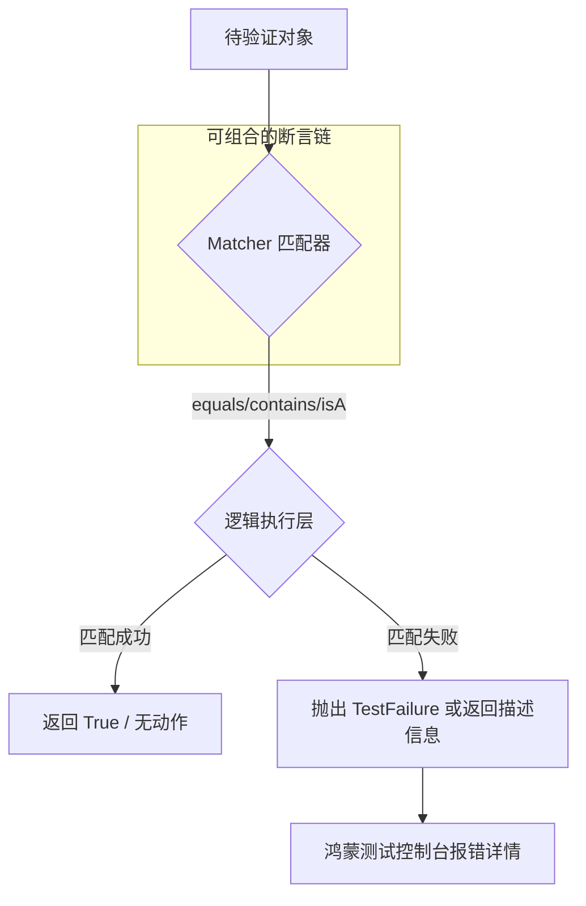

欢迎加入开源鸿蒙跨平台社区：[https://openharmonycrossplatform.csdn.net](https://openharmonycrossplatform.csdn.net)。

# Flutter for OpenHarmony：matcher — 代码逻辑的“严苛审判官”


## 前言

在鸿蒙（OpenHarmony）应用开发中，不管是编写健壮的单元测试，还是在业务代码中执行复杂的入参安全校验，仅仅使用 `==` 或 `!=` 是远远不够的。当我们需要验证一个列表是否包含特定子项、一个字符串是否符合正则模式，或者一个对象是否具备某种特定类型的属性时，我们需要更具语义化且可组合的工具。

`matcher` 是 Dart 核心库体系中负责断言与匹配的基石库（通常与 `test` 库配合使用）。它提供了一整套可扩展的匹配器（Matchers），能够以近似自然语言的方式描述校验逻辑。在 Flutter for OpenHarmony 的高质量交付流程中，`matcher` 是保障鸿蒙应用业务逻辑“分毫不差”的关键防线。

## 一、原理解析 / 概念介绍

### 1.1 基础模型

`matcher` 库定义了一个抽象的匹配协议，任何匹配逻辑本质上都是对一个对象进行“是否符合预期”的真值判断。



### 1.2 核心特性

- **高度语义化**：通过 `expect(actual, equals(expected))` 这种语法，极大提升了测试代码的可读性。
- **可组合性**：支持 `allOf`（且）、`anyOf`（或）、`isNot`（非）等逻辑组合。
- **丰富的内置匹配器**：涵盖数值范围、集合内容、类型判定、字符串模式等全方位领域。

## 二、核心 API / 工具详解

### 2.1 依赖引入

在鸿蒙工程的 `dev_dependencies` 中通常由测试框架自动引入，也可以手动添加：

```yaml
dev_dependencies:
  matcher: ^0.12.16
```

### 2.2 要点讲解

💡 **技巧**：在鸿蒙端处理多端统一返回的模型校验时，组合匹配器是最高效的。

```dart
import 'package:matcher/matcher.dart';

void validateHarmonyModel() {
  final result = {'code': 200, 'os': 'OpenHarmony', 'version': 4.0};

  // ✅ 推荐做法：通过 matchers 组合进行深度校验
  expect(result, allOf([
    containsPair('os', 'OpenHarmony'),
    containsPair('code', greaterThan(199)),
    isA<Map<String, dynamic>>(),
  ]));
}
```

## 三、典型应用场景

### 3.1 场景一：鸿蒙应用接口契约测试
模拟后端返回的复杂 JSON 报头，校验其中是否包含预期的“鸿蒙专属”认证字段。

### 3.2 场景二：异常分支覆盖
针对鸿蒙设备特有的硬件交互报错（如相机权限拒绝），验证业务代码是否准时抛出了预期的异常类型。

## 四、OpenHarmony 平台适配挑战

### 4.1 异步匹配的复杂性
在鸿蒙端处理 Future 或 Stream 时，传统的同步 `expect` 无法直接工作。

✅ **适配建议**：
1. **配合 completion 使用**：针对鸿蒙端的异步调用结果，使用 `expect(myFuture, completion(equals('done')))`，这能让测试引擎自动等待异步任务结束。
2. **处理浮点数精度曲线**：由于鸿蒙各终端芯片浮点运算可能存在微小差异，在对比位置坐标或动画进度时，务必使用 `closeTo(value, delta)` 匹配器，避免零误差匹配导致的测试假失败。

## 五_、综合实战演示

下面是一个演示如何在鸿蒙端通过自定义匹配器校验“鸿蒙化设备名称”的例子：

```dart
import 'package:flutter_test/flutter_test.dart';
import 'package:matcher/matcher.dart' as m;

void main() {
  test('鸿蒙设备标识符校验', () {
    const String deviceId = "OHOS_SMART_PHONE_MAX";

    // ✅ 使用 matcher 库的语义化断言
    m.expect(deviceId, m.startsWith("OHOS_"));
    m.expect(deviceId, m.stringContainsInOrder(["SMART", "PHONE"]));
    
    // 逻辑组合示例
    m.expect(deviceId, m.anyOf([
      m.contains("SMART"),
      m.contains("TABLET"),
    ]));
  });
}
```

## 六、总结

`matcher` 是鸿蒙开发者对代码质量发起的“第一道审判”。它不仅能减少人工排查 Bug 的成本，更能作为一份鲜活的业务契约。

✅ **核心建议**：
1. **优先使用语义匹配器**：能用 `equals` 就不用 `==`（在 expect 中），因为前者能提供更好的失败描述。
2. **保持测试逻辑纯粹**：不要在匹配器里写过于复杂的业务转换，保持测试代码的单一职责。

📦 **参考源码**：见官方 test 仓库源码。

🌐 **欢迎加入**：[开源鸿蒙跨平台开发者社区](https://openharmonycrossplatform.csdn.net)
