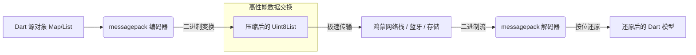

欢迎加入开源鸿蒙跨平台社区：[https://openharmonycrossplatform.csdn.net](https://openharmonycrossplatform.csdn.net)。

# Flutter for OpenHarmony：messagepack — 二进制序列化的速度与激情


## 前言

在鸿蒙（OpenHarmony）应用开发中，数据序列化（Serialization）是网络通信和本地存储的基础。虽然 JSON 凭借极高的可读性成为了事实上的标准，但在追求极致性能的场景下（如高频传感器数据回传、大型游戏包同步、低功耗物联网通信），JSON 肥大的包体积和较慢的解析速度逐渐成为了系统的瓶颈。

`messagepack` 是一种高效的二进制序列化格式。它的座右铭是“It's like JSON. but fast and small.”。通过将结构化数据以紧凑的二进制形式存储，它可以显著减少鸿蒙应用的带宽占用并提升解析效率。在 Flutter for OpenHarmony 的性能调优实践中，`messagepack` 是从底层重塑数据流动效率的关键工具。

## 一、原理解析 / 概念介绍

### 1.1 基础模型

`messagepack` 不像 JSON 那样使用冗长的键值对字符串，而是通过特定的类型字节和长度编码来描述数据。



### 1.2 核心优势

- **体积更小**：相比 JSON，通常能节省 20%-50% 的空间。
- **解析更快**：二进制扫描无需执行复杂的正则表达式和字符转义，对鸿蒙 CPU 更加友好。
- **强类型映射**：天然支持字节流、整数、浮点数等基础类型的精准还原。

## 二、核心 API / 工具详解

### 2.1 依赖引入

在鸿蒙工程的 `pubspec.yaml` 中添加以下依赖：

```yaml
dependencies:
  messagepack: ^0.1.0 # 或者使用对应的 dart 实现版本
```

### 2.2 要点讲解

💡 **技巧**：在鸿蒙端处理大型复杂 Map 时，其 API 设计非常符合直觉。

```dart
import 'package:messagepack/messagepack.dart';
import 'dart:typed_data';

void harmonyPackDemo() {
  // ✅ 推荐做法：创建打包器
  final packer = Packer();
  
  // 按照结构依次写入
  packer.packMap({
    'device': 'Harmony-Mate-60',
    'status': 1,
    'sensors': [0.1, 0.5, 0.9]
  });

  // 生成二进制流
  final Uint8List binaryData = packer.takeBytes();
  print('经过 MessagePack 压缩后的长度: ${binaryData.length}');
  
  // 解码过程
  final unpacker = Unpacker(binaryData);
  final map = unpacker.unpackMap();
}
```

## 三、典型应用场景

### 3.1 场景一：鸿蒙分布式协同数据同步
在多个鸿蒙设备（手机、平板、手表）之间实时同步触控轨迹或系统状态，利用二进制格式保证极低的时延。

### 3.2 场景二：后台埋点数据批量上传
将应用产生的海量日志或埋点数据先打包为二进制包，减少上传时的流量损耗，提升鸿蒙端应用的服务续航。

## 四、OpenHarmony 平台适配挑战

### 4.1 数据对齐与端序
虽然 `messagepack` 屏蔽了大部分细节，但在处理极高性能的 C 层互操作时需注意。

✅ **适配建议**：
1. **统一端序标准**：确保鸿蒙端与后端服务器对 `messagepack` 的字节序理解一致（通常为大端序）。
2. **Buffer 管理**：针对内存受限的鸿蒙物联网设备，建议使用预分配固定的 `ByteData` 缓冲区，避免频繁创建 `Uint8List` 抛出内存溢出。

## 五、综合实战演示

下面是一个演示如何在鸿蒙端将复杂的应用配置进行二进制备份的例子：

```dart
import 'package:flutter/material.dart';
import 'dart:typed_data';
import 'package:messagepack/messagepack.dart';

class HarmonyPackerLab extends StatelessWidget {
  const HarmonyPackerLab({super.key});

  @override
  Widget build(BuildContext context) {
    // 模拟数据
    final Map<String, dynamic> config = {
      'theme': 'deep_dark',
      'last_pos': [10.5, 201.2],
      'sync_id': 998244353
    };

    // 执行打包
    final packer = Packer();
    packer.packMap(config);
    final binary = packer.takeBytes();

    return Scaffold(
      appBar: AppBar(title: const Text('二进制性能实验室')),
      body: Center(
        child: Column(
          children: [
            const Icon(Icons.compress, size: 80, color: Colors.blueAccent),
            Text('JSON 占位长度估算: ~200 Bytes'),
            Text(
              'MessagePack 长度: ${binary.length} Bytes', 
              style: const TextStyle(fontSize: 24, fontWeight: FontWeight.bold)
            ),
            const SizedBox(height: 20),
            SingleChildScrollView(child: Text('二进制预览: $binary')),
          ],
        ),
      ),
    );
  }
}
```

## 六、总结

`messagepack` 是鸿蒙开发者手中的“数据压缩机”。它不以牺牲可读性（通过良好的工具链）为代价，换取了实实在在的传输与解析收益。

✅ **核心建议**：
1. **结合 WebSocket**：在实时通信链路中，优先使用二进制协议。
2. **开发者工具**：建立一套能够在 DevEco 插件中直接解析二进制流的调试工具，方便日常排查。

📦 **参考源码**：见 AtomGit。

🌐 **欢迎加入**：[开源鸿蒙跨平台开发者社区](https://openharmonycrossplatform.csdn.net)
