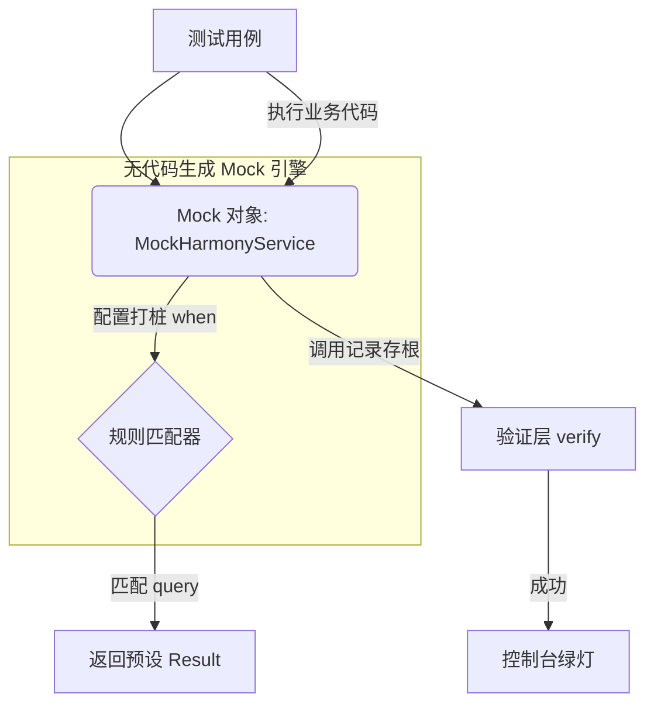

欢迎加入开源鸿蒙跨平台社区：[https://openharmonycrossplatform.csdn.net](https://openharmonycrossplatform.csdn.net)。

# Flutter for OpenHarmony：mocktail — 让测试不再依赖真实环境


## 前言

在维护高质量的鸿蒙（OpenHarmony）应用时，单元测试（Unit Testing）是不可或缺的环节。但我们经常会遇到这样的尴尬：想要测试一个简单的业务逻辑，却需要初始化复杂的网络库、真实的数据库甚至是鸿蒙原生蓝牙接口。这些外部依赖不仅让测试变得极慢，而且极具不稳定性。

`mocktail` 是一个灵感来源于 Mockito 但更加现代化的 Mock 库。它最大的特点是：**完全不需要代码生成（No Code Generation）**。利用 Dart 的类型系统和反射模拟能力，它可以瞬间伪造任何对象的行为。在 Flutter for OpenHarmony 的快速迭代周期中，`mocktail` 能够帮助开发者构建纯净的沙箱环境，让测试聚焦于逻辑本身而非环境搭建。

## 一、原理解析 / 概念介绍

### 1.1 基础模型

`mocktail` 通过创建一个继承自目标类的伪存根（Stub），拦截并记录所有的函数调用。



### 1.2 核心要点

- **类型安全**：不需要繁琐的 `build_runner`，直接通过 Class 继承即可实现 Mock。
- **丰富的 Matcher**：支持 `any`、`capture` 等高级匹配模式，精准捕获鸿蒙端的复杂对象入参。
- **与 Riverpod/GetIt 完美结合**：在依赖注入层轻松替换为 Mock 实现。

## 二、核心 API / 工具详解

### 2.1 依赖引入

在鸿蒙工程的 `dev_dependencies` 中添加依赖：

```yaml
dev_dependencies:
  mocktail: ^1.2.0
```

### 2.2 要点讲解

💡 **技巧**：在鸿蒙端处理模拟返回时，`when` 是最核心的语法。

```dart
import 'package:mocktail/mocktail.dart';
import 'package:test/test.dart';

// 1. 定义 Mock 类
class MockHarmonyApi extends Mock implements HarmonyApi {}

void main() {
  test('应该能正确处理鸿蒙登录成功的情况', () async {
    final api = MockHarmonyApi();
    
    // ✅ 推荐做法：配置桩方法
    when(() => api.login('user', 'pass'))
        .thenAnswer((_) async => 'mock_token_123');
    
    // 执行测试逻辑...
    expect(await api.login('user', 'pass'), 'mock_token_123');
    
    // 验证调用次数
    verify(() => api.login(any(), any())).called(1);
  });
}
```

## 三、典型应用场景

### 3.1 场景一：模拟鸿蒙原生系统弹窗
在无需真机的情况下，通过 Mock 鸿蒙原生的弹窗服务，测试用户点击“确定”或“取消”后，Flutter 端的后续逻辑流转。

### 3.2 场景二：复杂网络异常测试
通过配置 Mock 对象抛出自定义异常，测试鸿蒙应用在断网、超时或 500 错误时的 UI 反馈和重试机制。

## 四、OpenHarmony 平台适配挑战

### 4.1 异步与并发稳定性
鸿蒙端有时会涉及大量的异步调度。

✅ **适配建议**：
1. **优先使用 thenAnswer**：针对返回 `Future` 的鸿蒙 API，始终使用 `thenAnswer` 而非 `thenReturn`，以确保异步执行时序的模拟真实性。
2. **处理自定义类型寄存**：如果你的 Mock 方法接受鸿蒙特定的复杂类型作为参数，记得使用 `registerFallbackValue` 预注册该类型，否则 `any()` 匹配器会报错。

## 五_、综合实战演示

下面是一个演示如何 Mock 鸿蒙定位服务并测试 UI 显示的例子：

```dart
import 'package:flutter/material.dart';
import 'package:mocktail/mocktail.dart';
import 'package:test/test.dart';

abstract class LocationProvider {
  Future<String> getCurrentCity();
}

class MockLocation extends Mock implements LocationProvider {}

void main() {
  test('UI 应该显示 Mock 出的鸿蒙端定位', () async {
    final mockLocation = MockLocation();
    
    // 模拟鸿蒙系统返回“深圳”
    when(() => mockLocation.getCurrentCity()).thenAnswer((_) async => "深圳");

    final result = await mockLocation.getCurrentCity();
    
    expect(result, equals("深圳"));
    print('【测试验证】鸿蒙虚拟定位成功！');
  });
}
```

## 六、总结

`mocktail` 是鸿蒙开发者构建“高内聚、低耦合”代码的催化剂。它让原本由于环境限制“不可测”的代码，变成了只需几行配置即可覆盖的自动化资产。

✅ **核心建议**：
1. **不要 Mock 一切**：仅针对外部依赖（IO、网络、原生硬件）进行 Mock，业务模型类建议使用真实对象。
2. **测试即文档**：精心编写的 `when` 语句，其实就是对该组件功能逻辑的最好文字描述。

📦 **参考源码**：见 AtomGit。

🌐 **欢迎加入**：[开源鸿蒙跨平台开发者社区](https://openharmonycrossplatform.csdn.net)
