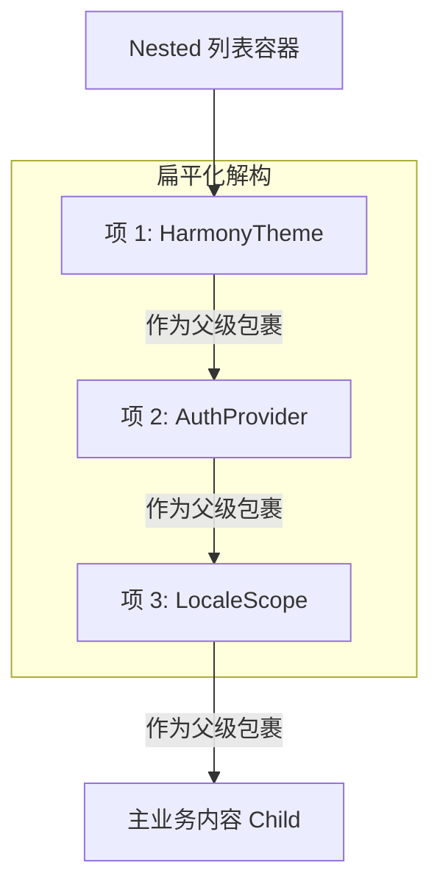

欢迎加入开源鸿蒙跨平台社区：[https://openharmonycrossplatform.csdn.net](https://openharmonycrossplatform.csdn.net)。

# Flutter for OpenHarmony：nested — 告别代码缩进的“死亡三角”


## 前言

在鸿蒙（OpenHarmony）应用开发过程中，随着功能的不断堆叠，开发者往往会陷入所谓的“嵌套地狱（Nested Hell）”。典型的场景是在应用根节点或复杂详情页中，我们需要同时注入多个 `Provider`、`MultiProvider`、`Theme` 以及各种业务作用域。这会导致代码向右侧不断缩进，一个普通的初始化逻辑可能需要嵌套七八层。

这种结构不仅难以阅读，更让代码维护和重构变得及其危险。`nested` 是一个非常精巧的工具库，它通过一种扁平化的方式重构了这种层级嵌套。实际上，风靡全球的 `Provider` 库底层的 `MultiProvider` 正是基于 `nested` 实现的。在 Flutter for OpenHarmony 的高质量代码治理中，`nested` 是让 UI 代码回归清爽、整洁的终极利器。

## 一、原理解析 / 概念介绍

### 1.1 基础模型

`nested` 将多个“包裹型”的 Widget 转化为一个线性的列表，并自动根据列表顺序建立父子包含关系。



### 1.2 核心价值

- **视觉扁平化**：将纵向的、大幅度缩进的代码结构转化为横向的、易读的列表结构。
- **动态性增强**：支持通过变量动态地增加或减少包裹层，而无需大规模调整 UI 树结构。
- **适配鸿蒙生态**：由于其本质是对 Widget 树的逻辑变换，不涉及原生渲染，在鸿蒙各型终端上运行极度稳定。

## 二、核心 API / 工具详解

### 2.1 依赖引入

在鸿蒙工程的 `pubspec.yaml` 中添加以下依赖：

```yaml
dependencies:
  nested: ^1.0.0
```

### 2.2 要点讲解

💡 **技巧**：在鸿蒙端重构复杂的入口页时，将自定义的 `SingleChildWidget` 放入 `Nested` 是核心操作。

```dart
import 'package:nested/nested.dart';

class HarmonyAppEntry extends StatelessWidget {
  const HarmonyAppEntry({super.key});

  @override
  Widget build(BuildContext context) {
    // ✅ 推荐做法：使用 Nested 代替多层手动嵌套
    return Nested(
      children: [
        const MyHarmonyThemeWidget(), // 必须继承自 SingleChildStatelessWidget/StatefulWidget
        const UserAuthProvider(),
        const SystemConfigWrapper(),
      ],
      child: const HomePage(),
    );
  }
}
```

## 三、典型应用场景

### 3.1 场景一：根结点注入大满贯
当鸿蒙应用需要同时支持国际化、暗黑模式切换、全局错误捕捉和依赖注入时，避免产生 10 层以上的 `return` 语句。

### 3.2 场景二：复杂详情页的特定作用域
例如在鸿蒙影音应用的视频播放页，同时需要包裹手势监听器、全屏控制器和音轨选择器。

## 四、OpenHarmony 平台适配挑战

### 4.1 继承体系的学习成本
`nested` 要求被包含的项必须继承自特定的 `SingleChildWidget` 类。

✅ **适配建议**：
1. **统一基类封装**：为了让团队更无感地使用，建议将鸿蒙常用的业务组件封装为继承自 `SingleChildStatelessWidget` 的快捷版本。
2. **性能检测**：由于 `Nested` 本质上还是在内存中构建了完整的 Widget 树，在处理包含几百个轻量项的列表时（虽然这极少见），应通过鸿蒙性能工具观测其对首屏启动时间的影响。

## 五_、综合实战演示

下面演示了一个如何在鸿蒙端通过 `Nested` 实现一个包含多个环境配置的整洁布局：

```dart
import 'package:flutter/material.dart';
import 'package:nested/nested.dart';

// 定义一个兼容 Nested 的自定义层
class HarmonyStyleWrapper extends SingleChildStatelessWidget {
  const HarmonyStyleWrapper({super.key, super.child});

  @override
  Widget buildWithChild(BuildContext context, Widget? child) {
    return Container(
      padding: const EdgeInsets.all(16),
      decoration: BoxDecoration(color: Colors.blue.withOpacity(0.1)),
      child: child,
    );
  }
}

class HarmonyNestedLab extends StatelessWidget {
  const HarmonyNestedLab({super.key});

  @override
  Widget build(BuildContext context) {
    return Scaffold(
      appBar: AppBar(title: const Text('扁平化布局实验室')),
      body: Center(
        child: Nested(
          children: const [
            HarmonyStyleWrapper(),
            Center(), // 兼容普通 Widget (通常建议使用专用包装)
            Padding(padding: EdgeInsets.all(20)),
          ],
          child: const Text('我被多层逻辑包裹，但代码很干净！', 
                           style: TextStyle(fontSize: 18)),
        ),
      ),
    );
  }
}
```

## 六、总结

`nested` 是解决大型项目“结构性代码臃肿”的一剂药方。它通过改变声明方式，让鸿蒙开发者能够重新夺回对代码缩进的控制权。

✅ **核心建议**：
1. **多层即优化**：只要嵌套层数超过 3 层，就应该考虑使用 `nested`。
2. **文档同步**：告知团队成员 `MultiProvider` 的原理，有助于大家更好地理解并接受这种扁平化写法。

📦 **参考源码**：见 AtomGit 仓库相关示例。

🌐 **欢迎加入**：[开源鸿蒙跨平台开发者社区](https://openharmonycrossplatform.csdn.net)
