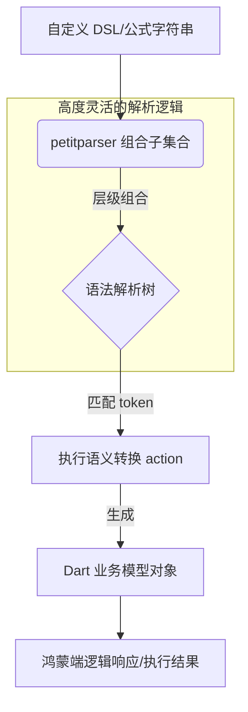

欢迎加入开源鸿蒙跨平台社区：[https://openharmonycrossplatform.csdn.net](https://openharmonycrossplatform.csdn.net)。

# Flutter for OpenHarmony：petitparser — 构建鸿蒙应用的“语言解析大脑”


## 前言

在鸿蒙（OpenHarmony）应用开发的一些高级场景（如内嵌一款简单的脚本引擎、解析复杂的自定义数据协议、实现功能强大的搜索过滤器或是开发一个支持数学公式录入的教育应用）中，开发者经常需要处理非标准化的文本数据。传统的正则表达式虽然强大，但在面对具有嵌套逻辑、上下文关联的复杂文本时，往往会显得力不从心且极难维护。

`petitparser` 是一个优雅、高性能且动态的解析组合库（Parser Combinators）。它鼓励开发者使用简单的解析器片段（如“解析一个数字”、“解析一个操作符”）通过各种转换、组合、重复逻辑构建出复杂的语言解析模型。在 Flutter for OpenHarmony 的底层工具开发中，`petitparser` 是承载业务动态化和协议自研的最佳选择。

## 一、原理解析 / 概念介绍

### 1.1 基础模型

`petitparser` 采用递归下降的解析策略，通过多种组合子（Combinators）构建语法树。



### 1.2 核心特性

- **动态构建**：解析器本身就是普通的 Dart 对象，可以在运行时根据鸿蒙端配置动态生成。
- **卓越的调试性**：提供了便捷的调试工具，能清晰定位到文本中哪个位置不符合语法规则。
- **无依赖实现**：纯 Dart 逻辑，完美兼容鸿蒙 AOT 编译。

## 二、核心 API / 工具详解

### 2.1 依赖引入

在鸿蒙工程的 `pubspec.yaml` 中添加以下依赖：

```yaml
dependencies:
  petitparser: ^6.0.0
```

### 2.2 要点讲解

💡 **技巧**：在鸿蒙端实现一个简单的加法解析器，只需几行声明代码。

```dart
import 'package:petitparser/petitparser.dart';

void solveHarmonyGrammar() {
  // ✅ 推荐做法：组合基础解析器
  final number = digit().plus().flatten().map(int.parse);
  final operator = char('+').trim();
  final parser = (number & operator & number).map((values) {
    return values[0] + values[2];
  });

  // 执行解析
  final result = parser.parse('123 + 456');
  if (result.isSuccess) {
    print('鸿蒙端动态解析结果: ${result.value}'); // 579
  }
}
```

## 三、典型应用场景

### 3.1 场景一：鸿蒙办公软件的公式编辑器
用户通过文字输入数学公式或逻辑表达式，利用 `petitparser` 将其转化为计算引擎可执行的算法树。

### 3.2 场景二：私有通信协议解析
针对鸿蒙设备间传输的、非 JSON/XML 格式的紧凑型文本协议，提供极高性能的结构化转换支持。

## 四、OpenHarmony 平台适配挑战

### 4.1 复杂语法的内存占用
如果定义的语法极其复杂且带有大量的递归调用，长时间的大规模解析可能会引起鸿蒙端的内存波动。

✅ **适配建议**：
1. **预先实例化**：解析器对象的构建相对昂贵。建议在鸿蒙端将其声明为全局单例或通过工厂进行缓存，避免每次解析同一个格式都要重新组合一次解析器。
2. **渐进式解析**：针对超大型文本（如数百 KB 的日志），建议先进行基于行的切片，再分段交给 `petitparser` 进行精细分析。

## 五_、综合实战演示

下面演示了一个在鸿蒙端实现的简单日期格式（如 `2026-02-25`）验证与提取工具：

```dart
import 'package:flutter/material.dart';
import 'package:petitparser/petitparser.dart';

class HarmonyParserLab extends StatelessWidget {
  const HarmonyParserLab({super.key});

  Parser _buildDateParser() {
    // 逻辑：4位数字 - 2位数字 - 2位数字
    final dig4 = digit().repeat(4).flatten();
    final dig2 = digit().repeat(2).flatten();
    final dash = char('-');
    return (dig4 & dash & dig2 & dash & dig2).flatten();
  }

  @override
  Widget build(BuildContext context) {
    const String input = "2026-02-25";
    final result = _buildDateParser().parse(input);

    return Scaffold(
      appBar: AppBar(title: const Text('语法解析实验室')),
      body: Center(
        child: Column(
          children: [
            const Icon(Icons.spellcheck, size: 80, color: Colors.blue),
            Text('待解析字符串: $input'),
            Text(
              result.isSuccess ? '✅ 解析成功: ${result.value}' : '❌ 解析失败',
              style: const TextStyle(fontSize: 22, fontWeight: FontWeight.bold),
            ),
          ],
        ),
      ),
    );
  }
}
```

## 六、总结

`petitparser` 是让鸿蒙应用具备“定制化逻辑理解能力”的神器。它将繁琐的正则表达式转换为了结构清晰、可维护的函数组合。

✅ **核心建议**：
1. **先写测试**：复杂的解析器逻辑必须配合完整的单元测试（test 库），确保各种边界字符能被正确命中。
2. **利用内置类**：利用库内置的 `ExpressionBuilder` 可以极速构建带优先级关系的数学表达式解析器。

📦 **参考资源**：源码已托管至官方。

🌐 **欢迎加入**：[开源鸿蒙跨平台开发者社区](https://openharmonycrossplatform.csdn.net)
