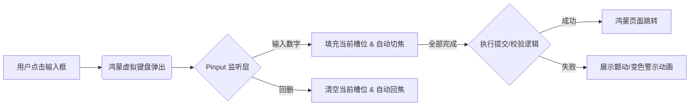

欢迎加入开源鸿蒙跨平台社区：[https://openharmonycrossplatform.csdn.net](https://openharmonycrossplatform.csdn.net)。

# Flutter for OpenHarmony：pinput — 打造极致的数字验证体验


## 前言

在鸿蒙（OpenHarmony）应用的登录、支付、二次验证（MFA）场景中，验证码输入框是一个核心 UI 组件。虽然使用普通的 `TextField` 配合多个输入框可以拼凑出类似功能，但往往会导致光标切换不流畅、无法自动填充、键盘遮挡以及样式不统一等诸多交互问题。

`pinput` 是 Flutter 生态中公认的最强大、定制化程度最高的验证码/PIN 码输入库。它针对移动端进行了深度优化，支持各种形状（圆角、下划线、光标动画）及智能处理各种输入场景。在 Flutter for OpenHarmony 的精品应用打造中，使用 `pinput` 能够立刻让你的验证页面拥有媲美系统原生的精致感。

## 一、原理解析 / 概念介绍

### 1.1 基础模型

`pinput` 内部管理了一个复杂的焦点树逻辑，确保用户每输入一个数字，焦点能以视觉感知不到的零延迟切换到下一格。



### 1.2 核心特性

- **高度自定样式**：支持为正常、激活、错误状态分别定义不同的装饰器（PinTheme）。
- **光标动画**：内置极具质感的光标平移和脉动效果。
- **自动填充与粘贴**：支持从剪贴板一键提取 6 位数字验证码。

## 二、核心 API / 工具详解

### 2.1 依赖引入

在鸿蒙工程的 `pubspec.yaml` 中添加以下依赖：

```yaml
dependencies:
  pinput: ^4.0.0 # 建议使用稳定版本
```

### 2.2 要点讲解

💡 **技巧**：在鸿蒙端实现一个简约的 4 位验证码框，配置 `PinTheme` 是重点。

```dart
import 'package:pinput/pinput.dart';

// ✅ 推荐做法：预定义主题
final defaultPinTheme = PinTheme(
  width: 56,
  height: 56,
  textStyle: const TextStyle(fontSize: 22, color: Colors.black, fontWeight: FontWeight.w600),
  decoration: BoxDecoration(
    border: Border.all(color: const Color.fromRGBO(234, 239, 243, 1)),
    borderRadius: BorderRadius.circular(12),
  ),
);

// 定义激活态
final focusedPinTheme = defaultPinTheme.copyDecorationWith(
  border: Border.all(color: const Color.fromRGBO(114, 178, 238, 1)),
  borderRadius: BorderRadius.circular(8),
);
```

## 三、典型应用场景

### 3.1 场景一：鸿蒙多端统一登录鉴权
在手机或平板端进行短信快捷登录时，提供统一的高刷响应式输入体验。

### 3.2 场景二：分布式的资产支付确认
用户在鸿蒙分布式协同设备上进行支付确认时，调起 `pinput` 进行 6 位交易密码的录入。

## 四、OpenHarmony 平台适配挑战

### 4.1 软键盘弹出与视位偏移
鸿蒙系统在不同分辨率下，键盘弹出的动画曲线可能影响 UI 的局部抖动。

✅ **适配建议**：
1. **配合键盘避让**：在外层包裹 `SingleChildScrollView` 并设置 `keyboardDismissBehavior`，确保 `pinput` 始终处于可视区域中心。
2. **触控震动反馈**：鸿蒙设备拥有优秀的震动马达。建议监听 `onCompleted` 事件，调用鸿蒙原生的 `HapticFeedback` 接口，给予用户清晰的物理反馈。

## 五_、综合实战演示

下面展示了一个带错误校验动画的鸿蒙风格 4 位验证码页面：

```dart
import 'package:flutter/material.dart';
import 'package:pinput/pinput.dart';

class HarmonyPinLab extends StatefulWidget {
  const HarmonyPinLab({super.key});

  @override
  State<HarmonyPinLab> createState() => _HarmonyPinLabState();
}

class _HarmonyPinLabState extends State<HarmonyPinLab> {
  final _pinController = TextEditingController();

  @override
  Widget build(BuildContext context) {
    return Scaffold(
      appBar: AppBar(title: const Text('安全输入实验室')),
      body: Center(
        child: Pinput(
          controller: _pinController,
          length: 4,
          onCompleted: (pin) {
            // 模拟验证码校验逻辑
            if (pin != '1234') {
              ScaffoldMessenger.of(context).showSnackBar(const SnackBar(content: Text('验证码错误！')));
              _pinController.clear();
            }
          },
          // ✅ 鸿蒙风格的简约装饰
          defaultPinTheme: PinTheme(
            width: 60, height: 60,
            decoration: BoxDecoration(
              color: Colors.grey[200],
              borderRadius: BorderRadius.circular(10),
            ),
          ),
          focusedPinTheme: PinTheme(
            width: 60, height: 60,
            decoration: BoxDecoration(
              color: Colors.white,
              border: Border.all(color: Colors.blue, width: 2),
              borderRadius: BorderRadius.circular(10),
            ),
          ),
        ),
      ),
    );
  }
}
```

## 六、总结

`pinput` 将繁杂的焦点切换逻辑抽象化，让开发者可以全神贯注于 UI 美感的设计。在鸿蒙应用中，它不仅仅是一个组件，更是打磨精品用户体验的细节保障。

✅ **核心建议**：
1. **默认开启 obscure**：如果是输入支付密码，务必开启密码遮掩功能以保障鸿蒙端的信息安全。
2. **结合倒计时**：在 `pinput` 下方通常会配合一个发送验证码的倒计时按钮，形成标准的交互闭环。

📦 **参考资源**：代码已托管。

🌐 **欢迎加入**：[开源鸿蒙跨平台开发者社区](https://openharmonycrossplatform.csdn.net)
