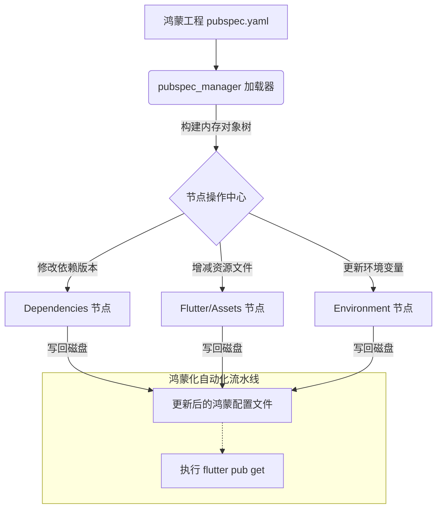

欢迎加入开源鸿蒙跨平台社区：[https://openharmonycrossplatform.csdn.net](https://openharmonycrossplatform.csdn.net)。

# Flutter for OpenHarmony：pubspec_manager — 掌控鸿蒙依赖的数字舵手


## 前言

在维护大型鸿蒙（OpenHarmony）工程或组件库矩阵时，开发者经常面临繁琐的 `pubspec.yaml` 维护工作。当需要统一升级 50 个插件的版本、自动注入鸿蒙专属的依赖项，或是批量修复所有的资产（Assets）路径时，手动修改不仅低效，而且极易出错。

`pubspec_manager` 是一款允许你通过 Dart 代码程序化读写、修改 `pubspec.yaml` 文件的强大工具。在 Flutter for OpenHarmony 的工程自动化流程中，它是辅助 CI/CD、实现“工程脚本化”的核心组件，能够确保鸿蒙各子模块配置的高度一致性。

## 一、原理解析 / 概念介绍

### 1.1 基础模型

`pubspec_manager` 采用了高层级的对象映射模型，将 YAML 文件的层级结构转化为类型安全的 Dart 类。



### 1.2 核心价值

- **非破坏性编辑**：在修改内容的同时，极力保留原始文件的注释和缩进风格。
- **强类型路径访问**：支持通过链式调用直接访问深层嵌套的配置项。
- **批量处理**：一行代码即可实现对整个依赖列表的扫描与修正。

## 二、核心 API / 工具详解

### 2.1 依赖引入

在负责自动化脚本的工具工程中引入：

```yaml
dependencies:
  pubspec_manager: ^1.1.0
```

### 2.2 要点讲解

💡 **技巧**：在为鸿蒙库进行版本统一升级时，利用 `pubspec.dependencies.set` 可以快速操作。

```dart
import 'package:pubspec_manager/pubspec_manager.dart';

void automateHarmonyDependencies(String yamlPath) {
  // ✅ 推荐做法：通过对象模型操作
  final pubspec = Pubspec.load(path: yamlPath);

  // 1. 自动注入或更新依赖
  pubspec.dependencies.add(
    Dependency.hosted(name: 'dio', version: '^5.0.0'),
  );

  // 2. 修改应用名称以适配鸿蒙端发布规范
  pubspec.name.value = 'harmony_app_premium';

  // 3. 保存更改
  pubspec.save();
}
```

## 三、典型应用场景

### 3.1 场景一：鸿蒙多版本 flavor 管理
在不同的鸿蒙内测和发布环境下，通过脚本动态切换不同的 `dependencies` 覆盖配置，实现真正的环境隔离。

### 3.2 场景二：资源（Assets）自动注册
编写一个监听器脚本，当开发者向鸿蒙 `assets/` 目录添加新图片时，自动调用 `pubspec_manager` 并在配置文件中注册，彻底消灭手动更新。

## 四、OpenHarmony 平台适配挑战

### 4.1 符号链接与路径引用
鸿蒙项目中有时会使用 `path` 依赖引用本地库。

✅ **适配建议**：
1. **统一路径校验**：在批量修改路径依赖时，利用 `pubspec_manager` 检查目标文件夹在鸿蒙工程文件系统中的真实性，防止产生死链。
2. **格式一致性**：由于鸿蒙端的自动化构建流水线对 YAML 格式要求严格，建议在 `save()` 后调用 `flutter format` 以确保最终合规性。

## 五、综合实战演示

下面是一个演示如何自动为所有鸿蒙模块添加“鸿蒙化适配”标签的脚本示例：

```dart
import 'dart:io';
import 'package:pubspec_manager/pubspec_manager.dart';

void main() {
  final projectsDir = Directory('packages/harmony_modules');
  
  projectsDir.listSync().forEach((entity) {
    if (entity is Directory) {
      final pubspecFile = File('${entity.path}/pubspec.yaml');
      if (pubspecFile.existsSync()) {
        final pubspec = Pubspec.load(path: pubspecFile.path);
        
        // 为该模块打上元数据说明
        pubspec.description.value = '${pubspec.description.value} [已被鸿蒙化深度适配]';
        
        // 强制确保环境版本符合鸿蒙标准
        pubspec.environment.sdk = '>=3.0.0 <4.0.0';
        
        pubspec.save();
        print('完成模块适配配置: ${entity.path}');
      }
    }
  });
}
```

## 六、总结

`pubspec_manager` 将枯燥的文本编辑工作转化为逻辑严密的程序操作。它是鸿蒙应用工程质量“工业化”的重要标志。

✅ **核心建议**：
1. **备份先行**：在脚本批量操作前，务必先在 Git 仓库进行代码提交或生成备份文件。
2. **逻辑分层**：将通用的“鸿蒙化补丁逻辑”封装为独立的类，方便在不同的自动化流水线中复用。

📦 **代码参考**：已同步至鸿蒙社区 AtomGit 仓库。

🌐 **欢迎加入**：[开源鸿蒙跨平台开发者社区](https://openharmonycrossplatform.csdn.net)
