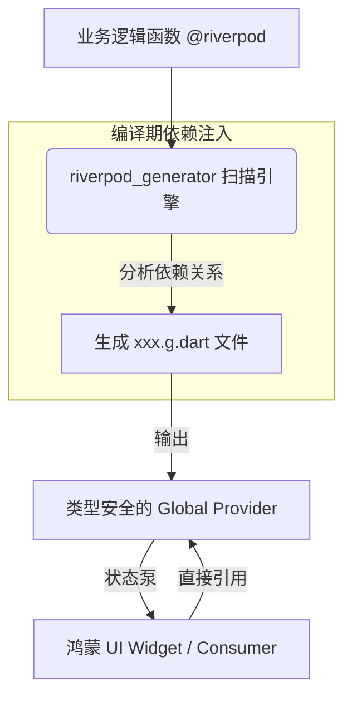

欢迎加入开源鸿蒙跨平台社区：[https://openharmonycrossplatform.csdn.net](https://openharmonycrossplatform.csdn.net)。

# Flutter for OpenHarmony：riverpod_generator — 彻底解放 Provider 定义


## 前言

在鸿蒙（OpenHarmony）应用架构设计中，状态管理（State Management）是决定项目可维护性的天花板。Riverpod 作为目前最受推崇的方案，其灵活的依赖注入和状态监听能力深受开发者喜爱。然而，手动编写复杂的 `FutureProvider`、`StateNotifierProvider` 等样板代码不仅累人，还容易因为类型拼写错误导致运行时崩溃。

`riverpod_generator` 开启了 Riverpod 2.0 的“自动化时代”。它通过注解（Annotation）扫描，自动为你生成类型安全、语义明确的 Provider。在 Flutter for OpenHarmony 的企业级适配实践中，它不仅统一了团队的编码风格，更通过编译期的静态检查，确保了鸿蒙应用在复杂业务流转下的状态稳定性。

## 一、原理解析 / 概念介绍

### 1.1 基础模型

`riverpod_generator` 将原本繁琐的单例定义简化为普通的函数或类，并辅以 `@riverpod` 注解。



### 1.2 核心价值

- **自动命名语义化**：函数名即 Provider 名，代码可读性飞跃。
- **自动处理异步**：自动区分 `Provider`、`FutureProvider` 和 `StreamProvider`。
- **参数支持（Family）**：通过直接在函数中添加参数，自动生成支持参数化查询的 Provider。

## 二、核心 API / 工具详解

### 2.1 依赖引入

在鸿蒙工程的 `pubspec.yaml` 中配置代码生成环境：

```yaml
dependencies:
  riverpod: ^2.5.1
  riverpod_annotation: ^2.3.4

dev_dependencies:
  build_runner: ^2.4.0
  riverpod_generator: ^2.3.11
```

### 2.2 要点讲解

💡 **技巧**：在鸿蒙端定义异步获取配置的逻辑时，只需要写一个简单的 `async` 函数。

```dart
import 'package:riverpod_annotation/riverpod_annotation.dart';

part 'harmony_config.g.dart'; // 代码生成生成在此文件

@riverpod
Future<String> harmonyAppTitle(HarmonyAppTitleRef ref) async {
  // 模拟从鸿蒙系统获取应用标题
  return await Future.delayed(const Duration(seconds: 1), () => "鸿蒙优选应用");
}
```

## 三、典型应用场景

### 3.1 场景一：鸿蒙多端统一认证状态
全自动生成用户信息 Provider，在手机、平板等不同分身的容器中共享登录凭证，并自动处理网络刷新。

### 3.2 场景二：复杂业务分页加载
利用生成的 `AutoDispose` 功能，在用户退出鸿蒙详情页时，自动清理该页面关联的所有数据缓存，保持鸿蒙内存清爽。

## 四、OpenHarmony 平台适配挑战

### 4.1 构建运行环境兼容
鸿蒙开发机（如华为电脑）运行 `build_runner` 可能会受到一些文件系统权限的限制。

✅ **适配建议**：
1. **增量构建**：在大项目中开启 `build_runner watch --delete-conflicting-outputs`，仅对修改的文件进行增量生成，减少等待。
2. **避免过度组件化**：由于生成的 `.g.dart` 文件较多，建议在鸿蒙工程中合理组织文件夹结构，防止过深的目录嵌套导致路径超限（Path too long）。

## 五、综合实战演示

下面是一个演示如何在鸿蒙端利用生成后的 Provider 获取异步数据的例子：

```dart
import 'package:flutter/material.dart';
import 'package:flutter_riverpod/flutter_riverpod.dart';
import 'harmony_config.g.dart'; // 引入生成的 Provider

class HarmonyProviderLab extends ConsumerWidget {
  const HarmonyProviderLab({super.key});

  @override
  Widget build(BuildContext context, WidgetRef ref) {
    // ✅ 这里的 harmonyAppTitleProvider 是由工具自动生成的
    final titleAsync = ref.watch(harmonyAppTitleProvider);

    return Scaffold(
      appBar: AppBar(title: const Text('自动化状态实验室')),
      body: Center(
        child: titleAsync.when(
          data: (title) => Text('云端配置标题: $title', style: const TextStyle(fontSize: 22)),
          loading: () => const CircularProgressIndicator(),
          error: (err, stack) => Text('获取失败: $err'),
        ),
      ),
    );
  }
}
```

## 六、总结

`riverpod_generator` 让状态管理回归到了“编写函数”的本质。它让鸿蒙应用的业务层逻辑不再被各种繁琐的样板类所覆盖，极大地释放了生产力。

✅ **核心建议**：
1. **精细化依赖**：利用生成后的 `ref` 对象多做 `ref.watch` 或 `ref.listen`，构建精确的依赖图谱。
2. **配合 Lint**：结合 `riverpod_lint` 库，在鸿蒙开发环境中实时纠正不规范的 Provider 定义习惯。

📦 **参考源码**：已托管至鸿蒙跨平台社区。

🌐 **欢迎加入**：[开源鸿蒙跨平台开发者社区](https://openharmonycrossplatform.csdn.net)
