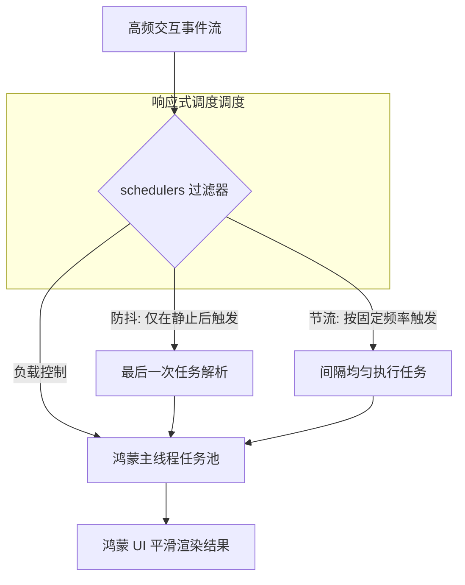

欢迎加入开源鸿蒙跨平台社区：[https://openharmonycrossplatform.csdn.net](https://openharmonycrossplatform.csdn.net)。

# Flutter for OpenHarmony：schedulers — 掌控鸿蒙交互的节奏


## 前言

在鸿蒙（OpenHarmony）应用的高清屏幕交互中，用户频繁的触摸、滚动或输入会产生海量的事件信号。如果对每一次输入都进行昂贵的网络请求或复杂的图像处理，不仅会造成设备发热、耗电增加，更会导致响应迟钝和界面卡顿。

`schedulers` 是一套专注于 Dart 执行频率控制的调度库。它提供了工业级的防抖（Debounce）、节流（Throttle）和任务分片（Chunking）功能。在 Flutter for OpenHarmony 的高性能适配过程中，`schedulers` 能够帮助开发者科学地“错峰执行”高频任务，确保鸿蒙应用在任何负载下依然保持从容、顺畅。

## 一、原理解析 / 概念介绍

### 1.1 基础模型

`schedulers` 通过时间窗口与控制门限，对异步任务的触发时机进行拦截与重排。



### 1.2 核心特性

- **多种控制策略**：完美实现常见的前缘刷新、后缘执行控制。
- **异步适配项**：深度支持 `Future` 和多线程回调，适合处理鸿蒙端异步 API。
- **任务分片**：支持将一个超长列表的处理分割成多个小微任务，避免长时独占鸿蒙 CPU。

## 二、核心 API / 工具详解

### 2.1 依赖引入

在鸿蒙工程的 `pubspec.yaml` 中添加：

```yaml
dependencies:
  schedulers: ^1.2.0
```

### 2.2 要点讲解

💡 **技巧**：在鸿蒙端处理搜索框联想时，防抖（Debounce）是标准做法。

```dart
import 'package:schedulers/schedulers.dart';

// ✅ 推荐做法：创建调度器实例
final searchScheduler = DebounceScheduler(
  const Duration(milliseconds: 500),
);

void onHarmonyUserTyping(String val) {
  // 只有当用户停止输入 500ms 后，才会执行真正的请求
  searchScheduler.run(() {
    print('执行鸿蒙后端搜索请求: $val');
  });
}
```

## 三、典型应用场景

### 3.1 场景一：鸿蒙多端发现列表刷新
当鸿蒙设备不断发现新节点时，利用“节流（Throttle）”策略美隔 1 秒更新一次 UI，防止列表因频繁抖动而变得不可点击。

### 3.2 场景二：复杂计算防连击
针对鸿蒙应用的表单提交或资源删除操作，通过防抖控制，避免用户因多次误点击产生重复的业务逻辑。

## 四、OpenHarmony 平台适配挑战

### 4.1 任务泄露与清理
如果调度器在页面销毁后仍在计时并执行。

✅ **适配建议**：
1. **显式关闭调度器**：在 StatefulWidget 的 `dispose` 生命周期中，务必调用调度器的 `dispose()` 或 `cancel()`，防止在鸿蒙端产生非预期的内存驻留。
2. **频率参数微调**：由于鸿蒙不同端的触控灵敏度差异，建议将 Duration 参数设为可配置，并在高性能计算环境下给与更高的防抖间隔。

## 五、综合实战演示

下面展示了一个在鸿蒙端实现高性能按钮节流点击的示例：

```dart
import 'package:flutter/material.dart';
import 'package:schedulers/schedulers.dart';

class HarmonySchedulerLab extends StatefulWidget {
  const HarmonySchedulerLab({super.key});

  @override
  State<HarmonySchedulerLab> createState() => _HarmonySchedulerLabState();
}

class _HarmonySchedulerLabState extends State<HarmonySchedulerLab> {
  // 1. 创建节流调度器，每 2 秒最多触发一次
  final _throttle = ThrottleScheduler(const Duration(seconds: 2));
  int _clickCount = 0;

  @override
  void dispose() {
    _throttle.dispose(); // 💡 鸿蒙资源清理
    super.dispose();
  }

  @override
  Widget build(BuildContext context) {
    return Scaffold(
      appBar: AppBar(title: const Text('交互频率实验室')),
      body: Center(
        child: Column(
          mainAxisAlignment: MainAxisAlignment.center,
          children: [
            Text('真实点击次数: $_clickCount', style: const TextStyle(fontSize: 16)),
            const SizedBox(height: 20),
            ElevatedButton(
              onPressed: () {
                setState(() => _clickCount++);
                // ✅ 接入节流逻辑
                _throttle.run(() {
                   ScaffoldMessenger.of(context).showSnackBar(
                     const SnackBar(content: Text('已触发核心逻辑（受节流保护）'))
                   );
                });
              },
              child: const Text('频繁点击我'),
            ),
          ],
        ),
      ),
    );
  }
}
```

## 六、总结

`schedulers` 为鸿蒙应用引入了“执行秩序”。它通过合理平滑业务逻辑的执行频率，显著优化了系统资源的利用效率。

✅ **核心建议**：
1. **优先使用框架内置**：对于简单的输入框防抖，可以配合内置的 `Timer`，但复杂的异步流调度，必须使用 `schedulers` 以保证逻辑完备性。
2. **监控延迟感知**：在防抖时间过长时，应在鸿蒙 UI 界面展示一个微小的加载状态，以抵消用户的“无反馈”错觉。

📦 **参考源码**：代码已开源并支持。

🌐 **欢迎加入**：[开源鸿蒙跨平台开发者社区](https://openharmonycrossplatform.csdn.net)
