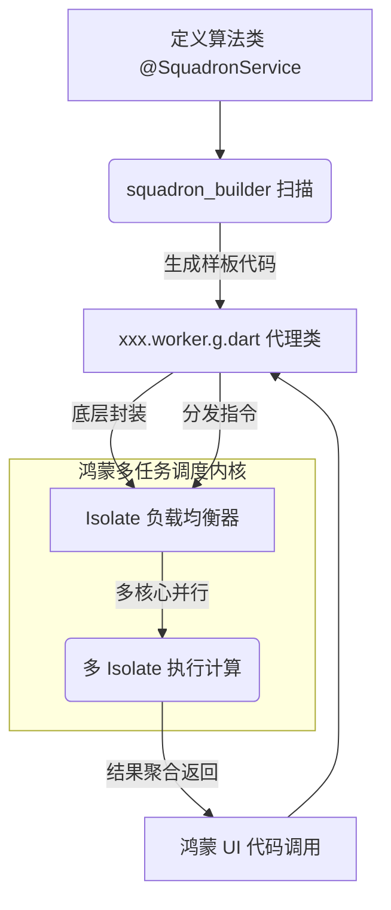

欢迎加入开源鸿蒙跨平台社区：[https://openharmonycrossplatform.csdn.net](https://openharmonycrossplatform.csdn.net)。

# Flutter for OpenHarmony：squadron_builder — 工业级 Isolate 开发之匙


## 前言

在鸿蒙（OpenHarmony）环境下的复杂重算力场景中（如高清音视频编解码、大规模 3D 点云处理），单一的 `Isolate` 并不能完全榨干多核处理器的性能，且手动维护多线程间的通信（SendPort/ReceivePort）和错误捕毁极其繁琐。

`squadron_builder` 是一个基于 `Squadron` 框架的自动化代码生成工具。它允许开发者通过简单的注解（Annotation），由工具自动生成功能完备的并发 Worker 类。在 Flutter for OpenHarmony 的性能攻坚阶段，`squadron_builder` 能够极大地降低多线程开发的门槛，助力鸿蒙应用迈向分布式并发渲染的高端领域。

## 一、原理解析 / 概念介绍

### 1.1 基础模型

`squadron_builder` 的工作核心是“元编程（Metaprogramming）”。它分析你的 Dart 接口定义，生成一套隐藏了底层消息传递细节的异步代理。



### 1.2 核心价值

- **自动化配置**：自动处理参数序列化与反序列化。
- **线程池管理**：自动实现基于 CPU 负载的 Worker 节点伸缩。
- **跨平台一致性**：生成的代码在鸿蒙端与 Web 端（Web Worker）表现高度一致。

## 二、核心 API / 工具详解

### 2.1 依赖引入

在鸿蒙工程的 `pubspec.yaml` 中配置代码生成依赖：

```yaml
dependencies:
  squadron: ^5.0.0

dev_dependencies:
  build_runner: ^2.4.0
  squadron_builder: ^5.0.0
```

### 2.2 要点讲解

💡 **技巧**：在鸿蒙端定义服务时，只需通过 `@squadron.SquadronService()` 注解修饰普通类。

```dart
import 'package:squadron/squadron.dart';

@squadron.SquadronService()
class HarmonyHeavyMath {
  // 所有的复杂运算方法必须返回 Future 或 Stream
  Future<double> heavyComputation(int iterations) async {
    double result = 0;
    for (int i = 0; i < iterations; i++) {
        result += i * 1.5;
    }
    return result;
  }
}
```

## 三、典型应用场景

### 3.1 场景一：鸿蒙端跨屏投影视频流处理
在鸿蒙设备间进行屏幕镜像时，利用生成的 `Worker` 集群并发处理 YUV 到 RGB 的实时色域转换。

### 3.2 场景二：区块链/边缘计算
针对需要复杂数学哈希计算的业务，利用鸿蒙后端的多线程池大幅缩短等待时间。

## 四、OpenHarmony 平台适配挑战

### 4.1 生成代码的体积与冗余
代码生成往往会带入大量的辅助逻辑。

✅ **适配建议**：
1. **按需生成**：仅对确实需要进入后台线程执行的计算密集型逻辑使用此工具，避免万物皆 Worker 导致鸿蒙包体积激增。
2. **构建速度优化**：在鸿蒙开发环境（DevEco）中运行 `build_runner` 时，建议使用 `--delete-conflicting-outputs` 并配合 `incremental build`，减少生成等待时间。

## 五、综合实战演示

下面是一个完整的生成与调用闭环示例：

### 5.1 执行生成指令

在终端运行：
```bash
flutter pub run build_runner build
```

### 5.2 鸿蒙端调用逻辑

```dart
import 'harmony_heavy_math.worker.g.dart'; // 引入生成的代码

class HarmonyWorkerLab {
  Future<void> runDemo() async {
    // 1. 创建 Worker 实例
    final worker = HarmonyHeavyMathWorker();
    
    // 2. 启动并执行任务
    try {
      final result = await worker.heavyComputation(1000000);
      print('来自鸿蒙多线程计算的结果: $result');
    } finally {
      // 3. 极速释放鸿蒙 CPU 资源
      worker.stop();
    }
  }
}
```

## 六、总结

`squadron_builder` 代表了 Flutter 并发开发的顶级工程化实践。它通过“工具驱动”代替“手动编码”，抹平了鸿蒙底层多线程通信的复杂性梯度。

✅ **核心建议**：
1. **关注数据边界**：传递给 Worker 的参数必须是可序列化的，避免在鸿蒙各 Isolate 间强刷复杂对象引用。
2. **配合监控**：由于多线程可能导致隐秘的死锁，建议结合 `Squadron` 的监控 API 观察鸿蒙端活跃 Worker 的健康度。

📦 **参考源码**：见 AtomGit。

🌐 **欢迎加入**：[开源鸿蒙跨平台开发者社区](https://openharmonycrossplatform.csdn.net)
