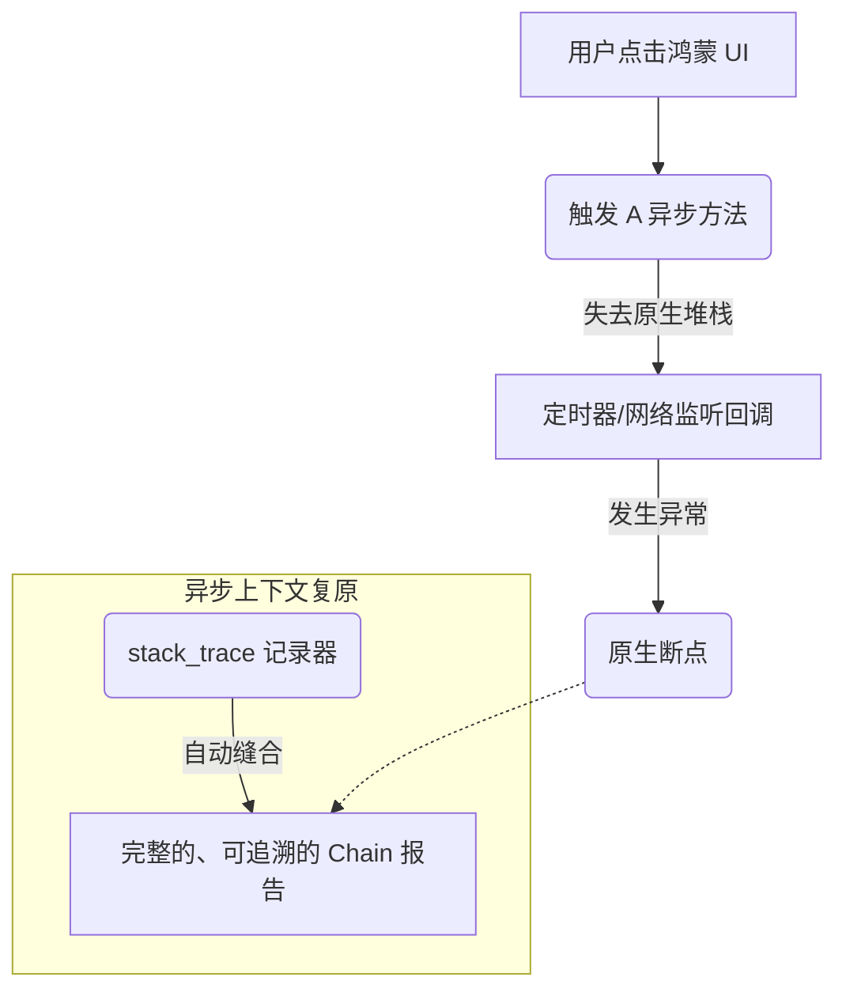

欢迎加入开源鸿蒙跨平台社区：[https://openharmonycrossplatform.csdn.net](https://openharmonycrossplatform.csdn.net)。

# Flutter for OpenHarmony：stack_trace — 让异步错误无所遁形


## 前言

在鸿蒙（OpenHarmony）应用开发中，异步操作（Furture、Stream、Async/Await）是整个架构运行的灵魂。然而，当应用发生崩溃或逻辑异常时，Dart 原生的 `StackTrace` 往往表现得极度吝啬：它由于底层运行时的限制，只能打印出当前线程最后一段同步代码的调用点，而丢失了引发该异步任务的父级上下文。

`stack_trace` 是一款功能强大且极其专注的堆栈处理库。它能够像胶水一样，将断裂的异步调用链重新缝合，从而展示出从用户点击按钮到最终产生报错的完整路径。在 Flutter for OpenHarmony 的线上监控与本地调试中，它是定位“幽灵逻辑”最得力的侦探工具。

## 一、原理解析 / 概念介绍

### 1.1 基础模型

`stack_trace` 通过 `Chain`（链）的概念，捕获并保存了每一个异步回调发生时的调用帧快照。



### 1.2 核心要点

- **异步合并**：自动跨越 `Future.then` 和 `stream.listen` 边界，展示完整的逻辑生命周期。
- **可读性优化**：将原本晦涩的内存偏移地址转化为开发者一眼可见的文件名与行号。
- **过滤器（Folding）**：支持隐藏第三方库或 SDK 内部的繁琐帧，只保留核心业务代码。

## 二、核心 API / 工具详解

### 2.1 依赖引入

在鸿蒙工程的 `pubspec.yaml` 中添加以下依赖：

```yaml
dependencies:
  stack_trace: ^1.11.1
```

### 2.2 要点讲解

💡 **技巧**：在鸿蒙端初始化时，封装一个全局的错误拦截器是展示其威力的最佳时刻。

```dart
import 'package:stack_trace/stack_trace.dart';

void initHarmonyErrorTracker() {
  // ✅ 推荐做法：在异步作用域中捕获
  Chain.capture(() {
    runApp(const HarmonyApp());
  }, onError: (error, chain) {
    // 这里打印出的 chain 是多段异步拼接后的完整路径
    print('【全链路报错】: $error');
    print(chain.terse); // .terse 用于简化不必要的中间帧
  });
}
```

## 三_、典型应用场景

### 3.1 场景一：鸿蒙多端分布式调用追踪
当一个分布式的任务在多个鸿蒙设备节点间通过 RPC 或事件流流转时，利用合并后的堆栈可以快速判断逻辑是在哪一步发生了中断。

### 3.2 场景二：复杂业务的回调地狱调试
在处理类似“用户选择相册 -> 图片压缩 -> 滤镜合成 -> 上传 -> 返回 UI”这样的长链异步逻辑时，清晰的堆栈能瞬间帮你指出崩溃发生在哪个环节。

## 四_、OpenHarmony 平台适配挑战

### 4.1 混淆后的堆栈还原
在鸿蒙 Release 模式下，代码会被混淆，直接打印出的文件名可能是 `a.dart:123`。

✅ **适配建议**：
1. **结合 Symbol 映射**：在使用 `stack_trace` 获取原始信息后，应配合后端或鸿蒙自研的符号解析工具（Symbolicator）进行格式化，以还原真实的业务代码点。
2. **内存开销控制**：由于捕获每个异步帧会消耗额外的堆内存。建议仅在鸿蒙应用处于“开发者模式”或在 `main` 函数捕获顶层未处理异常时开启，避免对常规流畅度产生细微影响。

## 五_、综合实战演示

下面是一个演示如何在异步异常发生时获取漂亮的格式化堆栈的示例：

```dart
import 'package:flutter/material.dart';
import 'package:stack_trace/stack_trace.dart';

class HarmonyDebugLab extends StatelessWidget {
  const HarmonyDebugLab({super.key});

  Future<void> _doAsyncPanic() async {
     await Future.delayed(const Duration(milliseconds: 100));
     throw Exception("发生了一次典型的鸿蒙端异步故障！");
  }

  @override
  Widget build(BuildContext context) {
    return Center(
      child: ElevatedButton(
        onPressed: () {
          // ✅ 手动捕获链式堆栈
          Chain.capture(() async {
            await _doAsyncPanic();
          }, onError: (err, chain) {
             debugPrint("整理后的堆栈: \n${chain.foldFrames((f) => f.isCore || f.isThirdParty).terse}");
          });
        },
        child: const Text('触发异步报错调试'),
      ),
    );
  }
}
```

## 六、总结

`stack_trace` 是给异步代码安装的“监控摄像头”。它让本已支离破碎的异常信息重归完整，极大降低了鸿蒙应用在复杂环境下的排障门槛。

✅ **核心建议**：
1. **合理折叠**：利用 `.foldFrames` 排除掉 SDK 和系统库的内部调用，让报错信息直戳业务痛点。
2. **上报原始信息**：在崩溃收集中，优先上报包含完整信息的原始 `chain` 对象。

📦 **参考资源**：代码已上线。

🌐 **欢迎加入**：[开源鸿蒙跨平台开发者社区](https://openharmonycrossplatform.csdn.net)
