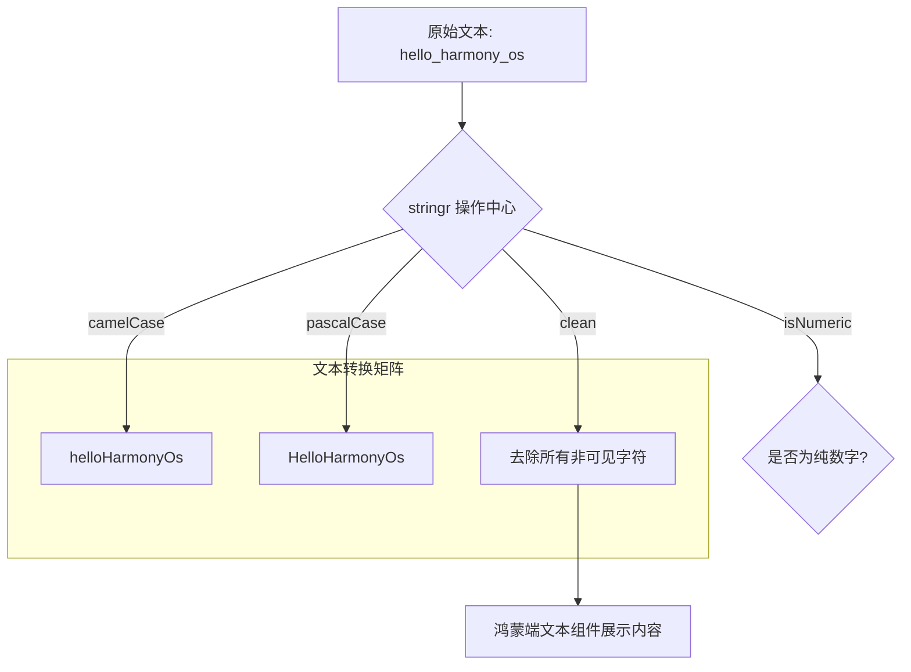

欢迎加入开源鸿蒙跨平台社区：[https://openharmonycrossplatform.csdn.net](https://openharmonycrossplatform.csdn.net)。

# Flutter for OpenHarmony：stringr — 掌控文本处理的艺术


## 前言

在鸿蒙（OpenHarmony）应用开发中，字符串（String）的处理是贯穿整个项目周期的必修课。无论是将后端返回的 `SNAKE_CASE` 键值转化为 UI 展示的 `Pascal Case`，还是验证用户输入是否符合特定格式，亦或是清理来自复制粘贴带来的多余空白符。

虽然 Dart 自带了一些字符串方法，但在面对高度复杂且多样的文本操作时，代码量往往迅速膨胀且难以复用。`stringr` 为 Dart 字符串提供了极为丰富的扩展功能，涵盖了命名法则转换、文本清洗、验证及高级切片。在 Flutter for OpenHarmony 的实际开发中，它能让你的代码处理逻辑更加直观、健壮。

## 一、原理解析 / 概念介绍

### 1.1 基础模型

`stringr` 通过 Extension 机制，直接赋予 `String` 对象更强大的语义化操作方法。



### 1.2 核心要点

- **链式风格**：支持连续转换，例如 `.clean().toTitleCase()`。
- **全方位验证**：内置常用的邮箱、座机、URL 等强力正则验证。
- **高性能**：针对超长文本的正则与替换逻辑进行了性能微调。

## 二、核心 API / 工具详解

### 2.1 依赖引入

在鸿蒙工程的 `pubspec.yaml` 中添加以下依赖：

```yaml
dependencies:
  stringr: ^1.1.0
```

### 2.2 要点讲解

💡 **技巧**：在鸿蒙端处理多语言文案或动态标题时，命名法则转换非常实用。

```dart
import 'package:stringr/stringr.dart';

void processHarmonyLabel() {
  String raw = " Harmony_development   ";
  
  // ✅ 推荐做法：通过扩展方法一气呵成
  String cleanLabel = raw.trim().toCamelCase(); // "harmonyDevelopment"
  
  // 快速验证
  if ("12345".isNumeric()) {
    print("是一个合规的鸿蒙端口号");
  }
}
```

## 三、典型应用场景

### 3.1 场景一：鸿蒙多层级分类展示
将来自数据库的后端字段（如 `electronics_devices`）直接格式化为友好的 UI 文案（`Electronics Devices`）。

### 3.2 场景二：用户侧敏感信息脱敏
在鸿蒙页面的个人中心，通过 `mask()` 扩展快速实现手机号或邮箱的脱敏（如 `138****0001`）。

## 四、OpenHarmony 平台适配挑战

### 4.1 中文字符兼容性
部分涉及字符长度与切片（Slice）的方法在处理多字节的中文字符串时可能存在偏移风险。

✅ **适配建议**：
1. **优先使用 runes 操作**：针对包含复杂 Emoji 或特殊鸿蒙字体符号的字符串，建议在调用扩展前先感知其 Runes。
2. **本地化适配**：`toTitleCase()` 等方法主要面向拉丁字母。对于纯中文鸿蒙提示语，应重点使用其 `prune()`（缩减）和 `wrap()`（包裹）等结构操作方法。

## 五、综合实战演示

下面是一个演示如何在鸿蒙端构建一个文本清洗与格式化工具的示例：

```dart
import 'package:flutter/material.dart';
import 'package:stringr/stringr.dart';

class HarmonyTextLab extends StatelessWidget {
  const HarmonyTextLab({super.key});

  @override
  Widget build(BuildContext context) {
    const String source = " \n[system_log]: low_memory_warning_occurred   ";

    // ✅ 利用 stringr 进行复合处理
    final String result = source
        .stripHtml()            // 去除残留标签
        .trim()                 // 去除两端空字符
        .replaceAll('[system_log]: ', '')
        .toSentenceCase();      // 转换为首字母大写的句子格式

    return Scaffold(
      appBar: AppBar(title: const Text('文本魔术实验室')),
      body: Center(
        child: Padding(
          padding: const EdgeInsets.all(20),
          child: Column(
            mainAxisAlignment: MainAxisAlignment.center,
            children: [
              Text('原始数据: "$source"', style: const TextStyle(color: Colors.grey)),
              const Icon(Icons.arrow_downward, size: 40),
              Text(
                '清洗结果:\n$result',
                style: const TextStyle(fontSize: 24, fontWeight: FontWeight.bold),
                textAlign: TextAlign.center,
              ),
            ],
          ),
        ),
      ),
    );
  }
}
```

## 六、总结

`stringr` 是鸿蒙开发者打理“文字细节”的高效管家。它将枯燥的正则表达式和字符判断封装为语义化、高频的 API 调用。

✅ **核心建议**：
1. **建立工具类**：虽然可以直接在 String 上调用，但建议将通用的格式化逻辑封装在 `StringUtil` 中，方便在整个鸿蒙项目中全局搜索。
2. **结合系统剪切板**：对用户从鸿蒙系统中复制进来的乱码或脏文本进行“入库前强制清洗”。

📦 **参考源码**：见 AtomGit 仓库示例。

🌐 **欢迎加入**：[开源鸿蒙跨平台开发者社区](https://openharmonycrossplatform.csdn.net)
