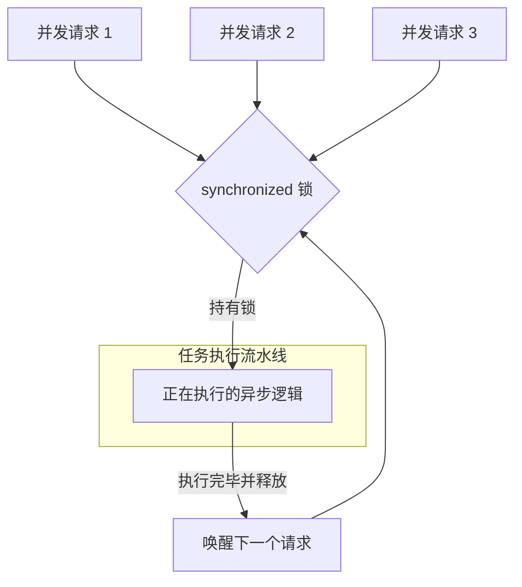

欢迎加入开源鸿蒙跨平台社区：[https://openharmonycrossplatform.csdn.net](https://openharmonycrossplatform.csdn.net)。

# Flutter for OpenHarmony：synchronized — 让异步代码井然有序


## 前言

在鸿蒙（OpenHarmony）应用开发中，异步操作（Async/Await）无处不在。虽然 Dart 是单线程的，但其 `Future` 机制和各种并发回调可能会引发隐秘的“竞态条件（Race Condition）”。例如：两个异步函数同时尝试初始化同一个鸿蒙本地文件，或者两个接口请求几乎同时触发了同一个数据库事务的写入。

`synchronized` 是一款功能强大且易用的异步锁（Lock）库。它能确保在任何时刻，被包裹的异步逻辑块仅能被一个调用执行，其余调用将排队等待。在 Flutter for OpenHarmony 的底层架构实践中，它是解决分布式状态不一致、数据库死锁以及文件读写竞争的必备工具。

## 一、原理解析 / 概念介绍

### 1.1 基础模型

`synchronized` 建立了一个虚拟的“排队队列（Queue）”，每一个进入锁定的 `Future` 必须等待前一个完成。



### 1.2 核心特性

- **非阻塞重入**：支持嵌套调用同一个锁（Reentrant），防止逻辑自锁。
- **内存安全**：利用高效的任务队列替代轮询等待，对鸿蒙端 CPU 极其节省。
- **极简 API**：就像使用普通函数一样简单地包裹代码块。

## 二、核心 API / 工具详解

### 2.1 依赖引入

在鸿蒙工程的 `pubspec.yaml` 中添加以下依赖：

```yaml
dependencies:
  synchronized: ^3.1.0
```

### 2.2 要点讲解

💡 **技巧**：在鸿蒙端处理初始化逻辑时，利用锁可以保证单例执行。

```dart
import 'package:synchronized/synchronized.dart';

// ✅ 推荐做法：创建实例级或全局锁
final _lock = Lock();

Future<void> initHarmonyStorage() async {
  await _lock.synchronized(() async {
    // 这段复杂的异步逻辑在同一时间只会被执行一次
    print('正在安全初始化鸿蒙存储核心...');
    await Future.delayed(const Duration(seconds: 1));
    print('初始化完毕！');
  });
}
```

## 三、典型应用场景

### 3.1 场景一：分布式文件读写保护
在鸿蒙设备间进行文件同步时，防止多个进程或异步流同时对同一个物理文件进行 `writeAsString` 操作，避免产生文件损坏。

### 3.2 场景二：支付请求防抖（后端级）
针对涉及金钱或订单创建的操作，在鸿蒙端前端通过异步锁确保第一个请求未返回结果前，第二个相同的点击动作不会触发实际的网络 I/O。

## 四、OpenHarmony 平台适配挑战

### 4.1 死锁风险排查
如果不小心在锁中等待了一个永远不会完成的 Future。

✅ **适配建议**：
1. **设置超时机制**：虽然库本身不直接带 timeout，但建议在锁内代码块配合 `Future.timeout` 使用，防止因为某次鸿蒙系统 API 挂起导致整个应用的异步逻辑永久锁定。
2. **锁的细粒度化**：不要用一把万能锁去管理整个鸿蒙应用。根据业务模块（如 FileLock, DbLock）创建独立的锁对象，减少不必要的线程等待开销。

## 五_、综合实战演示

下面展示了一个模拟鸿蒙本地数据库单例初始化锁的例子：

```dart
import 'package:flutter/material.dart';
import 'package:synchronized/synchronized.dart';

class HarmonyLockLab extends StatelessWidget {
  HarmonyLockLab({super.key});

  final Lock _initLock = Lock();
  bool _isInitialized = false;

  Future<void> _safeInitialize() async {
    // ✅ 关键加锁点
    await _initLock.synchronized(() async {
      if (_isInitialized) {
        print('鸿蒙服务已就绪，无需重复操作');
        return;
      }
      
      print('开始执行高开销初始化...');
      await Future.delayed(const Duration(milliseconds: 1500));
      _isInitialized = true;
      print('初始化完成 ✅');
    });
  }

  @override
  Widget build(BuildContext context) {
    return Scaffold(
      appBar: AppBar(title: const Text('并发竞争实验室')),
      body: Center(
        child: ElevatedButton(
          onPressed: () {
            // 模拟用户疯狂手抖连击
            _safeInitialize();
            _safeInitialize();
            _safeInitialize();
          },
          child: const Text('多路并发初始化测试'),
        ),
      ),
    );
  }
}
```

## 六、总结

`synchronized` 是鸿蒙应用代码稳健运行的“定海神针”。它将混乱的异步执行流整理为有序的执行序列，从根源上消除了逻辑的不确定性。

✅ **核心建议**：
1. **优先保障 I/O**：凡是涉及本地文件操作的行为，都建议加上锁。
2. **配合日志**：在锁的进入和退出处打印 Debug 日志，方便观测鸿蒙端在高并发下的排队时长。

📦 **参考源码**：相关代码片段已上传。

🌐 **欢迎加入**：[开源鸿蒙跨平台开发者社区](https://openharmonycrossplatform.csdn.net)
