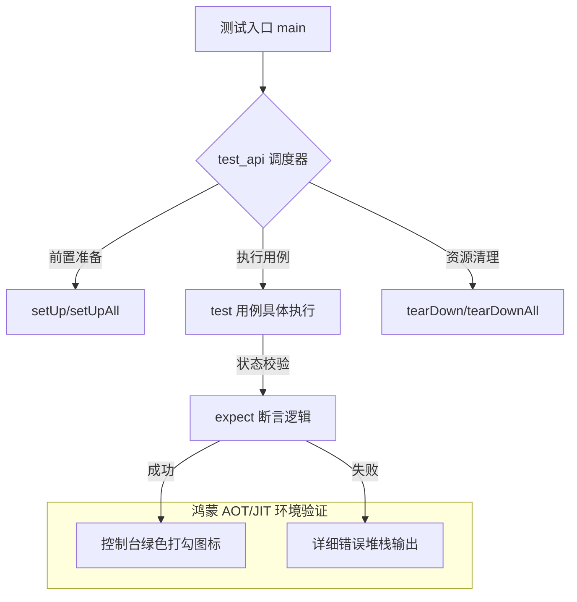

欢迎加入开源鸿蒙跨平台社区：[https://openharmonycrossplatform.csdn.net](https://openharmonycrossplatform.csdn.net)。

# Flutter for OpenHarmony：test_api — 守护鸿蒙应用代码质量


## 前言

随着鸿蒙（OpenHarmony）应用项目的复杂度不断增加，如何确保新功能的加入不会破坏已有的业务逻辑，成为了每个鸿蒙开发者必须思考的问题。在软件开发中，“测试先行”是确保系统健壮性的不二法门。

`test_api` 是 Dart 系统中最底层的测试框架集合。虽然大家更熟悉上层的 `test` 库，但 `test_api` 提供了驱动测试运行的核心接口和断言机制。在 Flutter for OpenHarmony 的开发流程中，掌握 `test_api` 能帮助我们编写更加精准、高效的单元测试（Unit Test），从源头切断 Bug 的产生路径。

## 一、原理解析 / 概念介绍

### 1.1 基础模型

`test_api` 提供了一套结构化的声明方式，让测试过程具有明确的生命周期。



### 1.2 核心特性

- **高度结构化**：利用 `group` 嵌套实现复杂的测试场景模拟。
- **异步支持**：原生处理 `Future` 和 `Stream` 的等待，非常适合测试鸿蒙端的异步业务。
- **丰富的断言器**：包含从简单的数值对比到复杂的集合匹配（Matchers）功能。

## 二、核心 API / 工具详解

### 2.1 依赖引入

在鸿蒙工程的 `pubspec.yaml` 中，通常将其加入 `dev_dependencies`：

```yaml
dev_dependencies:
  test_api: ^0.7.0
```

### 2.2 要点讲解

💡 **技巧**：在鸿蒙端测试模型层逻辑时，建议充分利用 Matcher 提升报错的可读性。

```dart
import 'package:test_api/test_api.dart';

void main() {
  group('鸿蒙解析测试', () {
    test('应该能正确反序列化鸿蒙消息', () {
      final msg = "{'id': 1, 'os': 'harmony'}";
      
      // ✅ 推荐做法：通过更加具体的 Matcher 进行校验
      expect(msg, contains('harmony'));
      expect(msg, isA<String>());
    });
  });
}
```

## 三、典型应用场景

### 3.1 场景一：业务模型回归测试
在鸿蒙应用重构过程中，运行所有的模型层测试用例，确保数据转换逻辑的一致性。

### 3.2 场景二：算法准确性验证
针对鸿蒙私有协议、自定义加密算法等核心代码，通过构造大量的边界 Case 并在测试环境下运行，提前发现隐含 Bug。

## 四、OpenHarmony 平台适配挑战

### 4.1 运行环境差异
测试代码通常运行在开发机（x64/M1）的环境下，可能与鸿蒙 ARM 设备存在微小的数值计算误差。

✅ **适配建议**：
1. **Mock 平台依赖**：由于单元测试不包含鸿蒙原生环境，请使用 `mockito` 或 `mocktail` 模拟所有的鸿蒙原生接口，确保测试的独立性。
2. **多机验证**：对于极度敏感的计算逻辑，除了通过 `test_api` 运行单元测试，还应结合 `flutter_driver` 在鸿蒙真实物理机上进行集成回归。

## 五、综合实战演示

下面展示了如何为一个简单的购物车计算器编写测试：

```dart
// 业务逻辑代码
class HarmonyCart {
  double total = 0;
  void addItem(double price) => total += price;
}

// ✅ 测试代码实现
import 'package:test_api/test_api.dart';

void main() {
  late HarmonyCart cart;

  // 1. 初始化
  setUp(() {
    cart = HarmonyCart();
  });

  // 2. 编写测试用例
  test('初始状态金额应为 0', () {
    expect(cart.total, equals(0.0));
  });

  test('添加商品后总价应累加', () {
    cart.addItem(19.9);
    cart.addItem(20.1);
    
    // 💡 提示：对于浮点数，建议使用 closeTo 进行容差匹配
    expect(cart.total, moreOrLessEquals(40.0));
  });
}
```

## 六、总结

`test_api` 是鸿蒙应用迈向成熟工程化的“奠基石”。虽然它不直接触及 UI，但它保证了整个应用的骨架是稳固的。

✅ **核心建议**：
1. **高覆盖率**：核心算法和 Data Mapping 层应保证 100% 的覆盖。
2. **CI/CD 集成**：将测试运行指令加入到鸿蒙应用的流水线中，确保每次提交记录都能通过自动化审计。

📦 **参考资源**：相关代码模板已上传至社区 AtomGit。

🌐 **欢迎加入**：[开源鸿蒙跨平台开发者社区](https://openharmonycrossplatform.csdn.net)
