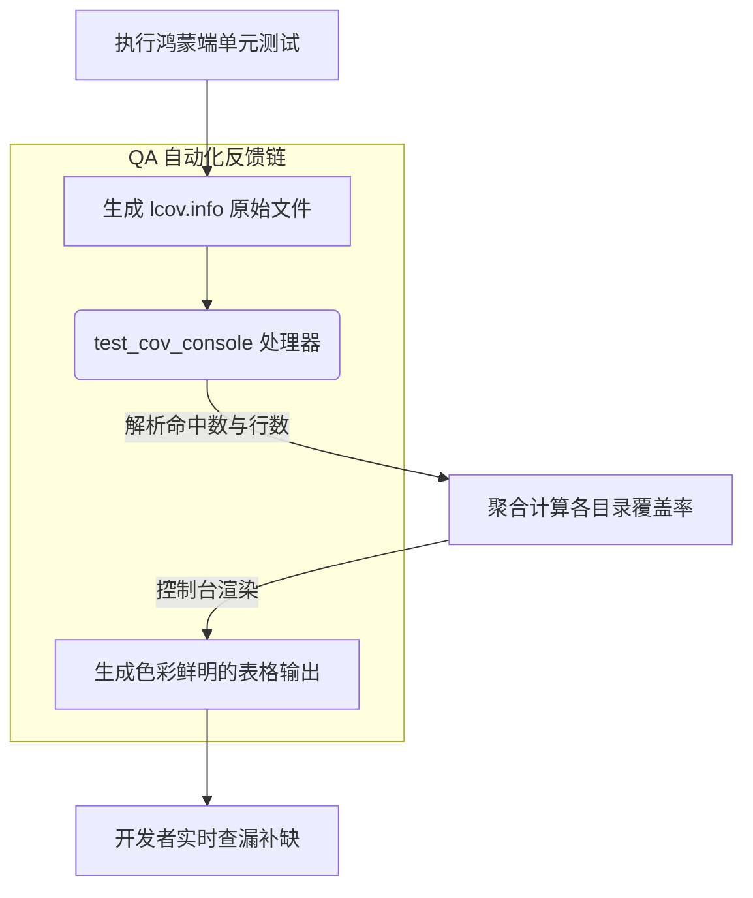

欢迎加入开源鸿蒙跨平台社区：[https://openharmonycrossplatform.csdn.net](https://openharmonycrossplatform.csdn.net)。

# Flutter for OpenHarmony：test_cov_console — 让测试覆盖率触手可及


## 前言

在鸿蒙（OpenHarmony）应用的工程化开发中，编写单元测试只是第一步。如何客观评价测试的质量？哪些核心业务逻辑还没有被测试覆盖到？通常我们需要运行 `flutter test --coverage` 并在专门的 HTML 浏览器中查看报告。但这在 CI/CD 流水线或基于命令行的快速开发迭代中显得过于繁琐。

`test_cov_console` 解决了一个非常具体但痛点明显的场景：它能将 LCOV 覆盖率报告直接以极其美观、清晰的表格形式打印在你的开发终端（Terminal）中。在 Flutter for OpenHarmony 的集成化开发流程中，它实现了质量治理的毫秒级反馈，让鸿蒙开发者一眼洞察代码逻辑的安全边界。

## 一、原理解析 / 概念介绍

### 1.1 基础模型

该库作为一个单纯的报告解析器，读取二进制生成的 `lcov.info` 并根据源码路径进行聚合展示。



### 1.2 核心特性

- **直观易读**：通过进度条和颜色（绿/黄/红）区分覆盖率等级。
- **层级分段**：支持按目录、按文件展示覆盖率，方便定位盲区。
- **CI 友好**：支持设置最小覆盖率门限，不达标则报错拦截。

## 二、核心 API / 工具详解

### 2.1 依赖引入

在鸿蒙工程的 `dev_dependencies` 中添加：

```yaml
dev_dependencies:
  test_cov_console: ^0.2.0 # 建议安装为全局工具或本地开发依赖
```

### 2.2 要点讲解

💡 **技巧**：在鸿蒙端完成测试后，仅需一条简单的命令即可激活。

```bash
# 1. 运行鸿蒙工程测试
flutter test --coverage

# 2. ✅ 执行覆盖率显示
dart run test_cov_console
```

你会在控制台得到类似以下的输出：

```text
--------------------------------------------------------------------------------
File                                       | Lines      | Uncovered 
--------------------------------------------------------------------------------
lib/models/harmony_user.dart               | 95.0%      | 12-15
lib/services/network.dart                  | 42.0%      | 45, 56-90
--------------------------------------------------------------------------------
Total Coverage                             | 82.5%      |
--------------------------------------------------------------------------------
```

## 三、典型应用场景

### 3.1 场景一：DevEco Studio 内测反馈
开发者在修改完一段鸿蒙底层逻辑后，在 IDE 的 Terminal 窗口快速运行脚本，确认新增的代码行已被测试路径覆盖。

### 3.2 场景二：Git 代码提交门禁
通过脚本配置，如果鸿蒙工程的总体覆盖率掉出 80%，则禁止本次本地提交（Pre-commit），确保代码质量不倒退。

## 四、OpenHarmony 平台适配挑战

### 4.1 LCOV 路径兼容性
不同的环境生成的 `lcov.info` 对相对路径的处理可能不一致。

✅ **适配建议**：
1. **统一根目录**：确保在鸿蒙工程的根目录下执行命令。
2. **排除生成文件**：利用 `test_cov_console` 的参数（或配合 `remove_from_coverage` 库）排除掉类似 `.freezed.dart`、`.g.dart` 等自动生成的样板文件，让数据更真实地反映核心业务。

## 五_、综合实战演示

下面演示了一个如何在鸿蒙端构建“质量看板任务”的示例脚本：

```dart
// 💡 脚本文件: scripts/check_quality.dart
import 'dart:io';

Future<void> main() async {
  print('🚀 启动鸿蒙测试全量扫描...');
  
  // 1. 执行测试
  final testRes = await Process.run('flutter', ['test', '--coverage']);
  if (testRes.exitCode != 0) {
    print('❌ 测试未通过，终止任务');
    exit(1);
  }

  // 2. ✅ 运行可视化展示
  // 加上参数 -i 指定输入，-e 排除某些文件
  final covRes = await Process.run('dart', [
    'run', 
    'test_cov_console', 
    '-i', 'coverage/lcov.info',
    '-m', '80.0' // 强制 80% 覆盖率门标
  ]);
  
  print(covRes.stdout);
  
  if (covRes.exitCode != 0) {
    print('💔 质量门限拦截：覆盖率未达标！');
    exit(1);
  }
}
```

## 六、总结

`test_cov_console` 虽然是一个轻量级工具，但它极大缩短了“发现低质量代码”到“修复它”的物理距离。在追求卓越质量的鸿蒙项目中，它是不可或缺的质量哨兵。

✅ **核心建议**：
1. **关注关键路径**：不要盲目追求 100%，应确保逻辑极其复杂的 Service 层获得高分。
2. **可视化集成**：建议将该命令集成到鸿蒙开发机的 Alias 中，形成肌肉记忆。

📦 **参考资源**：代码已同步至社区 AtomGit。

🌐 **欢迎加入**：[开源鸿蒙跨平台开发者社区](https://openharmonycrossplatform.csdn.net)
