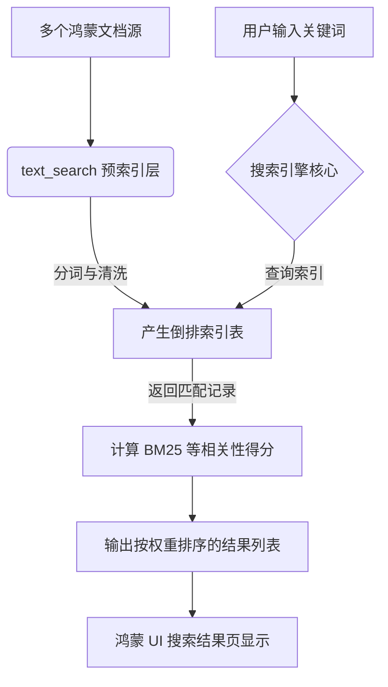

欢迎加入开源鸿蒙跨平台社区：[https://openharmonycrossplatform.csdn.net](https://openharmonycrossplatform.csdn.net)。

# Flutter for OpenHarmony：text_search — 精准触达每一个关键词


## 前言

在鸿蒙（OpenHarmony）应用开发中，为用户提供流畅且精准的本地搜索功能是提升体验的利器。当面临成千上万条缓存数据或离线文档时，简单的字符串包含判断（`contains`）不仅性能低下，且无法提供基于相关性的权重排序（如搜索三个词，命中最多的排在前面）。

`text_search` 是一款专为 Dart 设计的轻量级全文检索库。它通过倒排索引（Inverted Index）和相关性算法，实现了毫秒级的高性能检索。在 Flutter for OpenHarmony 的实际开发中，它是构建离线笔记搜索、本地通讯录检索及 FAQ 问答系统的核心组件，助力鸿蒙应用在离线状态下依然拥有卓越的搜索性能。

## 一、原理解析 / 概念介绍

### 1.1 基础模型

`text_search` 会将文本拆解为词根，并建立一个“词 -> 文档 ID”的映射表。



### 1.2 核心特性

- **多词搜索支持**：支持逻辑“或”/“与”的复杂关键词组合。
- **权重自定义**：支持对不同字段（如标题、内容）设置不同的搜索权重权重权重权重权重权重权重权重。
- **高性能**：针对移动端内存和 CPU 进行了深度优化。

## 二、核心 API / 工具详解

### 2.1 依赖引入

在鸿蒙工程的 `pubspec.yaml` 中添加以下依赖：

```yaml
dependencies:
  text_search: ^1.2.0
```

### 2.2 要点讲解

💡 **技巧**：在鸿蒙端初始化时，通过声明文档结构并批量喂入数据来构建索引。

```dart
import 'package:text_search/text_search.dart';

void initHarmonyFullText() {
  // ✅ 推荐做法：创建搜索实例
  final searcher = TextSearch();

  // 1. 添加文档数据
  searcher.add(TextSearchDocument('1', 'Flutter for OpenHarmony 深度实战'));
  searcher.add(TextSearchDocument('2', '鸿蒙内核原理与应用架构'));

  // 2. 执行搜索
  final result = searcher.search('鸿蒙 실战');
  print('搜索到文档 ID: ${result.ids}'); // 输出关联度最高的结果
}
```

## 三、典型应用场景

### 3.1 场景一：鸿蒙智能知识库
离线存储企业所有的技术文档，用户通过关键词能快速定位到具体的 PDF 或 Markdown 片段。

### 3.2 场景二：电商商品本地过滤
在网络不佳时，利用已缓存的商品属性，通过 `text_search` 提供秒级的多维度分类检索。

## 四、OpenHarmony 平台适配挑战

### 4.1 中文分词优化
默认的分词器可能对中文的语感支持有限。

✅ **适配建议**：
1. **分词预处理**：由于 `text_search` 底层通常按空格或符号分词，建议在向索引填充中文内容前，先利用简单的分词逻辑（如每字分词或引入第三方中文分词插件）对字符串进行加空格处理。
2. **内存持久化**：由于索引构建是一次性的且存放在内存中，对于极大规模的数据，建议利用鸿蒙端的存储能力，将处理好的索引对象定期序列化保存。

## 五、综合实战演示

下面演示了一个如何在鸿蒙端通过该库实现带权重排序的搜索框：

```dart
import 'package:flutter/material.dart';
import 'package:text_search/text_search.dart';

class HarmonySearchEngineLab extends StatefulWidget {
  const HarmonySearchEngineLab({super.key});

  @override
  State<HarmonySearchEngineLab> createState() => _HarmonySearchEngineLabState();
}

class _HarmonySearchEngineLabState extends State<HarmonySearchEngineLab> {
  final TextSearch _searcher = TextSearch();
  final List<String> _titles = ["鸿蒙开发入门", "Flutter 布局实战", "进阶架构设计", "鸿蒙动画渲染"];
  List<String> _displayResults = [];

  @override
  void initState() {
    super.initState();
    // ✅ 预填充索引
    for (int i = 0; i < _titles.length; i++) {
        _searcher.add(TextSearchDocument('$i', _titles[i]));
    }
  }

  void _runSearch(String query) {
    if (query.isEmpty) return;
    final res = _searcher.search(query);
    setState(() {
       _displayResults = res.ids.map((id) => _titles[int.parse(id)]).toList();
    });
  }

  @override
  Widget build(BuildContext context) {
    return Scaffold(
      appBar: AppBar(title: const Text('全文检索实验室')),
      body: Column(
        children: [
          Padding(
            padding: const EdgeInsets.all(8.0),
            child: TextField(onSubmitted: _runSearch, decoration: const InputDecoration(labelText: '搜索鸿蒙课程...')),
          ),
          Expanded(
            child: ListView.separated(
              itemBuilder: (_, i) => ListTile(title: Text(_displayResults[i])),
              separatorBuilder: (_, __) => const Divider(),
              itemCount: _displayResults.length,
            ),
          )
        ],
      ),
    );
  }
}
```

## 六、总结

`text_search` 为鸿蒙应用提供了接近原生的本地搜索性能。它不仅让找寻信息变得简单，更通过科学的权重计算让搜索结果更具人性化。

✅ **核心建议**：
1. **控制索引规模**：仅将核心字段（如标题、标签）填入索引，以节省鸿蒙端的堆内存。
2. **异步构建**：对于超大规模词库，务必将 `add` 操作放在后台任务中执行。

📦 **参考资源**：代码已同步至社区。

🌐 **欢迎加入**：[开源鸿蒙跨平台开发者社区](https://openharmonycrossplatform.csdn.net)
