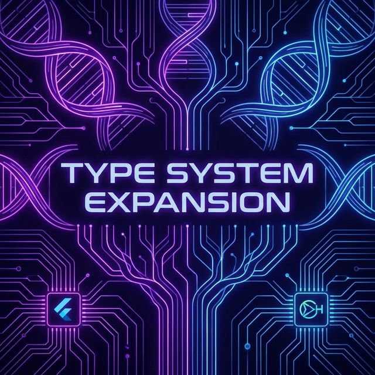
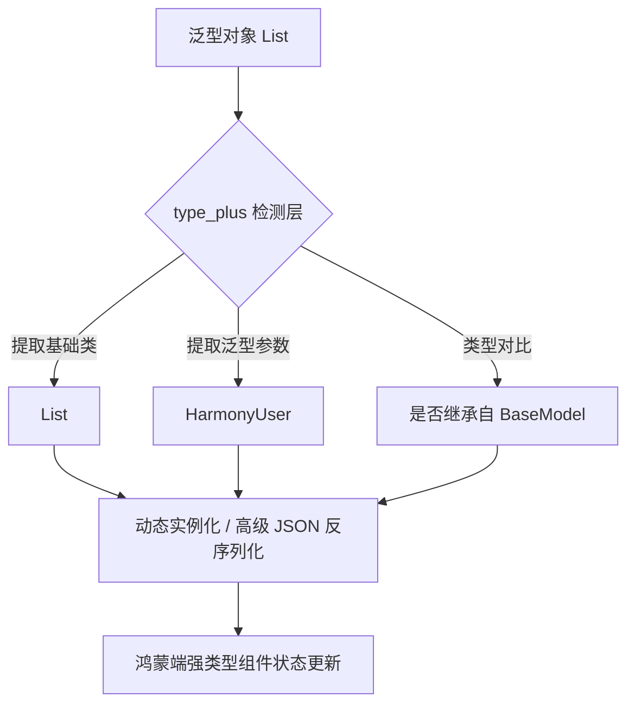

欢迎加入开源鸿蒙跨平台社区：[https://openharmonycrossplatform.csdn.net](https://openharmonycrossplatform.csdn.net)。

# Flutter for OpenHarmony：type_plus — 赋能 Dart 强类型操作



## 前言

在深耕鸿蒙（OpenHarmony）应用开发的过程中，随着业务复杂度的攀升，开发者经常会遇到一些难以解决的“类型难题”，比如：如何在运行时动态判断复杂的泛型类型？如何实现更灵活的多态 JSON 解析？

`type_plus` 是一个旨在扩展 Dart 类型系统能力的增强库。它在高层级抽象上提供了更加直观、强大的类型分析与转换功能。在 Flutter for OpenHarmony 的大规模工程实践中，它能够帮助我们构建更加通用的数据工厂和服务定位器，实现高度解耦的鸿蒙化系统架构。

## 一、原理解析 / 概念介绍

### 1.1 基础模型

`type_plus` 本质上是对 Dart 语言底层类型元数据的高级封装。它允许你通过更简洁的 API 来获取类型的层级关系、泛型参数以及构造信息。



### 1.2 核心价值

- **深度泛型分析**：轻松应对 `Map<String, List<int>>` 这种复杂嵌套。
- **动态构造**：通过元数据信息实现对象的动态实例化。
- **鸿蒙适配优势**：由于其基于纯 Dart 静态元数据，能够绕过某些平台对深度反射的限制，在鸿蒙端的性能表现非常优异。

## 二、核心 API / 工具详解

### 2.1 依赖引入

在鸿蒙工程的 `pubspec.yaml` 中添加以下依赖：

```yaml
dependencies:
  type_plus: ^1.1.0
```

### 2.2 要点讲解

💡 **技巧**：在鸿蒙端处理多端统一数据协议时，利用 `id` 属性可以极大地简化接口的匹配逻辑。

```dart
import 'package:type_plus/type_plus.dart';

// ✅ 推荐做法：注册类型 ID
void initHarmonyTypes() {
  TypePlus.add<List<int>>(id: 'int_list');
  
  // 运行时检查
  Type t = List<int>;
  print(t.id); // 输出: int_list
}
```

## 三、典型应用场景

### 3.1 场景一：鸿蒙多态消息工厂
在分布式通知系统中，通过 `type_plus` 动态解析不同类型的通知载体（图片、视频、文本），实现高度自动化的 UI 分发。

### 3.2 场景二：插件式架构
在鸿蒙应用中开发插件时，宿主端利用该库动态识别并加载不同三方库注入的自定义类型。

## 四、OpenHarmony 平台适配挑战

### 4.1 代码构建稳定性
在集成到鸿蒙构建流程时，过于复杂的类型链路可能会影响编译速度。

✅ **适配建议**：
1. **适度注册**：仅针对核心的、需要频繁动态判断的类进行 `TypePlus.add` 注册，避免无谓的内存开销。
2. **配合混淆保护**：在鸿蒙 Release 模式下开启源码混淆时，确保通过 `TypePlus` 注册的 ID 不在混淆排除名单内，否则运行时匹配会失效。

## 五、综合实战演示

下面展示了如何在鸿蒙应用中实现一个支持复杂泛型判断的日志工具：

```dart
import 'package:type_plus/type_plus.dart';

class HarmonyTypeLogger {
  static void logInfo<T>(T data) {
    // 利用 type_plus 提取具体类型
    final typeInfo = T.base;
    final isCollection = T.isSubtypeOf<Iterable>();

    print('【鸿蒙日志】数据类型: $typeInfo');
    print('【鸿蒙日志】是否为集合: $isCollection');
    
    if (T.args.isNotEmpty) {
      print('【鸿蒙日志】泛型参数: ${T.args.first}');
    }
  }
}

// 调用示例
void test() {
  List<double> scores = [98.5, 99.0];
  HarmonyTypeLogger.logInfo(scores);
}
```

## 六、总结

`type_plus` 为 Dart 提供了一套“可以被感知的”运行时类型大脑。它让鸿蒙应用的底层逻辑变得更加智能和健壮，减少了硬编码。

✅ **核心建议**：
1. **集中化注册**：在应用启动的 `main` 函数中统一完成类型预注册。
2. **结合原生通信**：在进行鸿蒙原生 MethodChannel 通信时，利用类型指纹快速校验数据格式是否合规。

📦 **参考源码**：见项目 `examples/type_plus` 相关路径。

🌐 **欢迎加入**：[开源鸿蒙跨平台开发者社区](https://openharmonycrossplatform.csdn.net)
