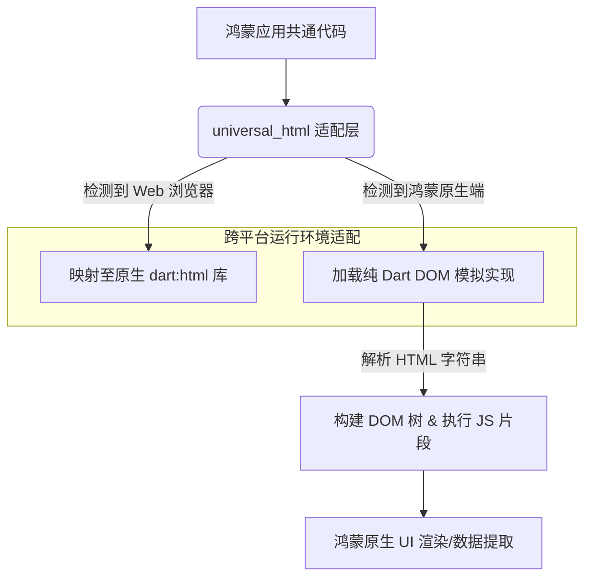

欢迎加入开源鸿蒙跨平台社区：[https://openharmonycrossplatform.csdn.net](https://openharmonycrossplatform.csdn.net)。

# Flutter for OpenHarmony：universal_html — 抹平 Web 访问的平台鸿沟


## 前言

在鸿蒙（OpenHarmony）应用开发中，处理 HTML 数据是一个常见的需求。无论是解析后端传回的富文本、实现复杂的 Web 内容抓取，还是在非浏览器环境下（如鸿蒙原生端）模拟 DOM 操作，开发者往往会习惯性地寻找 `dart:html` 库。然而，`dart:html` 仅能运行在 Web 浏览器环境中，在鸿蒙原生端直接引用会导致编译错误。

`universal_html` 是一个完美的跨平台替代方案。它提供了一套与 `dart:html` 完全一致的 API，但在原生端（如鸿蒙 ARM 环境）使用了由纯 Dart 实现的高性能 DOM 解析引擎。在 Flutter for OpenHarmony 的工程适配中，它是构建跨端 Web 数据处理器和富文本解析器的核心底座。

## 一、原理解析 / 概念介绍

### 1.1 基础模型

`universal_html` 通过条件导出（Conditional Export）技术，实现了在不同运行环境下的自动感知与切换。



### 1.2 核心价值

- **代码零改动**：只需替换 `import 'dart:html'` 为 `import 'package:universal_html/html.dart'` 即可运行。
- **全栈模拟**：不仅支持 DOM 节点操作，还支持 `Window`、`Document`、`Element` 等核心对象的各种属性和方法。
- **高性能解析**：针对鸿蒙端的 AOT 环境进行了优化，处理庞大的 HTML 文档依然得心应手。

## 二、核心 API / 工具详解

### 2.1 依赖引入

在鸿蒙工程的 `pubspec.yaml` 中添加以下依赖：

```yaml
dependencies:
  universal_html: ^2.2.4
```

### 2.2 要点讲解

💡 **技巧**：在鸿蒙端处理爬虫数据或富文本抓取时，直接使用 `Window` 对象进行辅助解析。

```dart
import 'package:universal_html/html.dart';

void parseHarmonyWebData(String htmlString) {
  // ✅ 推荐做法：使用标准 DOM API
  final document = DomParser().parseFromString(htmlString, 'text/html');
  
  // 像在浏览器里一样查询节点
  final elements = document.querySelectorAll('.post-content p');
  for (var element in elements) {
    print('通过鸿蒙端解析出的段落: ${element.text}');
  }
}
```

## 三、典型应用场景

### 3.1 场景一：鸿蒙端富文本内容提取
在展示新闻或博客正文时，先通过 `universal_html` 动态过滤掉危险的 `<script>` 标签或调整图片样式，再交给渲染组件显示。

### 3.2 场景二：跨平台 Web 插件适配
当你有一个原本仅支持 Web 端的 Flutter 插件（使用了大量 DOM 操作）时，通过引用该库，可以使其无缝运行在鸿蒙原生端，极大提升代码复用率。

## 四、OpenHarmony 平台适配挑战

### 4.1 模拟层的内存消耗
相比原生浏览器引擎，纯 Dart 模拟出的 DOM 树会占用更多堆内存。

✅ **适配建议**：
1. **及时销毁引用**：对于解析完的大型 HTML 文档对象，应及时解除引用，让鸿蒙端的 GC 能回收由于复杂 DOM 节点产生的内存碎片。
2. **针对性解析**：如果只是为了获取某个 Meta 标签，建议直接使用正则处理。仅在需要复杂层级查询（CSS Selector）时才动用 `universal_html`。

## 五、综合实战演示

下面演示了一个如何在鸿蒙端通过该库模拟创建一个 HTML 元素并提取属性的例子：

```dart
import 'package:flutter/material.dart';
import 'package:universal_html/html.dart' as html;

class HarmonyWebAdapterLab extends StatelessWidget {
  const HarmonyWebAdapterLab({super.key});

  @override
  Widget build(BuildContext context) {
    // 模拟一段来自鸿蒙原生服务的业务片段
    const fragment = '<div id="harmony-box" data-id="1234">鸿蒙内核深度适配</div>';
    
    // ✅ 动态构建与解析
    final element = html.Element.html(fragment);
    final dataId = element.dataset['id'];
    final content = element.text;

    return Scaffold(
      appBar: AppBar(title: const Text('通用的 Web 适配实验室')),
      body: Center(
        child: Column(
          mainAxisAlignment: MainAxisAlignment.center,
          children: [
            const Icon(Icons.web, size: 80, color: Colors.teal),
            Text('解析节点 ID: $dataId'),
            const SizedBox(height: 10),
            Text(
              '节点内容: $content',
              style: const TextStyle(fontSize: 22, fontWeight: FontWeight.bold),
            ),
          ],
        ),
      ),
    );
  }
}
```

## 六、总结

`universal_html` 是衔接 Web 技术栈与鸿蒙原生端的一座关键桥梁。它让鸿蒙应用处理互联网数据的手段变得更加丰富且符合标准。

✅ **核心建议**：
1. **统一引用入口**：在鸿蒙项目中建议通过 `export` 方式建立一个受控的 `web_api.dart`。
2. **关注安全性**：解析外部 HTML 时，务必开启其内置的安全过滤功能，防范由于 HTML 注入导致的鸿蒙端逻辑溢出风险。

📦 **参考资源**：代码已开源并支持最新鸿蒙 Flutter SDK。

🌐 **欢迎加入**：[开源鸿蒙跨平台开发者社区](https://openharmonycrossplatform.csdn.net)
