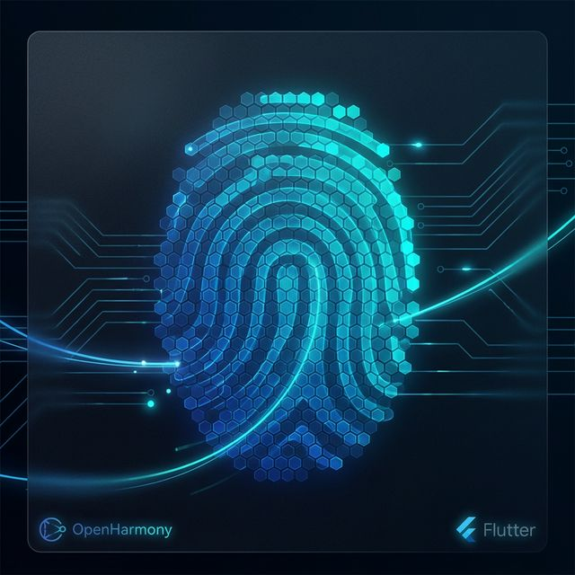
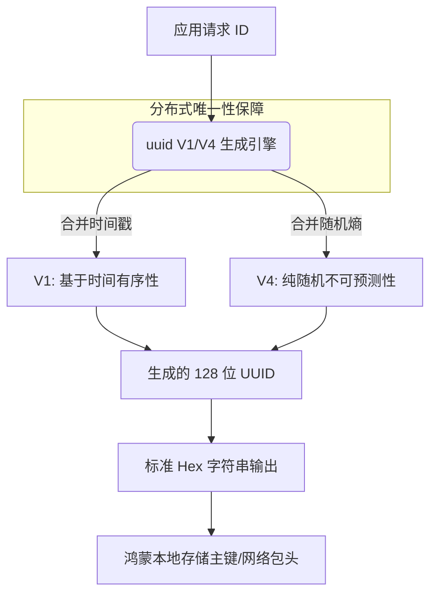

欢迎加入开源鸿蒙跨平台社区：[https://openharmonycrossplatform.csdn.net](https://openharmonycrossplatform.csdn.net)。

# Flutter for OpenHarmony：uuid — 为鸿蒙应用标记唯一的数字基因



## 前言

在建立复杂的鸿蒙（OpenHarmony）应用系统时，如何确保海量数据对象（如订单、日志记录、缓存文件）在分布式环境下拥有绝对唯一的 ID，是一个基础且关键的技术命题。如果仅依赖自增 ID 或简单的时间戳，在设备同步或离线存储合并时必然会发生冲突。

`uuid` 是一款符合 RFC4122 标准的高性能标识符生成库。它支持基于时间的 V1、基于随机数的 V4 以及基于命名空间的 V5 等多种版本。在 Flutter for OpenHarmony 的工程实践中，无论是构建本地数据库主键，还是生成多端互通的追踪 ID（Trace ID），`uuid` 都是开发者手中最可靠且不可或缺的工具。

## 一、原理解析 / 概念介绍

### 1.1 基础模型

`uuid` 利用设备特定的种子信息和强随机数引擎，确保生成的 128 位数字在全宇宙范围内都是唯一的。



### 1.2 核心特性

- **多版本适配**：V1 (Time-based)、V4 (Random-based)、V5 (Name-based)。
- **高度可预测/可控**：支持自定义时钟和随机数生成器。
- **极致性能**：生成速度极快，足以支撑高频的事务处理。

## 二、核心 API / 工具详解

### 2.1 依赖引入

在鸿蒙工程的 `pubspec.yaml` 中添加以下依赖：

```yaml
dependencies:
  uuid: ^4.3.3
```

### 2.2 要点讲解

💡 **技巧**：在鸿蒙端最常用的场景是生成 V4 随机标识符，API 设计非常扁平。

```dart
import 'package:uuid/uuid.dart';

void harmonyIdLab() {
  // ✅ 推荐做法：创建单例实例
  const uuid = Uuid();

  // 1. 生成基于随机数的 V4 UUID (最常用)
  String v4 = uuid.v4(); 
  print('新生成的鸿蒙业务 ID: $v4');

  // 2. 生成基于时间的 V1 UUID (适用于需要排序的日志)
  String v1 = uuid.v1();
  print('带时间顺序的追踪 ID: $v1');
}
```

## 三、典型应用场景

### 3.1 场景一：分布式数据库本地主键
当鸿蒙设备在离线状态下创建记录（如离线记事本）时，利用 UUID 作为主键，确保在稍后与云端或其它设备同步时不会发生 ID 碰撞。

### 3.2 场景二：文件系统重命名保护
在存储鸿蒙用户上传的媒体资源时，将文件名转换为 UUID，有效规避由于特殊字符或同名文件导致的路径冲突风险。

## 四、OpenHarmony 平台适配挑战

### 4.1 强随机数种子的获取
一些低端的鸿蒙物联网设备可能缺乏高质量的熵源。

✅ **适配建议**：
1. **优先使用底层 CSPRNG**：`uuid` 库默认通过 Dart 的 `Random.secure()` 获取种子，这在鸿蒙端能获得系统级的安全随机数支持。如果是极其关键的安全场景，可通过平台通道（MethodChannel）获取鸿蒙原生的安全随机数服务注入 `uuid` 库。
2. **字节格式优化**：针对存储极度敏感的场景，建议使用 `v4obj().bytes` 获取原始的 `Uint8List` 进行存储，能比 Hex 字符串节省一半以上的物理空间。

## 五_、综合实战演示

下面展示了一个在鸿蒙端生成并展示业务 ID 的简单 UI 片段：

```dart
import 'package:flutter/material.dart';
import 'package:uuid/uuid.dart';

class HarmonyUuidLab extends StatefulWidget {
  const HarmonyUuidLab({super.key});

  @override
  State<HarmonyUuidLab> createState() => _HarmonyUuidLabState();
}

class _HarmonyUuidLabState extends State<HarmonyUuidLab> {
  String _currentId = "点击下方按钮生成 ID";

  void _generateId() {
    setState(() {
      _currentId = const Uuid().v4();
    });
  }

  @override
  Widget build(BuildContext context) {
    return Scaffold(
      appBar: AppBar(title: const Text('唯一标识符实验室')),
      body: Center(
        child: Column(
          children: [
            const Icon(Icons.fingerprint, size: 80, color: Colors.indigo),
            Padding(
              padding: const EdgeInsets.all(20),
              child: SelectableText(
                _currentId,
                style: const TextStyle(fontSize: 16, fontFamily: 'monospace'),
              ),
            ),
            ElevatedButton(onPressed: _generateId, child: const Text('生成新业务 ID (V4)')),
          ],
        ),
      ),
    );
  }
}
```

## 六、总结

`uuid` 库虽然简单，却是构建大型分布式系统的“定海神针”。它为每一份鸿蒙数据都赋予了独一无二的数字身份。

✅ **核心建议**：
1. **统一版本规范**：在一个鸿蒙项目中，同类数据建议统一使用 V4，需要顺序性的日志建议统一使用 V1。
2. **避免重复实例化**：在全局建立一个 `Uuid()` 对象复用，减少内存波动。

📦 **参考源码**：相关示例已同步。

🌐 **欢迎加入**：[开源鸿蒙跨平台开发者社区](https://openharmonycrossplatform.csdn.net)
