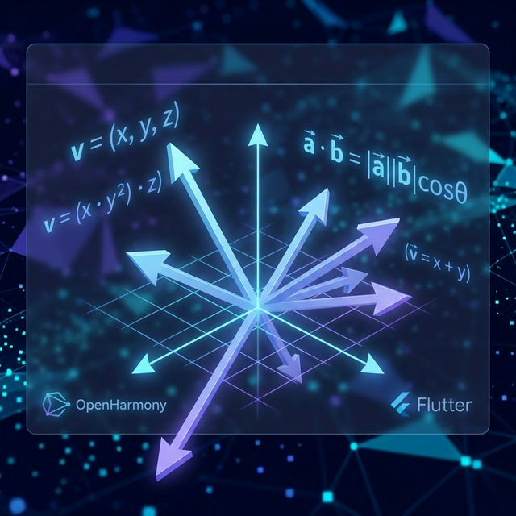
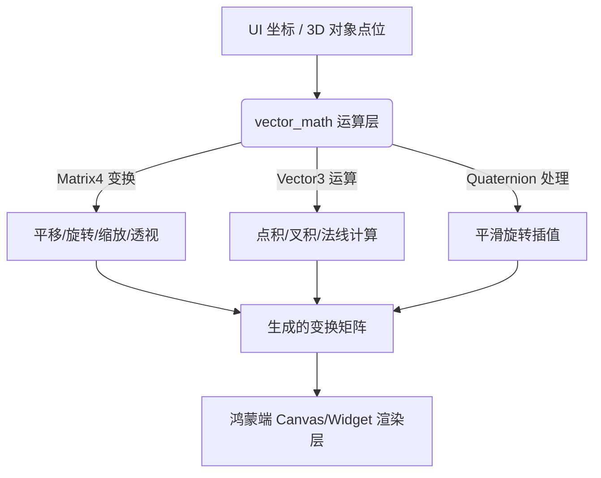

欢迎加入开源鸿蒙跨平台社区：[https://openharmonycrossplatform.csdn.net](https://openharmonycrossplatform.csdn.net)。

# Flutter for OpenHarmony：vector_math — 鸿蒙图形开发的逻辑大脑



## 前言

在鸿蒙（OpenHarmony）应用开发中，想要实现炫酷的 3D 转换动画、物理引擎模拟或是复杂的 2D 图形处理，底层的数学支撑是不可或缺的。无论是调整一个旋转立方体在鸿蒙屏幕上的透视角度，还是计算用户手势在多端设备上的精细位移，都需要处理大量的向量（Vector）和矩阵（Matrix）运算。

`vector_math` 是 Dart 生态中最为成熟、高性能的 2D/3D 数学库。它提供了从基础的坐标变换到复杂的四元数（Quaternion）计算的全套 API。在 Flutter for OpenHarmony 追求极致动效的适配过程中，`vector_math` 是开发者手中的精准手术刀，助你切开重重维度的技术挑战。

## 一、原理解析 / 概念介绍

### 1.1 基础模型

`vector_math` 内部使用了浮点数数组（Float32List）来存储数据，并利用 SIMD（单指令多数据流）等编译器优化手段，实现了极高的运算吞吐量。



### 1.2 核心要点

- **兼容性极强**：由于其基于纯 Dart 且高度优化，完美适配鸿蒙各型设备的 CPU 架构。
- **与 Flutter 无缝集成**：Flutter 内置的 `Matrix4` 变换引擎正是基于 `vector_math` 构建的。
- **性能卓越**：在大型循环中处理成千上万个顶点的数学变换时，依然能保持鸿蒙 UI 的连贯。

## 二、核心 API / 工具详解

### 2.1 依赖引入

在鸿蒙工程的 `pubspec.yaml` 中添加以下依赖：

```yaml
dependencies:
  vector_math: ^2.1.4
```

### 2.2 要点讲解

💡 **技巧**：在鸿蒙端处理多端适配的 UI 转换时，建议封装易懂的辅助函数。

```dart
import 'package:vector_math/vector_math_64.dart'; // 建议使用 64 位版本，精度更高

void createHarmonyTransform() {
  // ✅ 推荐做法：创建 4x4 矩阵
  final matrix = Matrix4.identity();
  
  // 链式应用变换逻辑
  matrix.translate(10.0, 20.0, 0.0); // 平移
  matrix.rotateZ(radians(45.0));     // 旋转 45 度（自动处理弧度转换）
}
```

## 三、典型应用场景

### 3.1 场景一：鸿蒙 3D 交互卡片
在分布式桌面上实现随陀螺仪转动的 3D 浮层卡片效果，利用 `Matrix4` 动态计算透视面。

### 3.2 场景二：游戏引擎基础
构建简单的 2D/3D 鸿蒙原生游戏时，用于计算碰撞检测（距离向量）和粒子运动轨迹。

## 四、OpenHarmony 平台适配挑战

### 4.1 精度与性能权衡
虽然 `vector_math_64` 精度极高，但对于某些鸿蒙低端物联网终端，32 位版本可能更有性能优势。

✅ **适配建议**：
1. **优先使用 Float32List**：在需要极致性能的像素级处理中，手动使用 `Vector3.array(...)` 与 `Float32List` 配合，能减少鸿蒙系统因浮点转换带来的微小开销。
2. **利用 SIMD 优化**：如果你的鸿蒙应用涉及大量顶点变换，确保开启了相关编译器选项，让底层指令集加速矩阵乘法。

## 五、综合实战演示

下面是一个演示如何在鸿蒙端利用矩阵运算实现一个 3D 倾斜视图的逻辑：

```dart
import 'package:flutter/material.dart';
import 'package:vector_math/vector_math_64.dart' hide Colors;

class HarmonyMatrixLab extends StatelessWidget {
  const HarmonyMatrixLab({super.key});

  @override
  Widget build(BuildContext context) {
    // 1. 定义变换矩阵
    final Matrix4 skewMatrix = Matrix4.identity()
      ..setEntry(3, 2, 0.001) // 设置透视系数，产生 Z 轴深意
      ..rotateX(-0.1)        // 绕 X 轴旋转产生俯视感
      ..rotateY(0.05);       // 绕 Y 轴稍微偏转

    return Scaffold(
      appBar: AppBar(title: const Text('空间变换实验室')),
      body: Center(
        child: Transform(
          transform: skewMatrix,
          alignment: FractionalOffset.center,
          child: Container(
            width: 200,
            height: 200,
            decoration: BoxDecoration(
              gradient: const LinearGradient(colors: [Colors.blue, Colors.purple]),
              borderRadius: BorderRadius.circular(20),
              boxShadow: const [BoxShadow(blurRadius: 20, color: Colors.black26)],
            ),
            child: const Center(child: Text('3D 鸿蒙组件', style: TextStyle(color: Colors.white))),
          ),
        ),
      ),
    );
  }
}
```

## 六、总结

`vector_math` 是鸿蒙开发者打通现实世界坐标与虚拟数字界面的“连接器”。它将晦涩的数学公式转化为高效的算法实现。

✅ **核心建议**：
1. **理解弧度制**：`vector_math` 内部度量通常是弧度，使用 `radians()` 工具函数可避免逻辑错误。
2. **预计算常数**：在高性能场景下，预先计算好旋转矩阵的常数项，能显著降低鸿蒙端每帧的渲染压力。

📦 **代码参考**：已上传至鸿蒙开发者社区 AtomGit 仓库。

🌐 **欢迎加入**：[开源鸿蒙跨平台开发者社区](https://openharmonycrossplatform.csdn.net)
